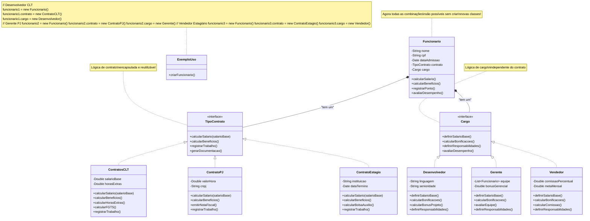

# Alguns Princípios Básicos

## Encapsulamento das Mudanças

O princípio de ***"encapsular o que pode variar"*** é uma das diretrizes fundamentais do design de software. Sua idéia central é isolar as partes dos sistemas mais propensas a mudanças, de modo que essas mudanças não afetem outras partes do sistema. 

Sempre que você escreve código, algumas partes são mais **estáveis** e outras são mais **voláteis**. Este princípio sugere que você deve identificar essas partes voláteis e encapsulá-las, ou seja, isolá-las de outras partes do sistema. Isso permite que você faça alterações nessas partes sem afetar o restante do código, tornando o sistema mais robusto e fácil de manter.

Quando não encapsulamos as partes voláteis, mudanças pequenas podem ter um efeito cascata, quebrando outras partes do sistema e tornando o código difícil de entender e manter. Imagine um sistema de vendas onde a forma que é calculado o frete dos produtos está espalhada por várias partes do código. Se você precisar mudar a lógica de cálculo do frete, terá que alterar várias partes do código, o que aumenta o risco de introduzir bugs e torna o sistema mais difícil de manter.

Para aplicar esse princípio na prática, procure por trechos de código que possuem muitos `if`/`else`, `switch`/`case`, ou outros condicionais que indicam que o código pode mudar com frequência. Esses trechos de código são candidatos a serem encapsulados. Você pode criar classes, interfaces ou módulos que encapsulem essas partes voláteis, isolando-as do restante do sistema.

Essa habilidade de identificar esses trechos de códigos voláteis é desenvolvida com a prática e a experiência. À medida que você ganha mais experiência, não apenas com o código, mas também com o domínio do problema que está resolvendo, você se torna mais capaz de identificar essas partes voláteis e encapsulá-las de forma eficaz.

### Encapsulamento a nível de método

Imagine que você está desenvolvendo um sistema de vendas e tem o seguinte método que calcula o preço total de um pedido, envolvendo o calculo de impostos:

```python

def calcular_valor_nota_fiscal(pedido):
    preco_total = 0
    for item in pedido.itens:
        preco_total += item.preco * item.quantidade
    match pedido.pais:
        case "US":
            preco_total += preco_total * 0.07  # imposto de 7% nos EUA
        case "EU":
            preco_total += preco_total * 0.20  # imposto de 20% na União Europeia
        case _:
            ValorErro("País não suportado")
    return preco_total

def calcular_valor_carrinho(pedido):
    preco_total = 0
    for item in pedido.itens:
        preco_total += item.preco * item.quantidade
    match pedido.pais:
        case "US":
            preco_total += preco_total * 0.07  # imposto de 7% nos EUA
        case "EU":
            preco_total += preco_total * 0.20  # imposto de 20% na União Europeia
        case _:
            ValorErro("País não suportado")
    return preco_total
    
```
Neste exemplo, o cálculo do imposto está diretamente embutido no método `calcular_valor_nota_fiscal` e `calcular_valor_carrinho`. Se você precisar alterar a lógica de cálculo do imposto, terá que modificar esses métodos, o que pode ser arriscado e propenso a erros, especialmente se houver outros métodos que também dependem dessa lógica.

Para encapsular essa lógica de cálculo do imposto e do calculo total, você pode criar um método separado que lida apenas com o cálculo do imposto, como mostrado abaixo:

```python
def obter_aliquota_imposto(pais):
    match pais:
        case "US":
            return 0.07  # imposto de 7% nos EUA
        case "EU":
            return 0.20  # imposto de 20% na União Europeia
        case _:
            raise ValueError("País não suportado")

def calcular_preco_total(pedido):
    preco_total = 0
    for item in pedido.itens:
        preco_total += item.preco * item.quantidade
    preco_total += preco_total * obter_aliquota_imposto(pedido.pais)
    return preco_total

def calcular_valor_nota_fiscal(pedido):
    return calcular_preco_total(pedido)

def calcular_valor_carrinho(pedido):
    return calcular_preco_total(pedido)
```
Neste exemplo, o método `obter_aliquota_imposto` encapsula a lógica de cálculo do imposto. Agora, se você precisar alterar a lógica de cálculo do imposto, poderá fazê-lo apenas nesse método, sem afetar os outros métodos que dependem dessa lógica. Isso torna o código mais modular e fácil de manter.

### Encapsulamento a nível de classe

Imagine que você está desenvolvendo um sistema de vendas e tem uma classe `Pedido` que contém a lógica de cálculo do preço total, incluindo o cálculo do imposto. Se você precisar alterar a lógica de cálculo do imposto, terá que modificar essa classe, o que pode ser arriscado e propenso a erros, especialmente se houver outras classes que também dependem dessa lógica.
Para encapsular essa lógica de cálculo do imposto, você pode criar uma classe separada que lida apenas com o cálculo do imposto, como mostrado abaixo:

```python
class CalculadoraImposto:
    def __init__(self, pais):
        self.pais = pais

    def obter_aliquota_imposto(self):
        match self.pais:
            case "US":
                return 0.07  # imposto de 7% nos EUA
            case "EU":
                return 0.20  # imposto de 20% na União Europeia
            case _:
                raise ValueError("País não suportado")

    def calcular_imposto(self, preco_total):
        return preco_total * self.obter_aliquota_imposto()


class Pedido:
    def __init__(self, itens, pais):
        self.itens = itens
        self.pais = pais

    def calcular_preco_total(self):
        preco_total = sum(item.preco * item.quantidade for item in self.itens)
        calculadora_imposto = CalculadoraImposto(self.pais)
        preco_total += calculadora_imposto.calcular_imposto(preco_total)
        return preco_total
```
Neste exemplo, a classe `CalculadoraImposto` encapsula a lógica de cálculo do imposto. Agora, se você precisar alterar a lógica de cálculo do imposto, poderá fazê-lo apenas nessa classe, sem afetar a classe `Pedido` que depende dessa lógica. Isso torna o código mais modular e fácil de manter.

## Use Interfaces e Abstrações e não Implemente Detalhes

O princípio de ***"programar para interfaces, não para implementações"*** é uma diretriz fundamental do design de software que enfatiza a importância de usar abstrações e interfaces em vez de depender de implementações concretas. A ideia central é que você deve definir contratos claros entre os diferentes componentes do sistema, permitindo que eles se comuniquem sem depender de detalhes específicos de implementação.

Mas como definir essas interfaces e abstrações? A resposta está em identificar os comportamentos e responsabilidades que os componentes do sistema devem ter, independentemente de como esses comportamentos são implementados. Isso permite que você crie um sistema mais flexível e extensível, onde as mudanças em uma parte do sistema não afetam outras partes. Por exemplo:

- Determinar quais métodos uma classe depende de outra classe.
- Definir quais dados uma classe precisa de outra classe.
- Identificar quais eventos uma classe deve notificar outras classes.

De poss dessas informações, você pode criar interfaces que definem esses contratos. Essas interfaces podem ser implementadas por diferentes classes, permitindo que você altere a implementação sem afetar o restante do sistema.

### Exemplo de Interface

Imagine um sistema de vendas onde você tem uma classe `Cobrança` que executa o processo de cobrança. 

```python
class Cobrança:
    def cobrar(self, pedido):
        # Lógica de cobrança usando um gateway de pagamento específico
        pass
```

Neste exemplo, a classe `Cobrança` está diretamente acoplada a uma implementação específica de um gateway de pagamento. Se você precisar mudar o gateway de pagamento, terá que modificar essa classe, o que pode ser arriscado e propenso a erros.

Para aplicar o princípio de programar para interfaces, você pode criar uma interface `GatewayPagamento` que define o contrato para qualquer gateway de pagamento:

```python
from abc import ABC, abstractmethod

class GatewayPagamento(ABC):
    @abstractmethod
    def cobrar(self, pedido):
        pass

class PagamentoStripe(GatewayPagamento):
    def cobrar(self, pedido):
        # Lógica de cobrança usando o Stripe
        pass
class PagamentoPayPal(GatewayPagamento):
    def cobrar(self, pedido):
        # Lógica de cobrança usando o PayPal
        pass
class Cobrança:
    def __init__(self, gateway: GatewayPagamento):
        self.gateway = gateway

    def cobrar(self, pedido):
        self.gateway.cobrar(pedido)
```

Neste exemplo, a interface `GatewayPagamento` define o contrato para qualquer gateway de pagamento. As classes `PagamentoStripe` e `PagamentoPayPal` implementam essa interface, permitindo que você altere a implementação do gateway de pagamento sem afetar a classe `Cobrança`. Agora, se você precisar mudar o gateway de pagamento, poderá fazê-lo apenas criando uma nova classe que implementa a interface `GatewayPagamento`, sem precisar modificar a classe `Cobrança`.

## Composição é Melhor que Herança

Quando falamos de herança, vemos aqui uma das forma mais comuns de reutilização de código. Mas a herança vem com alguns pontos negativos:

- **Uma subclasse não pode reduzir a interface da superclasse**: Se você herdar de uma classe que tem um método que retorna um tipo específico, você não pode mudar esse tipo na subclasse. Isso pode levar a problemas de compatibilidade e flexibilidade.

- **Sobrescrita de métodos**: Quando você sobrescreve um método na subclasse, você precisa garantir que o novo método mantenha a mesma assinatura e comportamento esperado. 

- **Qubra de encapsulamento**: A herança pode quebrar o encapsulamento, pois a subclasse tem acesso aos membros privados da superclasse. 

- **Acoplamento**: A herança cria um acoplamento forte entre a superclasse e a subclasse, o que pode dificultar a manutenção e evolução do código.

- **Hierarquia complexa**: À medida que você adiciona mais subclasses, a hierarquia de classes pode se tornar complexa e difícil de entender. 

Para evitar esses problemas, é recomendável usar composição em vez de herança sempre que possível. A composição permite que você crie classes que contêm outras classes como membros, em vez de herdar de uma superclasse. Isso permite que você reutilize código sem os problemas associados à herança.

### Exemplo de Composição

Neste exemplo, vamos pensar em um sistema de RH onde temos uma classe `Funcionario` que representa um funcionário. O problema aqui é que existem diferentes tipos de funcionários, desde formas de contratação, a cargos e responsabilidades.

```mermaid
classDiagram
    class Funcionario {
        +String nome
        +String cpf
        +Date dataAdmissao
        +calcularSalario()
        +calcularBeneficios()
        +registrarPonto()
        +avaliarDesempenho()
    }

    %% Hierarquia por tipo de contrato
    class FuncionarioCLT {
        +Double salarioBase
        +calcularHorasExtras()
        +calcularFGTS()
    }

    class FuncionarioPJ {
        +Double valorHora
        +String cnpj
        +emitirNotaFiscal()
    }

    class Estagiario {
        +String instituicao
        +Date dataTermino
        +calcularBolsaAuxilio()
    }

    %% Hierarquia por cargo
    class Desenvolvedor {
        +String linguagem
        +String senioridade
        +calcularBonusProjeto()
    }

    class Gerente {
        +List~Funcionario~ equipe
        +Double bonusGerencial
        +avaliarEquipe()
    }

    class Vendedor {
        +Double comissao
        +Double metaMensal
        +calcularComissao()
    }

    %% O PROBLEMA: onde ficam as combinações?
    class DesenvolvedorCLT {
        +calcularSalario()
        +calcularHorasExtras()
        +calcularBonusProjeto()
    }

    class DesenvolvedorPJ {
        +calcularSalario()
        +emitirNotaFiscal()
        +calcularBonusProjeto()
    }

    class GerenteCLT {
        +calcularSalario()
        +calcularHorasExtras()
        +avaliarEquipe()
    }

    class VendedorEstagiario {
        +calcularBolsaAuxilio()
        +calcularComissao()
        +registrarPonto()
    }

    %% Relacionamentos
    Funcionario <|-- FuncionarioCLT
    Funcionario <|-- FuncionarioPJ
    Funcionario <|-- Estagiario
    
    Funcionario <|-- Desenvolvedor
    Funcionario <|-- Gerente
    Funcionario <|-- Vendedor
    
    %% Explosão combinatorial
    FuncionarioCLT <|-- DesenvolvedorCLT
    FuncionarioPJ <|-- DesenvolvedorPJ
    FuncionarioCLT <|-- GerenteCLT
    Estagiario <|-- VendedorEstagiario

    %% Indicação do problema
    note for DesenvolvedorCLT "Código duplicado!\nLógica de desenvolvedor\n+ lógica CLT misturadas"
    
    note for DesenvolvedorPJ "Mais duplicação!\nMesma lógica de desenvolvedor\nmas com contrato PJ"
    
    note for VendedorEstagiario "Combinação estranha\nmas possível na realidade"
```


Neste exemplo, temos uma hierarquia complexa de classes que representa diferentes tipos de funcionários e suas combinações. Isso leva a uma explosão combinatorial, onde cada combinação de tipo de funcionário e cargo resulta em uma nova classe, o que torna o código difícil de manter e entender.

Para resolver esse problema, podemos usar composição em vez de herança. Podemos criar classes separadas para cada tipo de contrato e cargo, e usar essas classes como membros da classe `Funcionario`. Isso nos permite reutilizar código sem os problemas associados à herança.


Neste exemplo, a classe `Funcionario` agora tem dois membros: `contrato` e `cargo`, que são instâncias das interfaces `TipoContrato` e `Cargo`, respectivamente. As implementações dessas interfaces encapsulam a lógica específica de cada tipo de contrato e cargo, permitindo que você reutilize código sem os problemas associados à herança.