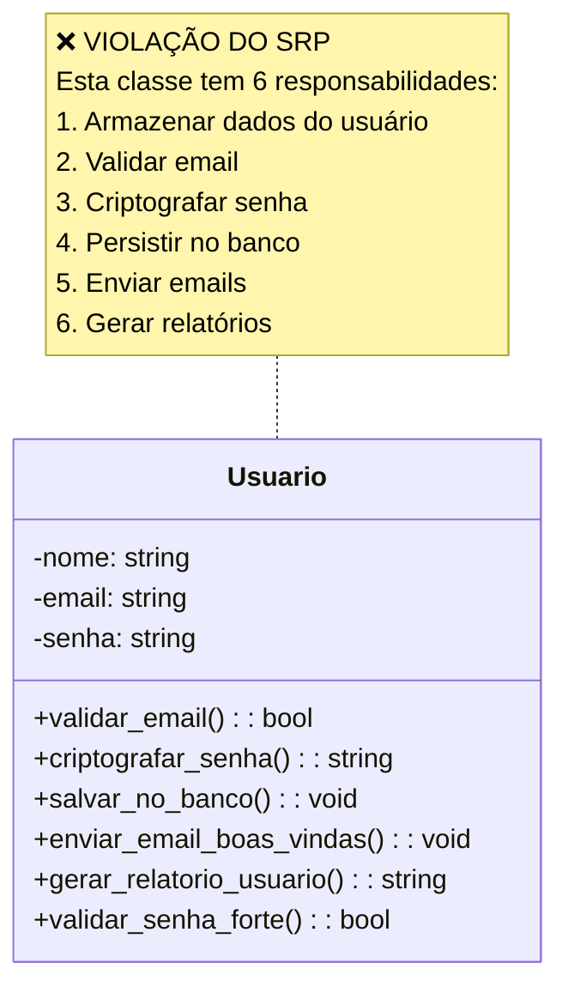
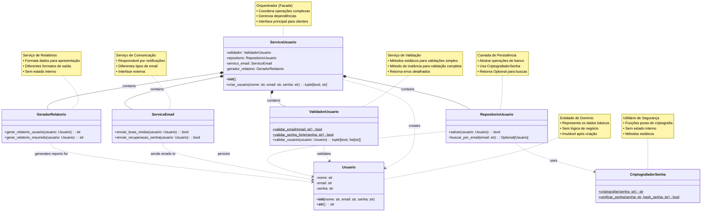
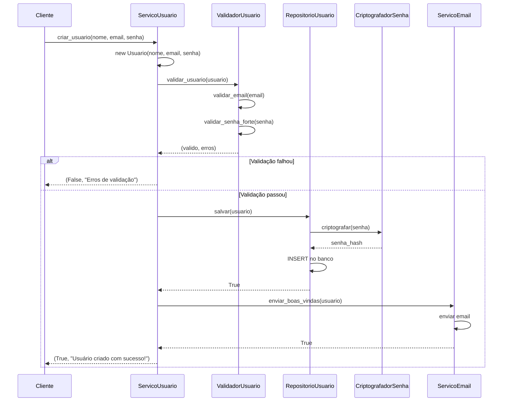

# Single Responsibility Principle (SRP) - Princípio da Responsabilidade Única

O primeiro princípio do SOLID, o *Single Responsibility Principle (SRP)*, estabelece que uma classe deve ter apenas uma razão para mudar. Isso significa que cada classe deve ser responsável por uma única parte da funcionalidade do software, evitando a mistura de responsabilidades que pode levar a um código difícil de manter e evoluir.

O **SRP** não se trata apenas de fazer classes pequenas, mas sim de garantir que cada classe tenha um propósito **bem definido e coeso**. Quando uma classe assume múltiplas responsabilidades, ela se torna mais difícil de entender, testar e manter. Mudanças em uma funcionalidade podem inadvertidamente afetar outras, criando um efeito cascata de bugs e complexidade.

A essência do SRP reside na **coesão** - elementos que trabalham juntos para um objetivo comum devem estar agrupados, enquanto responsabilidades distintas devem ser separadas. Isso resulta em código mais modular, reutilizável e resiliente a mudanças.

## Vantagens da Aplicação do SRP

### 1. **Facilidade de Manutenção**
Cada classe tem uma responsabilidade específica, tornando mudanças mais previsíveis e isoladas.

### 2. **Testabilidade**
Classes com responsabilidade única são mais fáceis de testar, pois têm menos dependências e comportamentos.

### 3. **Reutilização**
Componentes especializados podem ser reutilizados em diferentes contextos.

### 4. **Flexibilidade**
Mudanças em uma área (ex: validação) não afetam outras (ex: persistência).

### 5. **Clareza de Código**
O propósito de cada classe fica evidente, facilitando a compreensão.

## Sinais de Violação do SRP

- Classes com muitos métodos públicos
- Métodos que fazem coisas completamente diferentes
- Dificuldade para nomear a classe (nomes genéricos como "Manager", "Handler")
- Mudanças frequentes na mesma classe por motivos diferentes
- Dificuldade para escrever testes unitários
- Importações de muitas bibliotecas diferentes na mesma classe

O SRP é fundamental para criar código sustentável e de qualidade. Quando bem aplicado, resulta em sistemas mais organizados, testáveis e fáceis de evoluir.

## Exemplos Práticos

### ❌ Má Prática: Violando o SRP

#### Diagrama de Classes



#### Implementação

```python
class Usuario:
    def __init__(self, nome, email, senha):
        self.nome = nome
        self.email = email
        self.senha = senha
    
    def validar_email(self):
        """Valida formato do email"""
        import re
        pattern = r'^[a-zA-Z0-9._%+-]+@[a-zA-Z0-9.-]+\.[a-zA-Z]{2,}$'
        return re.match(pattern, self.email) is not None
    
    def criptografar_senha(self):
        """Criptografa a senha do usuário"""
        import hashlib
        return hashlib.sha256(self.senha.encode()).hexdigest()
    
    def salvar_no_banco(self):
        """Salva usuário no banco de dados"""
        # Simula conexão com banco
        print(f"Conectando ao banco de dados...")
        print(f"INSERT INTO usuarios (nome, email, senha) VALUES ('{self.nome}', '{self.email}', '{self.criptografar_senha()}')")
        print("Usuário salvo com sucesso!")
    
    def enviar_email_boas_vindas(self):
        """Envia email de boas-vindas"""
        print(f"Enviando email para {self.email}")
        print(f"Assunto: Bem-vindo, {self.nome}!")
        print("Corpo: Obrigado por se cadastrar em nossa plataforma!")
    
    def gerar_relatorio_usuario(self):
        """Gera relatório do usuário"""
        return f"""
        === RELATÓRIO DO USUÁRIO ===
        Nome: {self.nome}
        Email: {self.email}
        Status: Ativo
        Data de cadastro: 2024-01-01
        """
    
    def validar_senha_forte(self):
        """Valida se a senha é forte"""
        return (len(self.senha) >= 8 and 
                any(c.isupper() for c in self.senha) and
                any(c.islower() for c in self.senha) and
                any(c.isdigit() for c in self.senha))

```

#### Problemas desta implementação:

1. A classe tem 6 responsabilidades diferentes: 
   - Validação de email
   - Criptografia de senha
   - Persistência no banco de dados
   - Envio de email
   - Geração de relatórios
   - Validação de senha forte
2. Mudanças na validação afetam a classe inteira: se precisar alterar a lógica de validação de email, terá que modificar a classe `Usuario`, o que pode introduzir bugs em outras funcionalidades.
3. Difícil de testar cada funcionalidade isoladamente: testes unitários se tornam complicados, pois cada teste precisa lidar com múltiplas responsabilidades.
4. Alto acoplamento entre diferentes conceitos: a classe `Usuario` está acoplada a detalhes de implementação de validação, criptografia, persistência e envio de email, tornando-a menos flexível e reutilizável.

### ✅ Boa Prática: Seguindo o SRP

#### Diagrama de Classes



#### Implementação

```python
from abc import ABC, abstractmethod
from typing import Optional
import re
import hashlib

# 1. Classe focada apenas nos dados do usuário
class Usuario:
    def __init__(self, nome: str, email: str, senha: str):
        self.nome = nome
        self.email = email
        self.senha = senha
    
    def __str__(self):
        return f"Usuario(nome='{self.nome}', email='{self.email}')"

# 2. Responsabilidade única: validações
class ValidadorUsuario:
    @staticmethod
    def validar_email(email: str) -> bool:
        """Valida formato do email"""
        pattern = r'^[a-zA-Z0-9._%+-]+@[a-zA-Z0-9.-]+\.[a-zA-Z]{2,}$'
        return re.match(pattern, email) is not None
    
    @staticmethod
    def validar_senha_forte(senha: str) -> bool:
        """Valida se a senha é forte"""
        return (len(senha) >= 8 and 
                any(c.isupper() for c in senha) and
                any(c.islower() for c in senha) and
                any(c.isdigit() for c in senha))
    
    def validar_usuario(self, usuario: Usuario) -> tuple[bool, list[str]]:
        """Valida todos os aspectos do usuário"""
        erros = []
        
        if not self.validar_email(usuario.email):
            erros.append("Email inválido")
        
        if not self.validar_senha_forte(usuario.senha):
            erros.append("Senha deve ter pelo menos 8 caracteres, incluindo maiúscula, minúscula e número")
        
        return len(erros) == 0, erros

# 3. Responsabilidade única: criptografia
class CriptografadorSenha:
    @staticmethod
    def criptografar(senha: str) -> str:
        """Criptografa a senha usando SHA-256"""
        return hashlib.sha256(senha.encode()).hexdigest()
    
    @staticmethod
    def verificar_senha(senha: str, hash_senha: str) -> bool:
        """Verifica se a senha corresponde ao hash"""
        return CriptografadorSenha.criptografar(senha) == hash_senha

# 4. Responsabilidade única: persistência
class RepositorioUsuario:
    def salvar(self, usuario: Usuario) -> bool:
        """Salva usuário no banco de dados"""
        senha_criptografada = CriptografadorSenha.criptografar(usuario.senha)
        
        # Simula operação de banco
        print(f"Conectando ao banco de dados...")
        print(f"INSERT INTO usuarios (nome, email, senha) VALUES ('{usuario.nome}', '{usuario.email}', '{senha_criptografada}')")
        print("Usuário salvo com sucesso!")
        return True
    
    def buscar_por_email(self, email: str) -> Optional[Usuario]:
        """Busca usuário por email"""
        # Simula busca no banco
        print(f"SELECT * FROM usuarios WHERE email = '{email}'")
        return None

# 5. Responsabilidade única: envio de emails
class ServicoEmail:
    def enviar_boas_vindas(self, usuario: Usuario) -> bool:
        """Envia email de boas-vindas"""
        print(f"Enviando email para {usuario.email}")
        print(f"Assunto: Bem-vindo, {usuario.nome}!")
        print("Corpo: Obrigado por se cadastrar em nossa plataforma!")
        return True
    
    def enviar_recuperacao_senha(self, usuario: Usuario) -> bool:
        """Envia email de recuperação de senha"""
        print(f"Enviando email de recuperação para {usuario.email}")
        return True

# 6. Responsabilidade única: geração de relatórios
class GeradorRelatorio:
    def gerar_relatorio_usuario(self, usuario: Usuario) -> str:
        """Gera relatório detalhado do usuário"""
        return f"""
        === RELATÓRIO DO USUÁRIO ===
        Nome: {usuario.nome}
        Email: {usuario.email}
        Status: Ativo
        Data de cadastro: 2024-01-01
        """
    
    def gerar_relatorio_resumido(self, usuario: Usuario) -> str:
        """Gera relatório resumido"""
        return f"{usuario.nome} - {usuario.email}"

# 7. Orquestrador que coordena as operações (Facade Pattern)
class ServicoUsuario:
    def __init__(self):
        self.validador = ValidadorUsuario()
        self.repositorio = RepositorioUsuario()
        self.servico_email = ServicoEmail()
        self.gerador_relatorio = GeradorRelatorio()
    
    def criar_usuario(self, nome: str, email: str, senha: str) -> tuple[bool, str]:
        """Cria um novo usuário com todas as validações e processos"""
        usuario = Usuario(nome, email, senha)
        
        # Validação
        valido, erros = self.validador.validar_usuario(usuario)
        if not valido:
            return False, f"Erros de validação: {', '.join(erros)}"
        
        # Salvar no banco
        sucesso_salvamento = self.repositorio.salvar(usuario)
        if not sucesso_salvamento:
            return False, "Erro ao salvar usuário"
        
        # Enviar email de boas-vindas
        self.servico_email.enviar_boas_vindas(usuario)
        
        return True, "Usuário criado com sucesso!"

# Exemplo de uso
if __name__ == "__main__":
    servico = ServicoUsuario()
    
    # Criar usuário válido
    sucesso, mensagem = servico.criar_usuario("João Silva", "joao@email.com", "MinhaSenh@123")
    print(f"Resultado: {mensagem}")
    
    # Criar usuário inválido
    sucesso, mensagem = servico.criar_usuario("Maria", "email-inválido", "123")
    print(f"Resultado: {mensagem}")
```

#### Diagrama de Sequência
Fluxo de Criação de Usuário Seguindo SRP


#### Problemas Resolvidos
1. **Responsabilidades Claras**: Cada classe tem uma única responsabilidade, facilitando a compreensão e manutenção do código.
2. **Facilidade de Testes**: Cada funcionalidade pode ser testada isoladamente, permitindo testes unitários mais eficazes.
3. **Baixo Acoplamento**: As classes são independentes, permitindo que mudanças em uma parte do sistema não afetem outras.
4. **Reutilização**: Classes como `ValidadorUsuario` e `CriptografadorSenha` podem ser reutilizadas em outros contextos sem dependências desnecessárias.

