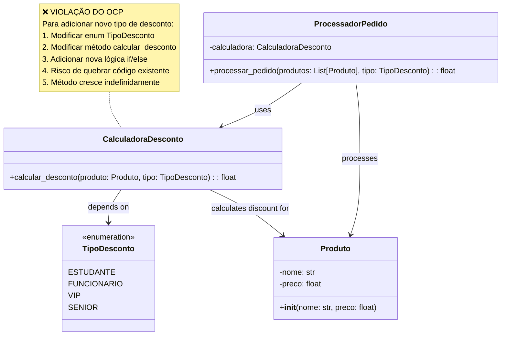
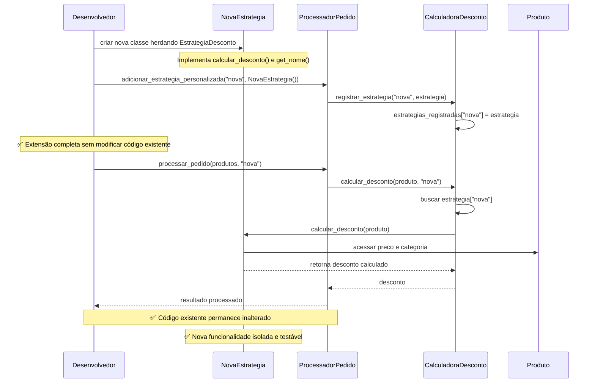

```mermaid
classDiagram
    class Produto {
        -nome: str
        -preco: Decimal
        -categoria: str
        +__init__(nome: str, preco: float, categoria: str)
        +__str__(): str
    }
    
    class EstrategiaDesconto {
        <<abstract>>
        +calcular_desconto(produto: Produto)* Decimal
        +get_nome()* str
        +eh_aplicavel(produto: Produto): bool
    }
    
    class DescontoEstudante {
        +calcular_desconto(produto: Produto): Decimal
        +get_nome(): str
    }
    
    class DescontoFuncionario {
        +calcular_desconto(produto: Produto): Decimal
        +get_nome(): str
    }
    
    class DescontoVIP {
        +calcular_desconto(produto: Produto): Decimal
        +get_nome(): str
    }
    
    class DescontoSenior {
        +calcular_desconto(produto: Produto): Decimal
        +get_nome(): str
    }
    
    class DescontoMilitar {
        +calcular_desconto(produto: Produto): Decimal
        +get_nome(): str
    }
    
    class DescontoProfessor {
        +calcular_desconto(produto: Produto): Decimal
        +get_nome(): str
        +eh_aplicavel(produto: Produto): bool
    }
    
    class DescontoProgressivo {
        -faixas: Dict[Decimal, Decimal]
        +__init__(faixas: Dict[float, float])
        +calcular_desconto(produto: Produto): Decimal
        +get_nome(): str
    }
    
    class DescontoCombinadoMaximo {
        -estrategias: List[EstrategiaDesconto]
        -limite_maximo: Decimal
        +__init__(estrategias: List, limite_maximo: float)
        +calcular_desconto(produto: Produto): Decimal
        +get_nome(): str
    }
    
    class CalculadoraDesconto {
        -estrategias_registradas: Dict[str, EstrategiaDesconto]
        +registrar_estrategia(nome: str, estrategia: EstrategiaDesconto)
        +calcular_desconto(produto: Produto, nome_estrategia: str): Decimal
        +listar_estrategias(): List[str]
    }
    
    class ProcessadorPedido {
        -calculadora: CalculadoraDesconto
        +processar_pedido(produtos: List[Produto], estrategia: str): Dict
        +adicionar_estrategia_personalizada(nome: str, estrategia: EstrategiaDesconto)
    }
    
    %% Herança
    EstrategiaDesconto <|-- DescontoEstudante
    EstrategiaDesconto <|-- DescontoFuncionario
    EstrategiaDesconto <|-- DescontoVIP
    EstrategiaDesconto <|-- DescontoSenior
    EstrategiaDesconto <|-- DescontoMilitar
    EstrategiaDesconto <|-- DescontoProfessor
    EstrategiaDesconto <|-- DescontoProgressivo
    EstrategiaDesconto <|-- DescontoCombinadoMaximo
    
    %% Composição e Uso
    ProcessadorPedido *-- CalculadoraDesconto : contains
    CalculadoraDesconto o-- EstrategiaDesconto : stores
    DescontoCombinadoMaximo o-- EstrategiaDesconto : combines
    EstrategiaDesconto ..> Produto : calculates discount for
    ProcessadorPedido ..> Produto : processes
    
    note for EstrategiaDesconto "✅ ABSTRAÇÃO BASE
    Define contrato comum para
    todas as estratégias de desconto.
    Permite extensão sem modificação."
    
    note for DescontoMilitar "✅ NOVA EXTENSÃO
    Adicionada sem modificar
    código existente.
    Segue o contrato da interface."
    
    note for CalculadoraDesconto "✅ CONTEXT CLASS
    Gerencia estratégias dinamicamente.
    Permite registro de novas estratégias
    em tempo de execução."
```

# Open Close Principle (OCP) - Princípio Aberto/Fechado

O **Princípio Aberto/Fechado (Open/Closed Principle - OCP)** é o segundo princípio do SOLID e um dos mais poderosos para criar arquiteturas flexíveis e extensíveis. Foi formulado por Bertrand Meyer em 1988. Este princípio estabelece que "as entidades de software devem estar abertas para extensão, mas fechadas para modificação". Em outras palavras, o código deve ser projetado de forma que novas funcionalidades possam ser adicionadas sem alterar o código existente.

## Conceitos-chave do OCP:

- **Aberto para extensão**: Podemos adicionar novos comportamentos quando os requisitos mudam
- **Fechado para modificação**: O código existente permanece intocado, preservando sua estabilidade
- **Abstração**: O mecanismo principal para implementar o OCP é através de **interfaces** e **classes abstratas**
- **Polimorfismo**: Permite que diferentes implementações sejam tratadas de forma uniforme

O OCP é fundamental para sistemas que precisam evoluir continuamente sem quebrar funcionalidades existentes, especialmente em ambientes de desenvolvimento ágil onde mudanças são frequentes.

# Vantagens da Aplicação do OCP

### 1. **Estabilidade do Código**
O código existente não é modificado, preservando funcionalidades já testadas e em produção.

### 2. **Facilidade de Extensão**
Novas funcionalidades podem ser adicionadas criando novas classes que implementam as interfaces existentes.

### 3. **Redução de Riscos**
Mudanças são isoladas, reduzindo o risco de quebrar funcionalidades existentes.

### 4. **Manutenibilidade**
Cada comportamento fica encapsulado em sua própria classe, facilitando manutenção e depuração.

### 5. **Testabilidade**
Novas funcionalidades podem ser testadas isoladamente sem afetar testes existentes.

### 6. **Flexibilidade Arquitetural**
Permite diferentes implementações da mesma abstração, facilitando mudanças futuras.

## Sinais de Violação do OCP

- **Estruturas condicionais extensas** (if/elif/else ou switch/case) que verificam tipos
- **Modificação frequente** da mesma classe para adicionar novos comportamentos
- **Enums que crescem constantemente** junto com lógica condicional correspondente
- **Métodos que crescem indefinidamente** com novos casos
- **Acoplamento forte** entre código cliente e implementações específicas
- **Dificuldade para adicionar funcionalidades** sem quebrar código existente
- **Testes que precisam ser modificados** quando novas funcionalidades são adicionadas
- **Código duplicado** em diferentes branches condicionais

## Exemplos Práticos

### ❌ Má Prática: Violando o OCP

#### Diagrama de Classes


#### Implementação
```python
from enum import Enum
from typing import List

class TipoDesconto(Enum):
    ESTUDANTE = "estudante"
    FUNCIONARIO = "funcionario"
    VIP = "vip"
    SENIOR = "senior"

class Produto:
    def __init__(self, nome: str, preco: float):
        self.nome = nome
        self.preco = preco

class CalculadoraDesconto:
    def calcular_desconto(self, produto: Produto, tipo_desconto: TipoDesconto) -> float:
        """
        ❌ VIOLAÇÃO DO OCP: Para adicionar um novo tipo de desconto,
        precisamos modificar este método existente
        """
        if tipo_desconto == TipoDesconto.ESTUDANTE:
            return produto.preco * 0.1  # 10% desconto
            
        elif tipo_desconto == TipoDesconto.FUNCIONARIO:
            return produto.preco * 0.15  # 15% desconto
            
        elif tipo_desconto == TipoDesconto.VIP:
            return produto.preco * 0.2   # 20% desconto
            
        elif tipo_desconto == TipoDesconto.SENIOR:
            # Desconto especial para idosos
            if produto.preco > 100:
                return produto.preco * 0.25  # 25% para produtos caros
            else:
                return produto.preco * 0.15  # 15% para outros produtos
        
        return 0.0

class ProcessadorPedido:
    def __init__(self):
        self.calculadora = CalculadoraDesconto()
    
    def processar_pedido(self, produtos: List[Produto], tipo_desconto: TipoDesconto) -> float:
        total = 0.0
        total_desconto = 0.0
        
        for produto in produtos:
            total += produto.preco
            total_desconto += self.calculadora.calcular_desconto(produto, tipo_desconto)
        
        return total - total_desconto
```
#### Problemas desta implementação:
1. Para adicionar novo tipo de desconto, precisamos modificar CalculadoraDesconto
2. O método calcular_desconto cresce indefinidamente
3. Cada mudança pode quebrar funcionalidades existentes
4. Difícil de testar novos tipos de desconto isoladamente
5. Não segue o princípio de responsabilidade única
6. Alto acoplamento entre lógicas de desconto diferentes

Esses problemas ficam mais evidentes com um exemplo de uso do código de exemplo:

```python
if __name__ == "__main__":
    produtos = [
        Produto("Notebook", 2000.0),
        Produto("Mouse", 50.0)
    ]
    
    processador = ProcessadorPedido()
    
    # Funciona para tipos existentes
    total_estudante = processador.processar_pedido(produtos, TipoDesconto.ESTUDANTE)
    print(f"Total com desconto estudante: R$ {total_estudante:.2f}")
    
    # Mas e se quisermos adicionar "MILITAR" ou "PROFESSOR"?
    # Teríamos que modificar o enum E o método calcular_desconto
```

### ✅ Boa Prática: Seguindo o OCP

#### Diagrama de Classes


#### Implementação

```python
from abc import ABC, abstractmethod
from typing import List, Dict
from decimal import Decimal

class Produto:
    def __init__(self, nome: str, preco: float, categoria: str = "geral"):
        self.nome = nome
        self.preco = Decimal(str(preco))
        self.categoria = categoria
    
    def __str__(self):
        return f"{self.nome} - R$ {self.preco:.2f}"

# Abstração que define o contrato para estratégias de desconto
class EstrategiaDesconto(ABC):
    @abstractmethod
    def calcular_desconto(self, produto: Produto) -> Decimal:
        """Calcula o desconto para um produto específico"""
        pass
    
    @abstractmethod
    def get_nome(self) -> str:
        """Retorna o nome da estratégia de desconto"""
        pass
    
    def eh_aplicavel(self, produto: Produto) -> bool:
        """Verifica se o desconto é aplicável ao produto (hook method)"""
        return True

# Implementações concretas - EXTENSÕES sem modificar código existente
class DescontoEstudante(EstrategiaDesconto):
    def calcular_desconto(self, produto: Produto) -> Decimal:
        return produto.preco * Decimal('0.10')  # 10%
    
    def get_nome(self) -> str:
        return "Desconto Estudante"

class DescontoFuncionario(EstrategiaDesconto):
    def calcular_desconto(self, produto: Produto) -> Decimal:
        return produto.preco * Decimal('0.15')  # 15%
    
    def get_nome(self) -> str:
        return "Desconto Funcionário"

class DescontoVIP(EstrategiaDesconto):
    def calcular_desconto(self, produto: Produto) -> Decimal:
        return produto.preco * Decimal('0.20')  # 20%
    
    def get_nome(self) -> str:
        return "Desconto VIP"

class DescontoSenior(EstrategiaDesconto):
    def calcular_desconto(self, produto: Produto) -> Decimal:
        # Lógica complexa específica para idosos
        if produto.preco > Decimal('100'):
            return produto.preco * Decimal('0.25')  # 25% para produtos caros
        else:
            return produto.preco * Decimal('0.15')  # 15% para outros
    
    def get_nome(self) -> str:
        return "Desconto Senior"

# ✅ NOVAS EXTENSÕES - Adicionadas SEM modificar código existente
class DescontoMilitar(EstrategiaDesconto):
    def calcular_desconto(self, produto: Produto) -> Decimal:
        # Desconto especial para militares
        return produto.preco * Decimal('0.18')  # 18%
    
    def get_nome(self) -> str:
        return "Desconto Militar"

class DescontoProfessor(EstrategiaDesconto):
    def calcular_desconto(self, produto: Produto) -> Decimal:
        # Desconto maior para livros e materiais educacionais
        if produto.categoria == "educacional":
            return produto.preco * Decimal('0.25')  # 25%
        else:
            return produto.preco * Decimal('0.12')  # 12%
    
    def get_nome(self) -> str:
        return "Desconto Professor"
    
    def eh_aplicavel(self, produto: Produto) -> bool:
        # Não se aplica a produtos de luxo
        return produto.categoria != "luxo"

class DescontoProgressivo(EstrategiaDesconto):
    def __init__(self, faixas: Dict[float, float]):
        """
        faixas: dict com limite_preco -> percentual_desconto
        Ex: {100: 0.05, 500: 0.10, 1000: 0.15}
        """
        self.faixas = {Decimal(str(k)): Decimal(str(v)) for k, v in faixas.items()}
        self.faixas_ordenadas = sorted(self.faixas.items(), reverse=True)
    
    def calcular_desconto(self, produto: Produto) -> Decimal:
        for limite, percentual in self.faixas_ordenadas:
            if produto.preco >= limite:
                return produto.preco * percentual
        return Decimal('0')
    
    def get_nome(self) -> str:
        return "Desconto Progressivo"

class DescontoCombinadoMaximo(EstrategiaDesconto):
    def __init__(self, estrategias: List[EstrategiaDesconto], limite_maximo: float = 0.5):
        self.estrategias = estrategias
        self.limite_maximo = Decimal(str(limite_maximo))
    
    def calcular_desconto(self, produto: Produto) -> Decimal:
        desconto_maximo = Decimal('0')
        
        for estrategia in self.estrategias:
            if estrategia.eh_aplicavel(produto):
                desconto = estrategia.calcular_desconto(produto)
                desconto_maximo = max(desconto_maximo, desconto)
        
        # Limita o desconto máximo
        limite_valor = produto.preco * self.limite_maximo
        return min(desconto_maximo, limite_valor)
    
    def get_nome(self) -> str:
        nomes = [e.get_nome() for e in self.estrategias]
        return f"Melhor entre: {', '.join(nomes)}"

# Context class que usa as estratégias
class CalculadoraDesconto:
    def __init__(self):
        self.estrategias_registradas: Dict[str, EstrategiaDesconto] = {}
    
    def registrar_estrategia(self, nome: str, estrategia: EstrategiaDesconto):
        """Permite registrar novas estratégias dinamicamente"""
        self.estrategias_registradas[nome] = estrategia
    
    def calcular_desconto(self, produto: Produto, nome_estrategia: str) -> Decimal:
        if nome_estrategia not in self.estrategias_registradas:
            raise ValueError(f"Estratégia '{nome_estrategia}' não encontrada")
        
        estrategia = self.estrategias_registradas[nome_estrategia]
        
        if not estrategia.eh_aplicavel(produto):
            return Decimal('0')
        
        return estrategia.calcular_desconto(produto)
    
    def listar_estrategias(self) -> List[str]:
        return list(self.estrategias_registradas.keys())

class ProcessadorPedido:
    def __init__(self):
        self.calculadora = CalculadoraDesconto()
        self._registrar_estrategias_padrao()
    
    def _registrar_estrategias_padrao(self):
        """Registra estratégias padrão do sistema"""
        self.calculadora.registrar_estrategia("estudante", DescontoEstudante())
        self.calculadora.registrar_estrategia("funcionario", DescontoFuncionario())
        self.calculadora.registrar_estrategia("vip", DescontoVIP())
        self.calculadora.registrar_estrategia("senior", DescontoSenior())
        self.calculadora.registrar_estrategia("militar", DescontoMilitar())
        self.calculadora.registrar_estrategia("professor", DescontoProfessor())
        
        # Estratégias mais complexas
        desconto_progressivo = DescontoProgressivo({
            100: 0.05,   # 5% para compras acima de R$ 100
            500: 0.10,   # 10% para compras acima de R$ 500
            1000: 0.15   # 15% para compras acima de R$ 1000
        })
        self.calculadora.registrar_estrategia("progressivo", desconto_progressivo)
        
        # Combinação de estratégias
        combo_especial = DescontoCombinadoMaximo([
            DescontoVIP(),
            DescontoSenior(),
            DescontoMilitar()
        ], limite_maximo=0.3)
        self.calculadora.registrar_estrategia("combo_especial", combo_especial)
    
    def processar_pedido(self, produtos: List[Produto], estrategia_desconto: str) -> Dict[str, any]:
        total_original = Decimal('0')
        total_desconto = Decimal('0')
        detalhes = []
        
        for produto in produtos:
            total_original += produto.preco
            desconto = self.calculadora.calcular_desconto(produto, estrategia_desconto)
            total_desconto += desconto
            
            detalhes.append({
                'produto': produto.nome,
                'preco_original': float(produto.preco),
                'desconto': float(desconto),
                'preco_final': float(produto.preco - desconto)
            })
        
        return {
            'total_original': float(total_original),
            'total_desconto': float(total_desconto),
            'total_final': float(total_original - total_desconto),
            'estrategia_usada': estrategia_desconto,
            'detalhes': detalhes
        }
    
    def adicionar_estrategia_personalizada(self, nome: str, estrategia: EstrategiaDesconto):
        """Permite adicionar novas estratégias sem modificar o código existente"""
        self.calculadora.registrar_estrategia(nome, estrategia)

# Exemplo de uso demonstrando extensibilidade
if __name__ == "__main__":
    # Criando produtos
    produtos = [
        Produto("Notebook Dell", 2000.0, "tecnologia"),
        Produto("Livro de Python", 80.0, "educacional"),
        Produto("Mouse Gamer", 150.0, "tecnologia"),
        Produto("Relógio Rolex", 5000.0, "luxo")
    ]
    
    processador = ProcessadorPedido()
    
    # Testando diferentes estratégias
    estrategias = ["estudante", "vip", "professor", "progressivo", "combo_especial"]
    
    for estrategia in estrategias:
        print(f"\n=== {estrategia.upper()} ===")
        try:
            resultado = processador.processar_pedido(produtos, estrategia)
            print(f"Total original: R$ {resultado['total_original']:.2f}")
            print(f"Total desconto: R$ {resultado['total_desconto']:.2f}")
            print(f"Total final: R$ {resultado['total_final']:.2f}")
        except ValueError as e:
            print(f"Erro: {e}")
    
    # ✅ ADICIONANDO NOVA ESTRATÉGIA SEM MODIFICAR CÓDIGO EXISTENTE
    class DescontoBlackFriday(EstrategiaDesconto):
        def calcular_desconto(self, produto: Produto) -> Decimal:
            # 50% de desconto em tudo!
            return produto.preco * Decimal('0.50')
        
        def get_nome(self) -> str:
            return "Black Friday - 50% OFF"
    
    # Registrando a nova estratégia
    processador.adicionar_estrategia_personalizada("blackfriday", DescontoBlackFriday())
    
    print(f"\n=== NOVA ESTRATÉGIA: BLACK FRIDAY ===")
    resultado = processador.processar_pedido(produtos, "blackfriday")
    print(f"Total original: R$ {resultado['total_original']:.2f}")
    print(f"Total desconto: R$ {resultado['total_desconto']:.2f}")
    print(f"Total final: R$ {resultado['total_final']:.2f}")
    
    print(f"\nEstratégias disponíveis: {processador.calculadora.listar_estrategias()}")
```
#### Diagrama de Sequência

Fluxo de Adição de Nova Estratégia (Extensão)



#### Problemas Resolvidos com OCP
1. **Extensibilidade**: Novas estratégias podem ser adicionadas sem modificar o código existente.
2. **Isolamento de Mudanças**: Cada estratégia é independente, facilitando manutenção e testes.
3. **Redução de Condicionais**: Evita estruturas condicionais extensas, tornando o código mais limpo e legível.
4. **Flexibilidade**: Permite que o sistema evolua com novas regras de negócio sem riscos de regressão.
5. **Testabilidade**: Cada estratégia pode ser testada isoladamente, melhorando a cobertura de testes.
6. **Responsabilidade Única**: Cada classe de estratégia tem uma única responsabilidade, seguindo o SRP.