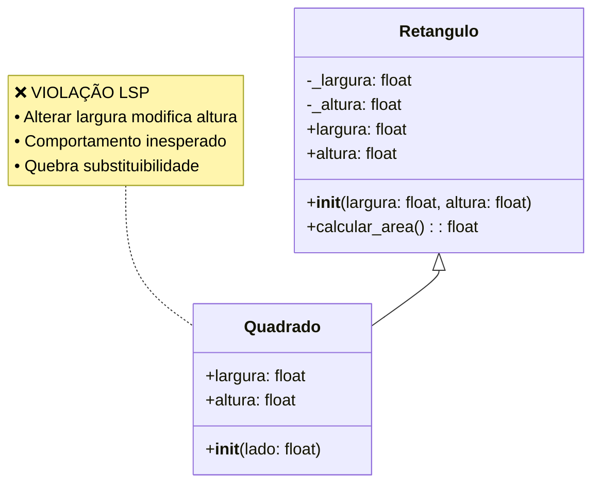
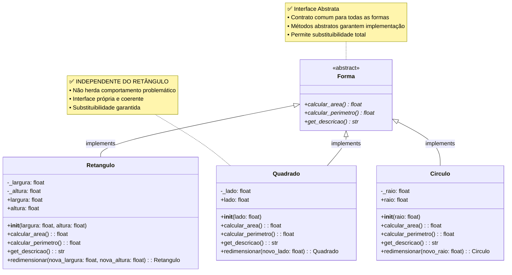
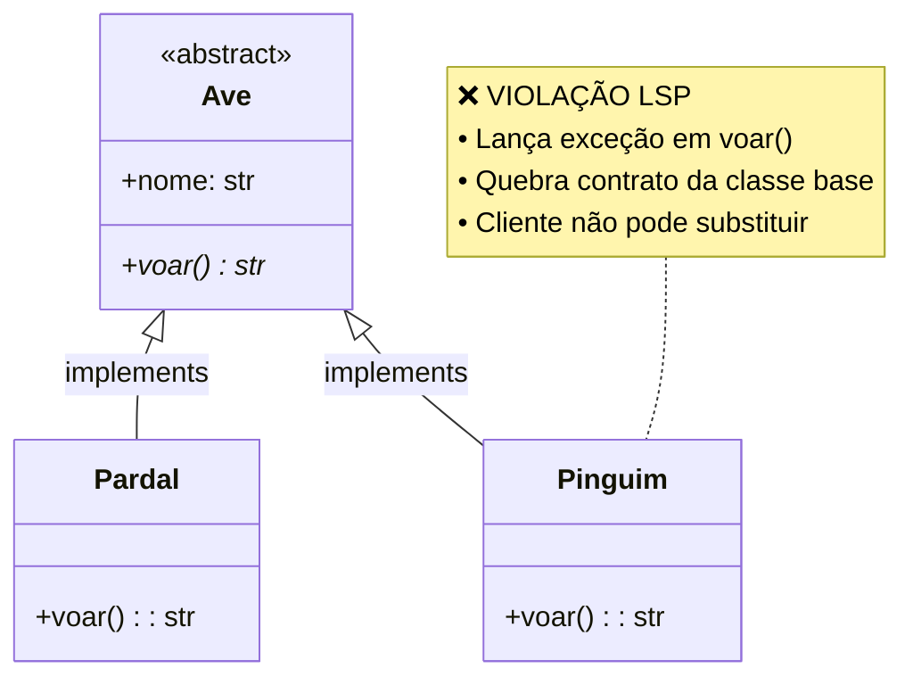
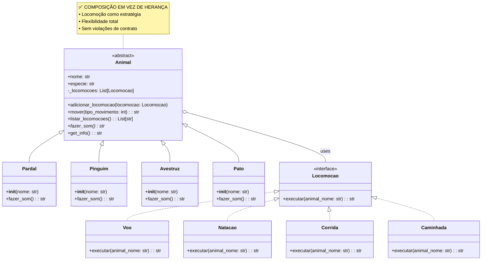

# Liskov Substitution Principle (LSP) - Princípio da Substituição de Liskov

O **Princípio da Substituição de Liskov (LSP)** é o terceiro princípio do SOLID, foi formulado por Barbara Liskov em 1987 e é essencial para garantir que as hierarquias de classes sejam utilizadas corretamente, promovendo a substituição segura de objetos. É considerado um dos princípios mais sutis e tecnicamente rigorosos, estabelecendo regras fundamentais para o uso correto da herança em programação orientada a objetos.

**Definição formal**: *"Se φ(x) é uma propriedade demonstrável dos objetos x de tipo T, então φ(y) deve ser verdadeira para objetos y de tipo S, onde S é um subtipo de T"*

**Definição prática**: *"Objetos de uma superclasse devem ser substituíveis por objetos de suas subclasses sem alterar a corretude do programa"*

Traduzindo um pouco mais essas definições, o LSP afirma que se uma classe B é uma subclasse de A, então podemos substituir objetos do tipo A por objetos do tipo B sem afetar o comportamento esperado do programa. Isso significa que as subclasses devem ser capazes de funcionar como substitutos das superclasses sem causar erros ou comportamentos inesperados.

O Liskov Substitution Principle é fundamental para garantir que a herança seja usada corretamente. Ele assegura que o polimorfismo funcione de forma previsível e segura, permitindo que sistemas sejam extensíveis sem comprometer a estabilidade.

**Principais lições:**

1. **Herança é sobre comportamento**, não apenas estrutura
2. **Contratos devem ser respeitados** por todas as implementações
3. **Composição muitas vezes é melhor** que herança
4. **Testes da classe base** devem passar para todas as subclasses
5. **Substituibilidade** é a chave para sistemas flexíveis

Lembre-se: **"Se parece um pato e nada como um pato, mas precisa de baterias, provavelmente você quebrou a abstração"**. O LSP nos ajuda a manter abstrações coerentes e sistemas robustos.

## Conceitos-chave do LSP:

- **Substituibilidade**: Subclasses devem poder substituir suas classes base completamente
- **Contratos comportamentais**: Não apenas assinaturas, mas comportamentos devem ser preservados
- **Fortalecimento de pré-condições é proibido**: Subclasses não podem ser mais restritivas que a classe base
- **Enfraquecimento de pós-condições é proibido**: Subclasses não podem prometer menos que a classe base
- **Preservação de invariantes**: Propriedades que sempre são verdadeiras devem continuar sendo
- **História restrições**: Subclasses não podem modificar estados de forma incompatível

O LSP garante que a herança seja usada corretamente, mantendo a consistência comportamental e permitindo que o polimorfismo funcione de forma segura e previsível.

## Regras Fundamentais do LSP

### 1. **Regra das Pré-condições**
As subclasses **não podem fortalecer** (tornar mais restritivas) as pré-condições da classe base.

```python
# ❌ Violação: Pré-condição mais restritiva
class ProcessadorBase:
    def processar(self, arquivo: str):
        if not arquivo:  # Pré-condição: arquivo não vazio
            raise ValueError("Arquivo obrigatório")

class ProcessadorRestritivo(ProcessadorBase):
    def processar(self, arquivo: str):
        if not arquivo or len(arquivo) < 5:  # ❌ Mais restritivo!
            raise ValueError("Arquivo deve ter pelo menos 5 caracteres")

# ✅ Correto: Pré-condição igual ou mais fraca
class ProcessadorFlexivel(ProcessadorBase):
    def processar(self, arquivo: str):
        # ✅ Aceita arquivo vazio também (menos restritivo)
        if arquivo and len(arquivo) > 1000:
            self._processar_arquivo_grande(arquivo)
        else:
            self._processar_arquivo_normal(arquivo)
```

### 2. **Regra das Pós-condições**
As subclasses **não podem enfraquecer** (prometer menos) as pós-condições da classe base.

```python
# ❌ Violação: Pós-condição mais fraca
class Calculadora:
    def dividir(self, a: float, b: float) -> float:
        if b == 0:
            raise ZeroDivisionError("Divisão por zero")
        return a / b  # Pós-condição: retorna float ou lança exceção

class CalculadoraSilenciosa(Calculadora):
    def dividir(self, a: float, b: float) -> float:
        if b == 0:
            return 0  # ❌ Retorna 0 em vez de lançar exceção!
        return a / b

# ✅ Correto: Pós-condição igual ou mais forte
class CalculadoraSegura(Calculadora):
    def dividir(self, a: float, b: float) -> float:
        if b == 0:
            raise ZeroDivisionError("Divisão por zero")
        resultado = a / b
        # ✅ Adiciona validação extra (mais forte)
        if abs(resultado) > 1e10:
            raise OverflowError("Resultado muito grande")
        return resultado
```

### 3. **Regra dos Invariantes**
As subclasses devem preservar todos os invariantes da classe base.

```python
class ContaBancaria:
    def __init__(self, saldo_inicial: float = 0):
        self._saldo = saldo_inicial
        # Invariante: saldo sempre >= 0
    
    @property
    def saldo(self) -> float:
        return self._saldo
    
    def sacar(self, valor: float):
        if valor <= 0:
            raise ValueError("Valor deve ser positivo")
        if self._saldo < valor:
            raise ValueError("Saldo insuficiente")
        self._saldo -= valor
        # Invariante mantido: saldo >= 0

# ❌ Violação: Quebra invariante
class ContaComChequeEspecial(ContaBancaria):
    def sacar(self, valor: float):
        if valor <= 0:
            raise ValueError("Valor deve ser positivo")
        self._saldo -= valor  # ❌ Permite saldo negativo!

# ✅ Correto: Preserva invariante
class ContaPoupanca(ContaBancaria):
    def sacar(self, valor: float):
        super().sacar(valor)  # ✅ Usa validação da classe base
        # Adiciona taxa
        self._saldo -= 0.10  # Taxa fixa
        if self._saldo < 0:  # ✅ Garante invariante
            self._saldo = 0
```

### 4. **Regra da História (History Constraint)**
As subclasses não devem modificar estados de formas que violem as expectativas da classe base.

```python
class Lista:
    def __init__(self):
        self._itens = []
    
    def adicionar(self, item):
        self._itens.append(item)
        # História: lista só cresce
    
    def tamanho(self) -> int:
        return len(self._itens)

# ❌ Violação: Modifica história
class ListaComLimite(Lista):
    def __init__(self, limite: int):
        super().__init__()
        self.limite = limite
    
    def adicionar(self, item):
        super().adicionar(item)
        if len(self._itens) > self.limite:
            self._itens.pop(0)  # ❌ Remove itens antigos!

# ✅ Correto: Mantém história
class ListaSegura(Lista):
    def __init__(self, limite: int):
        super().__init__()
        self.limite = limite
    
    def adicionar(self, item):
        if len(self._itens) >= self.limite:
            raise ValueError("Lista cheia")
        super().adicionar(item)  # ✅ Só adiciona se possível
```

## Exemplos Práticos do LSP

### Exemplo 1: Figuras Geométricas

#### ❌ Má Prática: Violando o LSP

##### Diagrama de Classes

##### Implementação
```python
class Retangulo:
    def __init__(self, largura: float, altura: float):
        self._largura = largura
        self._altura = altura
    
    @property
    def largura(self) -> float:
        return self._largura
    
    @largura.setter
    def largura(self, valor: float):
        if valor <= 0:
            raise ValueError("Largura deve ser positiva")
        self._largura = valor
    
    @property
    def altura(self) -> float:
        return self._altura
    
    @altura.setter
    def altura(self, valor: float):
        if valor <= 0:
            raise ValueError("Altura deve ser positiva")
        self._altura = valor
    
    def calcular_area(self) -> float:
        return self._largura * self._altura
    
    def __str__(self):
        return f"Retângulo({self._largura}x{self._altura})"

class Quadrado(Retangulo):
    """❌ VIOLAÇÃO DO LSP: Quadrado modifica comportamento do Retângulo"""
    
    def __init__(self, lado: float):
        super().__init__(lado, lado)
    
    @property
    def largura(self) -> float:
        return self._largura
    
    @largura.setter
    def largura(self, valor: float):
        if valor <= 0:
            raise ValueError("Lado deve ser positivo")
        # ❌ PROBLEMA: Modifica altura também, quebrando expectativa
        self._largura = valor
        self._altura = valor  # Comportamento inesperado!
    
    @property
    def altura(self) -> float:
        return self._altura
    
    @altura.setter
    def altura(self, valor: float):
        if valor <= 0:
            raise ValueError("Lado deve ser positivo")
        # ❌ PROBLEMA: Modifica largura também, quebrando expectativa
        self._largura = valor  # Comportamento inesperado!
        self._altura = valor

def testar_retangulo(ret: Retangulo):
    """Função que deveria funcionar com qualquer Retângulo"""
    print(f"Estado inicial: {ret}")
    ret.largura = 5
    ret.altura = 3
    print(f"Após definir largura=5, altura=3: {ret}")
    print(f"Área: {ret.calcular_area()}")
    
    # Expectativa: largura=5, altura=3, área=15
    # Realidade com Quadrado: largura=3, altura=3, área=9 ❌
    
    assert ret.largura == 5, f"Esperado largura=5, obtido {ret.largura}"
    assert ret.altura == 3, f"Esperado altura=3, obtido {ret.altura}"

print("1. Testando com Retângulo normal:")
try:
    retangulo = Retangulo(2, 2)
    testar_retangulo(retangulo)
    print("✅ Funcionou corretamente\n")
except AssertionError as e:
    print(f"❌ Falhou: {e}\n")

print("2. Testando com Quadrado (subclasse):")
try:
    quadrado = Quadrado(2)
    testar_retangulo(quadrado)
    print("✅ Funcionou corretamente\n")
except AssertionError as e:
    print(f"❌ Falhou: {e}\n")

```
#### ✅ Boa Prática: Seguindo o LSP

##### Diagrama de Classes


##### Implementação
```python
from abc import ABC, abstractmethod
from typing import List
import math

# Exemplo 1: Resolução do problema Retângulo/Quadrado
class Forma(ABC):
    """Abstração base que define contrato comum"""
    
    @abstractmethod
    def calcular_area(self) -> float:
        pass
    
    @abstractmethod
    def calcular_perimetro(self) -> float:
        pass
    
    @abstractmethod
    def get_descricao(self) -> str:
        pass

class Retangulo(Forma):
    def __init__(self, largura: float, altura: float):
        if largura <= 0 or altura <= 0:
            raise ValueError("Dimensões devem ser positivas")
        self._largura = largura
        self._altura = altura
    
    @property
    def largura(self) -> float:
        return self._largura
    
    @property
    def altura(self) -> float:
        return self._altura
    
    def calcular_area(self) -> float:
        return self._largura * self._altura
    
    def calcular_perimetro(self) -> float:
        return 2 * (self._largura + self._altura)
    
    def get_descricao(self) -> str:
        return f"Retângulo de {self._largura}x{self._altura}"
    
    def redimensionar(self, nova_largura: float, nova_altura: float) -> 'Retangulo':
        """Retorna nova instância com dimensões alteradas (imutável)"""
        return Retangulo(nova_largura, nova_altura)

class Quadrado(Forma):
    """✅ Quadrado como forma independente, não herda de Retângulo"""
    
    def __init__(self, lado: float):
        if lado <= 0:
            raise ValueError("Lado deve ser positivo")
        self._lado = lado
    
    @property
    def lado(self) -> float:
        return self._lado
    
    def calcular_area(self) -> float:
        return self._lado ** 2
    
    def calcular_perimetro(self) -> float:
        return 4 * self._lado
    
    def get_descricao(self) -> str:
        return f"Quadrado de lado {self._lado}"
    
    def redimensionar(self, novo_lado: float) -> 'Quadrado':
        """Retorna nova instância com novo lado (imutável)"""
        return Quadrado(novo_lado)

class Circulo(Forma):
    """✅ Implementação adicional seguindo o mesmo contrato"""
    
    def __init__(self, raio: float):
        if raio <= 0:
            raise ValueError("Raio deve ser positivo")
        self._raio = raio
    
    @property
    def raio(self) -> float:
        return self._raio
    
    def calcular_area(self) -> float:
        return math.pi * self._raio ** 2
    
    def calcular_perimetro(self) -> float:
        return 2 * math.pi * self._raio
    
    def get_descricao(self) -> str:
        return f"Círculo de raio {self._raio}"
    
    def redimensionar(self, novo_raio: float) -> 'Circulo':
        """Retorna nova instância com novo raio (imutável)"""
        return Circulo(novo_raio)

# Testando formas geométricas
def calcular_estatisticas_formas(formas: List[Forma]):
    """✅ Função que funciona com qualquer forma"""
    area_total = 0
    perimetro_total = 0
    
    for forma in formas:
        area = forma.calcular_area()
        perimetro = forma.calcular_perimetro()
        area_total += area
        perimetro_total += perimetro
        
        print(f"{forma.get_descricao()}: Área={area:.2f}, Perímetro={perimetro:.2f}")
    
    print(f"Total - Área: {area_total:.2f}, Perímetro: {perimetro_total:.2f}")

print("1. Testando formas geométricas:")
formas = [
    Retangulo(5, 3),
    Quadrado(4),
    Circulo(2.5)
]
calcular_estatisticas_formas(formas)
print()
```

### Exemplo 2: Animais

#### ❌ Má Prática: Violando o LSP
##### Diagrama de Classes


##### Implementação
```python
from abc import ABC, abstractmethod

class Ave(ABC):
    def __init__(self, nome: str):
        self.nome = nome
    
    @abstractmethod
    def voar(self) -> str:
        pass

class Pardal(Ave):
    def voar(self) -> str:
        return f"{self.nome} está voando!"

class Pinguim(Ave):
    """❌ VIOLAÇÃO DO LSP: Quebra contrato da classe base"""
    def voar(self) -> str:
        # ❌ PROBLEMA: Lança exceção onde não deveria
        raise NotImplementedError("Pinguins não podem voar!")

# Exceções inesperadas
def fazer_aves_voarem(aves: List[Ave]):
    """Função que deveria funcionar com qualquer Ave"""
    for ave in aves:
        try:
            print(ave.voar())
        except NotImplementedError as e:
            print(f"❌ Erro inesperado: {e}")

print("3. Testando voo de aves:")
aves = [Pardal("Pardal"), Pinguim("Pinguim")]
fazer_aves_voarem(aves)
print()
```

#### ✅ Boa Prática: Seguindo o LSP
##### Diagrama de Classes

##### Implementação
```python
from abc import ABC, abstractmethod
from typing import List, Protocol
from enum import Enum

class TipoLocomocao(Enum):
    VOAR = "voar"
    NADAR = "nadar"
    CORRER = "correr"
    CAMINHAR = "caminhar"

class Locomocao(Protocol):
    """Protocol define interface para diferentes tipos de locomoção"""
    def executar(self, animal_nome: str) -> str: ...

class Voo:
    def executar(self, animal_nome: str) -> str:
        return f"{animal_nome} está voando pelos ares!"

class Natacao:
    def executar(self, animal_nome: str) -> str:
        return f"{animal_nome} está nadando graciosamente!"

class Corrida:
    def executar(self, animal_nome: str) -> str:
        return f"{animal_nome} está correndo rapidamente!"

class Caminhada:
    def executar(self, animal_nome: str) -> str:
        return f"{animal_nome} está caminhando tranquilamente!"

class Animal(ABC):
    """✅ Classe base focada em características comuns"""
    
    def __init__(self, nome: str, especie: str):
        self.nome = nome
        self.especie = especie
        self._locomocoes: List[Locomocao] = []
    
    def adicionar_locomocao(self, locomocao: Locomocao):
        """Adiciona uma forma de locomoção"""
        self._locomocoes.append(locomocao)
    
    def mover(self, tipo_movimento: int = 0) -> str:
        """Move usando a locomoção especificada (padrão: primeira disponível)"""
        if not self._locomocoes:
            return f"{self.nome} não pode se mover!"
        
        if tipo_movimento >= len(self._locomocoes):
            tipo_movimento = 0
        
        return self._locomocoes[tipo_movimento].executar(self.nome)
    
    def listar_locomocoes(self) -> List[str]:
        """Lista todas as formas de locomoção disponíveis"""
        return [type(loc).__name__ for loc in self._locomocoes]
    
    @abstractmethod
    def fazer_som(self) -> str:
        pass
    
    def get_info(self) -> str:
        return f"{self.nome} ({self.especie})"

class Pardal(Animal):
    """✅ Implementação que segue o contrato da classe base"""
    
    def __init__(self, nome: str):
        super().__init__(nome, "Pardal")
        self.adicionar_locomocao(Voo())
        self.adicionar_locomocao(Caminhada())
    
    def fazer_som(self) -> str:
        return f"{self.nome} faz: Piu piu!"

class Pinguim(Animal):
    """✅ Implementação que segue o contrato da classe base"""
    
    def __init__(self, nome: str):
        super().__init__(nome, "Pinguim")
        self.adicionar_locomocao(Natacao())
        self.adicionar_locomocao(Caminhada())
    
    def fazer_som(self) -> str:
        return f"{self.nome} faz: Quack quack!"

class Avestruz(Animal):
    """✅ Ave que não voa, mas segue o contrato"""
    
    def __init__(self, nome: str):
        super().__init__(nome, "Avestruz")
        self.adicionar_locomocao(Corrida())
        self.adicionar_locomocao(Caminhada())
    
    def fazer_som(self) -> str:
        return f"{self.nome} faz: Gru gru!"

class Pato(Animal):
    """✅ Animal com múltiplas locomoções"""
    
    def __init__(self, nome: str):
        super().__init__(nome, "Pato")
        self.adicionar_locomocao(Voo())
        self.adicionar_locomocao(Natacao())
        self.adicionar_locomocao(Caminhada())
    
    def fazer_som(self) -> str:
        return f"{self.nome} faz: Quack!"
#Testando animais
def interagir_com_animais(animais: List[Animal]):
    """✅ Função que funciona com qualquer animal"""
    for animal in animais:
        print(f"{animal.get_info()}")
        print(f"  Som: {animal.fazer_som()}")
        print(f"  Locomoções: {', '.join(animal.listar_locomocoes())}")
        print(f"  Movimento: {animal.mover()}")
        print()

print("2. Testando animais:")
animais = [
    Pardal("Pedrinho"),
    Pinguim("Gelinho"),
    Avestruz("Corridão"),
    Pato("Quaquinha")
]
interagir_com_animais(animais)
```
## Conclusão

O **Princípio da Substituição de Liskov (LSP)** é um pilar fundamental da programação orientada a objetos, garantindo que as hierarquias de classes sejam utilizadas corretamente. Ele promove a substituição segura de objetos, assegurando que subclasses possam ser usadas como substitutos de suas superclasses sem comprometer o comportamento esperado do sistema.