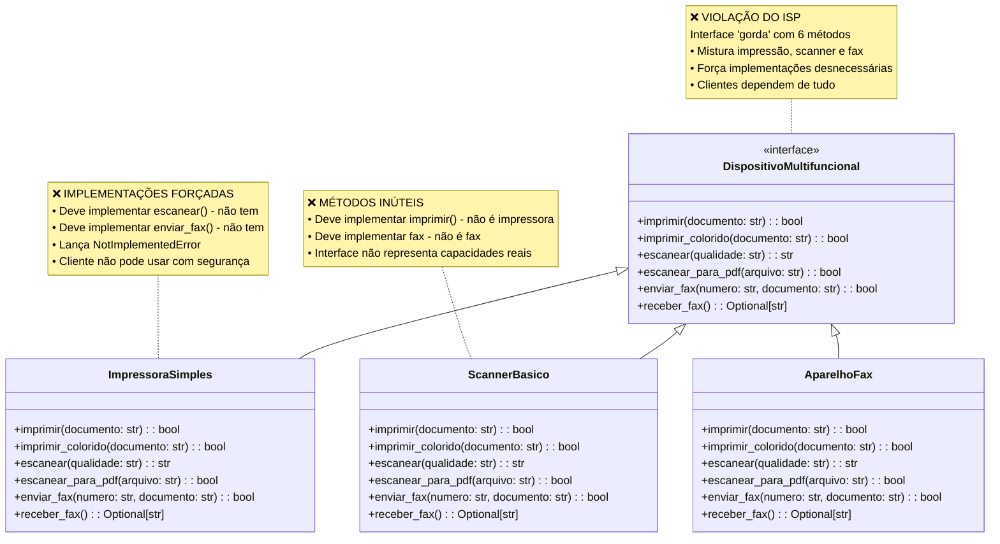

```mermaid
classDiagram
    class Imprimivel {
        <<Protocol>>
        +imprimir(documento: str): bool
    }
    
    class ImprimivelColorido {
        <<Protocol>>
        +imprimir_colorido(documento: str): bool
    }
    
    class Escaneavel {
        <<Protocol>>
        +escanear(qualidade: str): str
    }
    
    class EscaneavelPDF {
        <<Protocol>>
        +escanear_para_pdf(arquivo: str): bool
    }
    
    class EnviadorFax {
        <<Protocol>>
        +enviar_fax(numero: str, documento: str): bool
    }
    
    class ReceptorFax {
        <<Protocol>>
        +receber_fax(): Optional[str]
    }
    
    class ImpressoraSimples {
        +imprimir(documento: str): bool
    }
    
    class ImpressoraColorida {
        +imprimir(documento: str): bool
        +imprimir_colorido(documento: str): bool
    }
    
    class ScannerBasico {
        +escanear(qualidade: str): str
    }
    
    class ScannerAvancado {
        +escanear(qualidade: str): str
        +escanear_para_pdf(arquivo: str): bool
    }
    
    class AparelhoFax {
        +enviar_fax(numero: str, documento: str): bool
        +receber_fax(): Optional[str]
    }
    
    class MultifuncionalCompleta {
        -papel_disponivel: bool
        -tinta_colorida: bool
        +imprimir(documento: str): bool
        +imprimir_colorido(documento: str): bool
        +escanear(qualidade: str): str
        +escanear_para_pdf(arquivo: str): bool
        +enviar_fax(numero: str, documento: str): bool
        +receber_fax(): Optional[str]
    }
    
    %% Herança de interfaces
    Imprimivel <|-- ImprimivelColorido
    Escaneavel <|-- EscaneavelPDF
    
    %% Implementações especializadas
    Imprimivel <|.. ImpressoraSimples
    
    Imprimivel <|.. ImpressoraColorida
    ImprimivelColorido <|.. ImpressoraColorida
    
    Escaneavel <|.. ScannerBasico
    
    Escaneavel <|.. ScannerAvancado
    EscaneavelPDF <|.. ScannerAvancado
    
    EnviadorFax <|.. AparelhoFax
    ReceptorFax <|.. AparelhoFax
    
    %% Multifuncional implementa múltiplas interfaces
    Imprimivel <|.. MultifuncionalCompleta
    ImprimivelColorido <|.. MultifuncionalCompleta
    Escaneavel <|.. MultifuncionalCompleta
    EscaneavelPDF <|.. MultifuncionalCompleta
    EnviadorFax <|.. MultifuncionalCompleta
    ReceptorFax <|.. MultifuncionalCompleta
    
    note for Imprimivel "✅ INTERFACE COESA
    • Focada apenas em impressão
    • Todos que implementam podem imprimir
    • Sem dependências desnecessárias"
    
    note for ImpressoraSimples "✅ IMPLEMENTAÇÃO MÍNIMA
    • Implementa apenas o que consegue
    • Sem métodos vazios
    • Interface representa capacidade real"
    
    note for MultifuncionalCompleta "✅ IMPLEMENTAÇÃO COMPLETA
    • Implementa múltiplas interfaces
    • Cada interface é uma capacidade real
    • Composição de funcionalidades"
```

# Interface Segregation Principle (ISP) - Princípio da Segregação de Interface

O Interface Segregation Principle (ISP) é o quarto princípio SOLID, formulado por Robert C. Martin. É um princípio que foca na **granularidade** e **coesão** das interfaces, garantindo que os clientes não sejam forçados a depender de funcionalidades que não utilizam.

**Definição**: *"Nenhum cliente deve ser forçado a depender de métodos que não utiliza"*

**Reformulação prática**: *"Muitas interfaces específicas são melhores que uma interface geral"*

Em outras palavras, é melhor ter **muitas interfaces específicas** do que uma **interface geral e "gorda"**. O ISP promove a criação de interfaces coesas e focadas, evitando que clientes sejam obrigados a implementar funcionalidades que não precisam ou não podem fornecer.


### Conceitos-chave do ISP:

- **Segregação de responsabilidades**: Interfaces devem ser focadas e específicas
- **Acoplamento reduzido**: Clientes dependem apenas do que realmente precisam
- **Coesão alta**: Métodos relacionados ficam juntos
- **Evitar "fat interfaces"**: Interfaces inchadas que fazem muitas coisas
- **Flexibilidade**: Permite implementações parciais e especializadas
- **Manutenibilidade**: Mudanças em uma interface não afetam clientes não relacionados

O ISP está intimamente relacionado ao Single Responsibility Principle, mas enquanto o SRP foca nas classes, o ISP foca especificamente nas interfaces e contratos. Uma interface que viola o ISP força seus implementadores a criar métodos vazios ou que lançam exceções, indicando uma abstração mal projetada.

## Exemplo Prático

### ❌ Má Prática: Violando o ISP

#### Diagrama de Classes


#### Implementação

```python
from abc import ABC, abstractmethod
from typing import Optional

class DispositivoMultifuncional(ABC):
    """❌ VIOLAÇÃO DO ISP: Interface 'gorda' que força implementações desnecessárias"""
    
    # Funcionalidades de impressão
    @abstractmethod
    def imprimir(self, documento: str) -> bool:
        pass
    
    @abstractmethod
    def imprimir_colorido(self, documento: str) -> bool:
        pass
    
    # Funcionalidades de scanner
    @abstractmethod
    def escanear(self, qualidade: str) -> str:
        pass
    
    @abstractmethod
    def escanear_para_pdf(self, arquivo: str) -> bool:
        pass
    
    # Funcionalidades de fax
    @abstractmethod
    def enviar_fax(self, numero: str, documento: str) -> bool:
        pass
    
    @abstractmethod
    def receber_fax(self) -> Optional[str]:
        pass

# ❌ Implementações forçadas a implementar funcionalidades que não possuem
class ImpressoraSimples(DispositivoMultifuncional):
    """Impressora básica forçada a implementar scanner e fax"""
    
    def imprimir(self, documento: str) -> bool:
        print(f"Imprimindo: {documento}")
        return True
    
    def imprimir_colorido(self, documento: str) -> bool:
        # ❌ Não tem impressão colorida
        raise NotImplementedError("Esta impressora não suporta cores")
    
    def escanear(self, qualidade: str) -> str:
        # ❌ Não é scanner
        raise NotImplementedError("Esta impressora não pode escanear")
    
    def escanear_para_pdf(self, arquivo: str) -> bool:
        # ❌ Não é scanner
        raise NotImplementedError("Esta impressora não pode escanear para PDF")
    
    def enviar_fax(self, numero: str, documento: str) -> bool:
        # ❌ Não é fax
        raise NotImplementedError("Esta impressora não pode enviar fax")
    
    def receber_fax(self) -> Optional[str]:
        # ❌ Não é fax
        raise NotImplementedError("Esta impressora não pode receber fax")

class ScannerBasico(DispositivoMultifuncional):
    """Scanner básico forçado a implementar impressão e fax"""
    
    def imprimir(self, documento: str) -> bool:
        # ❌ Não é impressora
        raise NotImplementedError("Scanner não pode imprimir")
    
    def imprimir_colorido(self, documento: str) -> bool:
        # ❌ Não é impressora
        raise NotImplementedError("Scanner não pode imprimir")
    
    def escanear(self, qualidade: str) -> str:
        print(f"Escaneando com qualidade: {qualidade}")
        return f"documento_escaneado_{qualidade}.jpg"
    
    def escanear_para_pdf(self, arquivo: str) -> bool:
        print(f"Escaneando para PDF: {arquivo}")
        return True
    
    def enviar_fax(self, numero: str, documento: str) -> bool:
        # ❌ Não é fax
        raise NotImplementedError("Scanner não pode enviar fax")
    
    def receber_fax(self) -> Optional[str]:
        # ❌ Não é fax
        raise NotImplementedError("Scanner não pode receber fax")

class AparelhoFax(DispositivoMultifuncional):
    """Aparelho de fax forçado a implementar impressão e scanner"""
    
    def imprimir(self, documento: str) -> bool:
        # ❌ Não é impressora moderna
        raise NotImplementedError("Fax não pode imprimir documentos externos")
    
    def imprimir_colorido(self, documento: str) -> bool:
        # ❌ Não é impressora
        raise NotImplementedError("Fax não suporta impressão colorida")
    
    def escanear(self, qualidade: str) -> str:
        # ❌ Não é scanner moderno
        raise NotImplementedError("Fax não pode escanear externamente")
    
    def escanear_para_pdf(self, arquivo: str) -> bool:
        # ❌ Não é scanner
        raise NotImplementedError("Fax não pode escanear para PDF")
    
    def enviar_fax(self, numero: str, documento: str) -> bool:
        print(f"Enviando fax para {numero}: {documento}")
        return True
    
    def receber_fax(self) -> Optional[str]:
        print("Verificando fax recebido...")
        return "fax_recebido_001.txt"

# ❌ Problemas no uso
def demonstrar_problemas():
    dispositivos = [
        ImpressoraSimples(),
        ScannerBasico(),
        AparelhoFax()
    ]
    
    for dispositivo in dispositivos:
        print(f"\nTestando {type(dispositivo).__name__}:")
        
        try:
            dispositivo.imprimir("teste.txt")
            print("✅ Impressão funcionou")
        except NotImplementedError as e:
            print(f"❌ Erro na impressão: {e}")
        
        try:
            dispositivo.escanear("media")
            print("✅ Scanner funcionou")
        except NotImplementedError as e:
            print(f"❌ Erro no scanner: {e}")
        
        try:
            dispositivo.enviar_fax("123456", "documento")
            print("✅ Fax funcionou")
        except NotImplementedError as e:
            print(f"❌ Erro no fax: {e}")
```
#### Análise do Exemplo
Neste exemplo, temos uma interface `DispositivoMultifuncional` que viola o ISP ao incluir métodos para impressão, escaneamento e envio/recebimento de fax. As classes `ImpressoraSimples`, `ScannerBasico` e `AparelhoFax` são forçadas a implementar métodos que não fazem sentido para suas funcionalidades reais.

Isso resulta em implementações que lançam exceções ou não fazem sentido, indicando uma má abstração. Cada classe deveria ter sua própria interface específica, como `Impressora`, `Scanner` e `Fax`, permitindo que os clientes dependam apenas do que realmente utilizam.

### ✅ Boa Prática: Seguindo o ISP

#### Diagrama de Classes


#### Implementação

```python
from typing import Protocol

# ✅ Interfaces segregadas e focadas
class Imprimivel(Protocol):
    """Interface focada apenas em impressão básica"""
    def imprimir(self, documento: str) -> bool: ...

class ImprimivelColorido(Imprimivel, Protocol):
    """Interface para impressão colorida (herda de Imprimivel)"""
    def imprimir_colorido(self, documento: str) -> bool: ...

class Escaneavel(Protocol):
    """Interface focada apenas em scanner"""
    def escanear(self, qualidade: str) -> str: ...

class EscaneavelPDF(Escaneavel, Protocol):
    """Interface para scanner avançado (herda de Escaneavel)"""
    def escanear_para_pdf(self, arquivo: str) -> bool: ...

class EnviadorFax(Protocol):
    """Interface focada em envio de fax"""
    def enviar_fax(self, numero: str, documento: str) -> bool: ...

class ReceptorFax(Protocol):
    """Interface focada em recepção de fax"""
    def receber_fax(self) -> Optional[str]: ...

# ✅ Implementações especializadas que implementam apenas o que conseguem fazer
class ImpressoraSimples:
    """Implementa apenas impressão básica"""
    
    def imprimir(self, documento: str) -> bool:
        print(f"🖨️ Imprimindo: {documento}")
        return True

class ImpressoraColorida:
    """Implementa impressão básica E colorida"""
    
    def imprimir(self, documento: str) -> bool:
        print(f"🖨️ Imprimindo P&B: {documento}")
        return True
    
    def imprimir_colorido(self, documento: str) -> bool:
        print(f"🌈 Imprimindo colorido: {documento}")
        return True

class ScannerBasico:
    """Implementa apenas scanner básico"""
    
    def escanear(self, qualidade: str) -> str:
        arquivo = f"scan_{qualidade}.jpg"
        print(f"📷 Escaneando com qualidade {qualidade}: {arquivo}")
        return arquivo

class ScannerAvancado:
    """Implementa scanner básico E avançado"""
    
    def escanear(self, qualidade: str) -> str:
        arquivo = f"scan_avancado_{qualidade}.jpg"
        print(f"📷 Escaneando com qualidade {qualidade}: {arquivo}")
        return arquivo
    
    def escanear_para_pdf(self, arquivo: str) -> bool:
        print(f"📄 Escaneando diretamente para PDF: {arquivo}")
        return True

class AparelhoFax:
    """Implementa funcionalidades de fax"""
    
    def enviar_fax(self, numero: str, documento: str) -> bool:
        print(f"📠 Enviando fax para {numero}: {documento}")
        return True
    
    def receber_fax(self) -> Optional[str]:
        fax_recebido = "fax_001.txt"
        print(f"📥 Fax recebido: {fax_recebido}")
        return fax_recebido

class MultifuncionalCompleta:
    """Implementa múltiplas interfaces - dispositivo que realmente tem todas as funcionalidades"""
    
    def __init__(self):
        self.papel_disponivel = True
        self.tinta_colorida = True
    
    # Implementa Imprimivel
    def imprimir(self, documento: str) -> bool:
        print(f"🖨️ [Multifuncional] Imprimindo P&B: {documento}")
        return True
    
    # Implementa ImprimivelColorido
    def imprimir_colorido(self, documento: str) -> bool:
        if not self.tinta_colorida:
            print("❌ Sem tinta colorida!")
            return False
        print(f"🌈 [Multifuncional] Imprimindo colorido: {documento}")
        return True
    
    # Implementa Escaneavel
    def escanear(self, qualidade: str) -> str:
        arquivo = f"multiscan_{qualidade}.jpg"
        print(f"📷 [Multifuncional] Escaneando: {arquivo}")
        return arquivo
    
    # Implementa EscaneavelPDF
    def escanear_para_pdf(self, arquivo: str) -> bool:
        print(f"📄 [Multifuncional] Escaneando para PDF: {arquivo}")
        return True
    
    # Implementa EnviadorFax
    def enviar_fax(self, numero: str, documento: str) -> bool:
        print(f"📠 [Multifuncional] Enviando fax para {numero}: {documento}")
        return True
    
    # Implementa ReceptorFax
    def receber_fax(self) -> Optional[str]:
        fax = "multifax_001.txt"
        print(f"📥 [Multifuncional] Fax recebido: {fax}")
        return fax

# ✅ Clientes especializados que usam apenas as interfaces necessárias
def cliente_apenas_impressao(impressora: Imprimivel):
    """Cliente que só precisa imprimir - funciona com qualquer Imprimivel"""
    return impressora.imprimir("documento_importante.txt")

def cliente_impressao_colorida(impressora: ImprimivelColorido):
    """Cliente que precisa de impressão colorida"""
    impressora.imprimir("documento_pb.txt")
    return impressora.imprimir_colorido("apresentacao_colorida.ppt")

def cliente_digitalizacao(scanner: Escaneavel):
    """Cliente que só precisa escanear"""
    return scanner.escanear("alta")

def cliente_digitalizacao_pdf(scanner: EscaneavelPDF):
    """Cliente que precisa escanear para PDF"""
    scanner.escanear("media")
    return scanner.escanear_para_pdf("relatorio.pdf")

def cliente_comunicacao_fax(fax_enviador: EnviadorFax, fax_receptor: ReceptorFax):
    """Cliente que trabalha com fax"""
    fax_enviador.enviar_fax("11999999999", "contrato.txt")
    return fax_receptor.receber_fax()

def cliente_escritorio_completo(
    impressora: Imprimivel,
    scanner: Escaneavel,
    fax: EnviadorFax
):
    """Cliente que usa múltiplas funcionalidades, mas cada uma através de sua interface específica"""
    documento = scanner.escanear("alta")
    impressora.imprimir(documento)
    fax.enviar_fax("11888888888", documento)

# ✅ Demonstração das vantagens
def demonstrar_solucoes():
    print("=== SOLUÇÕES SEGUINDO O ISP ===\n")
    
    # Dispositivos especializados
    impressora_simples = ImpressoraSimples()
    impressora_colorida = ImpressoraColorida()
    scanner_basico = ScannerBasico()
    scanner_avancado = ScannerAvancado()
    fax = AparelhoFax()
    multifuncional = MultifuncionalCompleta()
    
    print("1. Cliente que só imprime:")
    cliente_apenas_impressao(impressora_simples)
    cliente_apenas_impressao(impressora_colorida)
    cliente_apenas_impressao(multifuncional)
    
    print("\n2. Cliente que precisa de impressão colorida:")
    cliente_impressao_colorida(impressora_colorida)
    cliente_impressao_colorida(multifuncional)
    # Note: impressora_simples NÃO implementa ImprimivelColorido
    
    print("\n3. Cliente que só digitaliza:")
    cliente_digitalizacao(scanner_basico)
    cliente_digitalizacao(scanner_avancado)
    cliente_digitalizacao(multifuncional)
    
    print("\n4. Cliente que precisa de PDF:")
    cliente_digitalizacao_pdf(scanner_avancado)
    cliente_digitalizacao_pdf(multifuncional)
    # Note: scanner_basico NÃO implementa EscaneavelPDF
    
    print("\n5. Cliente que usa fax:")
    cliente_comunicacao_fax(fax, fax)
    cliente_comunicacao_fax(multifuncional, multifuncional)
    
    print("\n6. Cliente que usa múltiplas funcionalidades:")
    cliente_escritorio_completo(multifuncional, multifuncional, multifuncional)

if __name__ == "__main__":
    print("=== DEMONSTRAÇÃO DOS PROBLEMAS ===")
    demonstrar_problemas()
    print("\n" + "="*50 + "\n")
    demonstrar_solucoes()
```
#### Análise do Exemplo

Neste exemplo, aplicamos o ISP criando interfaces específicas para cada funcionalidade: `Imprimivel`, `Escaneavel`, `EnviadorFax`, etc. Cada classe implementa apenas as interfaces que realmente utiliza, evitando a necessidade de métodos vazios ou exceções.

Isso resulta em um design mais limpo, onde os clientes podem depender apenas do que realmente precisam. Por exemplo, `ImpressoraSimples` implementa apenas `Imprimivel`, enquanto `ScannerAvancado` implementa tanto `Escaneavel` quanto `EscaneavelPDF`.

### Conclusão

O Interface Segregation Principle (ISP) é fundamental para criar sistemas modulares e flexíveis, onde as interfaces são projetadas para atender às necessidades específicas dos clientes sem impor dependências desnecessárias. Ao seguir o ISP, os desenvolvedores podem evitar problemas comuns de design, como interfaces "gordas" e implementações forçadas, resultando em código mais limpo, coeso e fácil de manter.