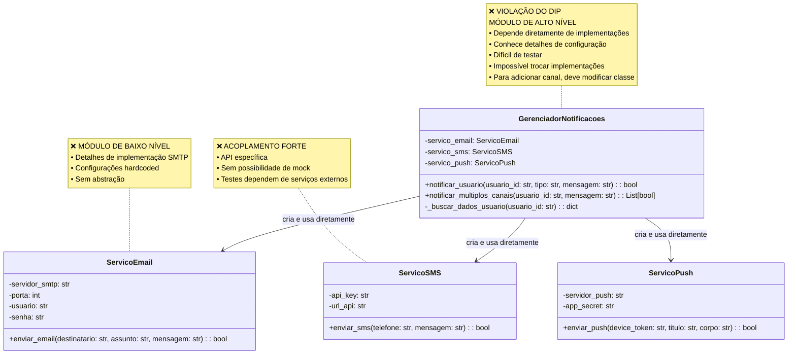
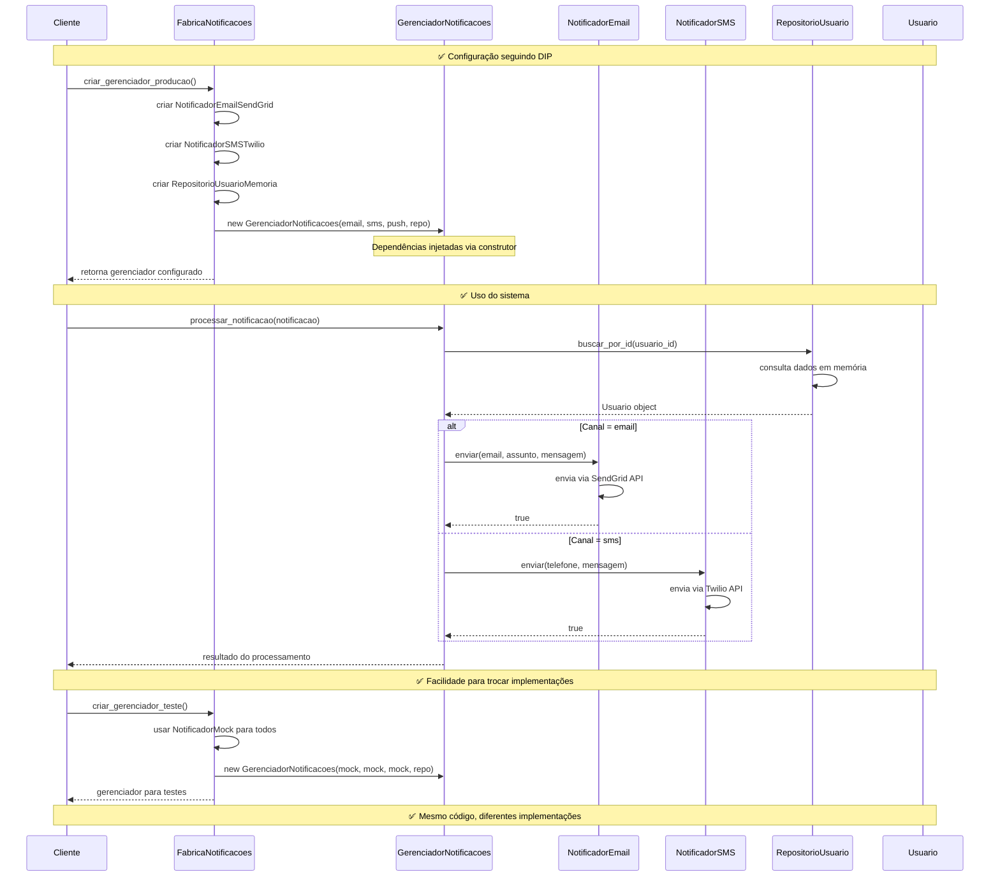
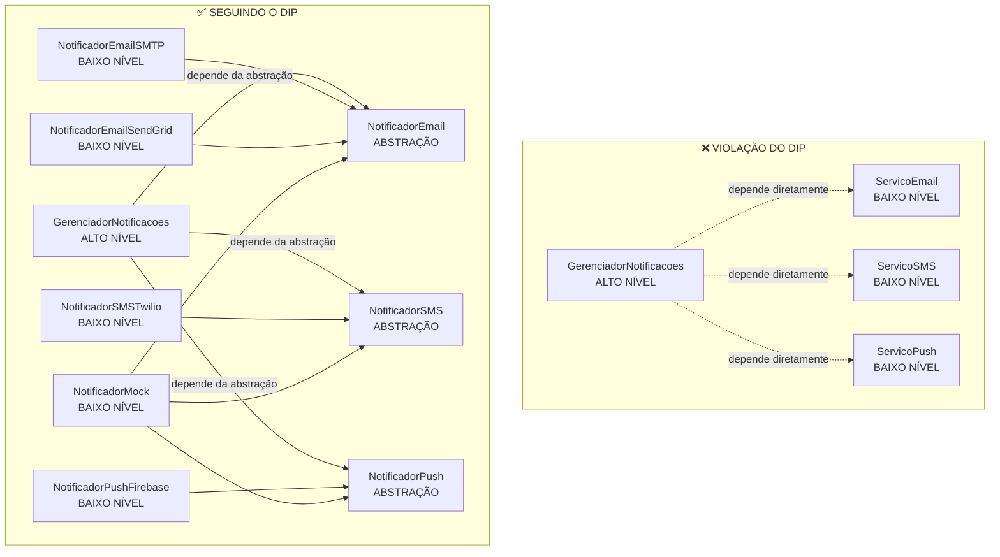

# Dependency Inversion Principle (DIP) - Princípio da Inversão de Dependência

O Dependency Inversion Principle (DIP) é o quinto e último princípio SOLID, formulado por Robert C. Martin. É considerado um dos mais transformadores para a arquitetura de software. O princípio estabelece:

> **"Módulos de alto nível não devem depender de módulos de baixo nível. Ambos devem depender de abstrações"**

> **"Abstrações não devem depender de detalhes. Detalhes devem depender de abstrações"**

## Conceitos-chave:

- **Inversão de dependência**: Classes de alto nível não conhecem implementações específicas
- **Abstrações como contratos**: Interfaces definem o que é feito, não como
- **Injeção de dependência**: Dependências são fornecidas externamente
- **Desacoplamento**: Facilita testes, manutenção e extensibilidade
- **Módulos de alto nível**: Contêm a lógica de negócio principal
- **Módulos de baixo nível**: Lidam com detalhes de implementação (BD, APIs, arquivos)

## Benefícios da Aplicação do DIP

### 1. **Testabilidade**
```python
# ✅ Fácil criar testes unitários
def test_notificacao_email():
    # Arrange
    mock = NotificadorMock()
    repo = RepositorioUsuarioMemoria()
    gerenciador = GerenciadorNotificacoes(mock, mock, mock, repo)
    
    notificacao = Notificacao("123", "Teste", "Mensagem teste", "email")
    
    # Act
    resultado = gerenciador.processar_notificacao(notificacao)
    
    # Assert
    assert resultado == True
    assert len(mock.emails_enviados) == 1
    assert "joao@email.com" in mock.emails_enviados[0]
```

### 2. **Flexibilidade de Configuração**
```python
# ✅ Diferentes configurações para diferentes ambientes

# Desenvolvimento - usa mocks
gerenciador_dev = FabricaNotificacoes.criar_gerenciador_teste()

# Produção - usa serviços reais
gerenciador_prod = FabricaNotificacoes.criar_gerenciador_producao()

# Configuração personalizada
gerenciador_custom = GerenciadorNotificacoes(
    notificador_email=NotificadorEmailSMTP(...),  # SMTP interno
    notificador_sms=NotificadorSMSTwilio(...),    # Twilio
    notificador_push=NotificadorPushFirebase(...), # Firebase
    repositorio_usuario=RepositorioBancoDados(...)  # Banco real
)
```

### 3. **Extensibilidade**
```python
# ✅ Fácil adicionar novas implementações
class NotificadorEmailMailgun(NotificadorEmail):
    def __init__(self, api_key: str, domain: str):
        self.api_key = api_key
        self.domain = domain
    
    def enviar(self, destinatario: str, assunto: str, mensagem: str) -> bool:
        # Implementação Mailgun
        return True

# Trocar implementação sem modificar código existente
gerenciador = GerenciadorNotificacoes(
    notificador_email=NotificadorEmailMailgun("key", "domain.com"),
    # ... outras dependências
)
```

### 4. **Manutenibilidade**
- **Separação clara** entre lógica de negócio e detalhes de implementação
- **Mudanças isoladas** - alterar um provedor não afeta a lógica principal
- **Código mais limpo** - cada classe tem uma responsabilidade específica

### 5. **Reutilização**
- **Abstrações estáveis** podem ser reutilizadas em diferentes contextos
- **Implementações específicas** podem ser compartilhadas entre projetos
- **Lógica de negócio** independente de detalhes técnicos

## Sinais de Violação do DIP

- **Imports de módulos concretos** em classes de alto nível
- **Instanciação direta** de dependências com `new` ou chamadas diretas
- **Configurações hardcoded** dentro das classes de negócio
- **Dificuldade para testar** devido a dependências externas
- **Classes que fazem muitas coisas** (violam SRP por conhecer detalhes)
- **Uso de `isinstance()`** para verificar tipos específicos
- **Comentários explicando** "como trocar" implementações

## Relação com Outros Princípios SOLID

### DIP + SRP
```python
# ✅ Cada classe tem uma responsabilidade E depende de abstrações
class ProcessadorPedido:  # SRP: só processa pedidos
    def __init__(self, calculadora: CalculadoraPreco):  # DIP: depende de abstração
        self._calculadora = calculadora
```

### DIP + OCP
```python
# ✅ Aberto para extensão via novas implementações
class NotificadorWhatsApp(NotificadorSMS):  # Estende sem modificar código existente
    def enviar(self, telefone: str, mensagem: str) -> bool:
        # Nova implementação
        return True
```

### DIP + ISP
```python
# ✅ Depende apenas das interfaces que precisa
class ProcessadorEmail:
    def __init__(self, 
                 enviador: EnviadorEmail,      # Interface específica
                 template: GeradorTemplate):   # Interface específica
        # Não depende de interface "gorda" de comunicação
```

## Exemplo Prático

### ❌ Má Prática: Violando o DIP

#### Diagrama de Classes

#### Implementação
```python
import smtplib
import requests
from email.mime.text import MIMEText
from typing import List

# ❌ Módulos de baixo nível - implementações concretas
class ServicoEmail:
    """Implementação concreta para envio de email"""
    
    def __init__(self, servidor_smtp: str, porta: int, usuario: str, senha: str):
        self.servidor_smtp = servidor_smtp
        self.porta = porta
        self.usuario = usuario
        self.senha = senha
    
    def enviar_email(self, destinatario: str, assunto: str, mensagem: str) -> bool:
        try:
            server = smtplib.SMTP(self.servidor_smtp, self.porta)
            server.starttls()
            server.login(self.usuario, self.senha)
            
            email = MIMEText(mensagem)
            email['Subject'] = assunto
            email['From'] = self.usuario
            email['To'] = destinatario
            
            server.send_message(email)
            server.quit()
            print(f"✅ Email enviado para {destinatario}")
            return True
        except Exception as e:
            print(f"❌ Erro ao enviar email: {e}")
            return False

class ServicoSMS:
    """Implementação concreta para envio de SMS"""
    
    def __init__(self, api_key: str, url_api: str):
        self.api_key = api_key
        self.url_api = url_api
    
    def enviar_sms(self, telefone: str, mensagem: str) -> bool:
        try:
            payload = {
                'api_key': self.api_key,
                'phone': telefone,
                'message': mensagem
            }
            response = requests.post(self.url_api, json=payload)
            
            if response.status_code == 200:
                print(f"✅ SMS enviado para {telefone}")
                return True
            else:
                print(f"❌ Erro HTTP: {response.status_code}")
                return False
        except Exception as e:
            print(f"❌ Erro ao enviar SMS: {e}")
            return False

class ServicoPush:
    """Implementação concreta para notificações push"""
    
    def __init__(self, servidor_push: str, app_secret: str):
        self.servidor_push = servidor_push
        self.app_secret = app_secret
    
    def enviar_push(self, device_token: str, titulo: str, corpo: str) -> bool:
        try:
            headers = {'Authorization': f'Bearer {self.app_secret}'}
            payload = {
                'device_token': device_token,
                'title': titulo,
                'body': corpo
            }
            response = requests.post(self.servidor_push, json=payload, headers=headers)
            
            if response.status_code == 200:
                print(f"✅ Push enviado para {device_token[:10]}...")
                return True
            else:
                print(f"❌ Erro HTTP push: {response.status_code}")
                return False
        except Exception as e:
            print(f"❌ Erro ao enviar push: {e}")
            return False

# ❌ VIOLAÇÃO DO DIP: Módulo de alto nível depende diretamente de módulos de baixo nível
class GerenciadorNotificacoes:
    """
    ❌ CLASSE DE ALTO NÍVEL que depende diretamente de implementações concretas
    Viola o DIP pois conhece detalhes específicos de cada serviço
    """
    
    def __init__(self):
        # ❌ Dependências hardcoded - acoplamento forte
        self.servico_email = ServicoEmail(
            servidor_smtp="smtp.gmail.com",
            porta=587,
            usuario="sistema@empresa.com",
            senha="senha_secreta"
        )
        
        self.servico_sms = ServicoSMS(
            api_key="sms_api_key_123",
            url_api="https://api.sms.com/send"
        )
        
        self.servico_push = ServicoPush(
            servidor_push="https://api.push.com/send",
            app_secret="push_secret_456"
        )
    
    def notificar_usuario(self, usuario_id: str, tipo: str, mensagem: str) -> bool:
        """❌ Lógica de alto nível misturada com detalhes de implementação"""
        
        # Simula busca de dados do usuário
        usuario_dados = self._buscar_dados_usuario(usuario_id)
        
        if tipo == "email":
            # ❌ Depende da interface específica do ServicoEmail
            return self.servico_email.enviar_email(
                destinatario=usuario_dados["email"],
                assunto="Notificação do Sistema",
                mensagem=mensagem
            )
        
        elif tipo == "sms":
            # ❌ Depende da interface específica do ServicoSMS
            return self.servico_sms.enviar_sms(
                telefone=usuario_dados["telefone"],
                mensagem=mensagem
            )
        
        elif tipo == "push":
            # ❌ Depende da interface específica do ServicoPush
            return self.servico_push.enviar_push(
                device_token=usuario_dados["device_token"],
                titulo="Notificação",
                corpo=mensagem
            )
        
        else:
            print(f"❌ Tipo de notificação não suportado: {tipo}")
            return False
    
    def notificar_multiplos_canais(self, usuario_id: str, mensagem: str) -> List[bool]:
        """❌ Para adicionar novo canal, precisa modificar esta classe"""
        resultados = []
        
        # ❌ Hardcoded - não extensível
        resultados.append(self.notificar_usuario(usuario_id, "email", mensagem))
        resultados.append(self.notificar_usuario(usuario_id, "sms", mensagem))
        resultados.append(self.notificar_usuario(usuario_id, "push", mensagem))
        
        return resultados
    
    def _buscar_dados_usuario(self, usuario_id: str) -> dict:
        """Simula busca de dados do usuário"""
        return {
            "email": f"usuario{usuario_id}@email.com",
            "telefone": f"+5511999{usuario_id}",
            "device_token": f"device_token_{usuario_id}_xyz"
        }

# ❌ Problemas no uso
def demonstrar_problemas():
    print("=== PROBLEMAS COM VIOLAÇÃO DO DIP ===\n")
    
    # ❌ Instanciação rígida - não pode trocar implementações
    gerenciador = GerenciadorNotificacoes()
    
    print("1. Testando notificações:")
    
    # ❌ Difícil de testar - dependências externas hardcoded
    sucesso_email = gerenciador.notificar_usuario("123", "email", "Teste de mensagem")
    sucesso_sms = gerenciador.notificar_usuario("123", "sms", "Teste de SMS")
    sucesso_push = gerenciador.notificar_usuario("123", "push", "Teste de Push")
    
    print(f"\nResultados: Email={sucesso_email}, SMS={sucesso_sms}, Push={sucesso_push}")
    
    # ❌ Para adicionar WhatsApp, seria necessário:
    # 1. Criar ServicoWhatsApp
    # 2. Modificar GerenciadorNotificacoes.__init__()
    # 3. Modificar notificar_usuario()
    # 4. Modificar notificar_multiplos_canais()
    
    print("\n❌ Problemas identificados:")
    print("- Impossível testar sem conexões reais")
    print("- Difícil trocar implementações (ex: outro provedor de SMS)")
    print("- Adicionar novo canal requer modificar classe de alto nível")
    print("- Configurações hardcoded")
    print("- Alto acoplamento entre camadas")
```

#### Análise do Exemplo
- **Acoplamento forte**: O `GerenciadorNotificacoes` depende diretamente de implementações concretas (`ServicoEmail`, `ServicoSMS`, `ServicoPush`), violando o DIP.
- **Dificuldade de teste**: É impossível testar o `GerenciadorNotificacoes` sem conexões reais, pois ele instancia diretamente os serviços.
- **Extensibilidade limitada**: Para adicionar um novo canal (ex: WhatsApp), seria necessário modificar o código do `GerenciadorNotificacoes`, o que viola o OCP.

### ✅ Boa Prática: Aplicando o DIP

#### Diagrama de Classes

```mermaid
classDiagram
    direction TB
    
    %% Abstrações (contratos)
    class NotificadorEmail {
        <<abstract>>
        +enviar(destinatario: str, assunto: str, mensagem: str): bool
    }
    
    class NotificadorSMS {
        <<abstract>>
        +enviar(telefone: str, mensagem: str): bool
    }
    
    class NotificadorPush {
        <<abstract>>
        +enviar(device_token: str, titulo: str, corpo: str): bool
    }
    
    class RepositorioUsuario {
        <<abstract>>
        +buscar_por_id(usuario_id: str): Optional[Usuario]
    }
    
    %% Entidades de domínio
    class Usuario {
        +id: str
        +email: str
        +telefone: str
        +device_token: str
        +preferencias_notificacao: Dict[str, bool]
    }
    
    class Notificacao {
        +destinatario_id: str
        +titulo: str
        +mensagem: str
        +canal: str
        +prioridade: str
    }
    
    %% Módulo de alto nível
    class GerenciadorNotificacoes {
        -_notificador_email: NotificadorEmail
        -_notificador_sms: NotificadorSMS
        -_notificador_push: NotificadorPush
        -_repositorio_usuario: RepositorioUsuario
        -_notificadores: Dict[str, function]
        +processar_notificacao(notificacao: Notificacao): bool
        +notificar_multiplos_canais(usuario_id: str, titulo: str, mensagem: str, canais: List[str]): Dict[str, bool]
        +adicionar_canal(nome: str, funcao_envio): void
        -_enviar_email(usuario: Usuario, notificacao: Notificacao): bool
        -_enviar_sms(usuario: Usuario, notificacao: Notificacao): bool
        -_enviar_push(usuario: Usuario, notificacao: Notificacao): bool
    }
    
    %% Implementações concretas (módulos de baixo nível)
    class NotificadorEmailSMTP {
        -servidor: str
        -porta: int
        -usuario: str
        -senha: str
        +enviar(destinatario: str, assunto: str, mensagem: str): bool
    }
    
    class NotificadorEmailSendGrid {
        -api_key: str
        +enviar(destinatario: str, assunto: str, mensagem: str): bool
    }
    
    class NotificadorSMSTwilio {
        -account_sid: str
        -auth_token: str
        +enviar(telefone: str, mensagem: str): bool
    }
    
    class NotificadorPushFirebase {
        -server_key: str
        +enviar(device_token: str, titulo: str, corpo: str): bool
    }
    
    class RepositorioUsuarioMemoria {
        -_usuarios: Dict[str, Usuario]
        +buscar_por_id(usuario_id: str): Optional[Usuario]
    }
    
    class NotificadorMock {
        +emails_enviados: List
        +sms_enviados: List
        +pushes_enviados: List
        +enviar(destinatario: str, assunto: str, mensagem: str): bool
        +enviar(telefone: str, mensagem: str): bool
        +enviar(device_token: str, titulo: str, corpo: str): bool
    }
    
    class FabricaNotificacoes {
        +criar_gerenciador_producao()$ GerenciadorNotificacoes
        +criar_gerenciador_teste()$ GerenciadorNotificacoes
    }
    
    %% Dependências invertidas (CORRETO)
    GerenciadorNotificacoes --> NotificadorEmail : depende da abstração
    GerenciadorNotificacoes --> NotificadorSMS : depende da abstração
    GerenciadorNotificacoes --> NotificadorPush : depende da abstração
    GerenciadorNotificacoes --> RepositorioUsuario : depende da abstração
    GerenciadorNotificacoes --> Usuario : usa entidade de domínio
    GerenciadorNotificacoes --> Notificacao : usa value object
    
    %% Implementações dependem das abstrações
    NotificadorEmail <|-- NotificadorEmailSMTP : implementa
    NotificadorEmail <|-- NotificadorEmailSendGrid : implementa
    NotificadorEmail <|-- NotificadorMock : implementa
    NotificadorSMS <|-- NotificadorSMSTwilio : implementa
    NotificadorSMS <|-- NotificadorMock : implementa
    NotificadorPush <|-- NotificadorPushFirebase : implementa
    NotificadorPush <|-- NotificadorMock : implementa
    RepositorioUsuario <|-- RepositorioUsuarioMemoria : implementa
    
    %% Factory cria configurações
    FabricaNotificacoes ..> GerenciadorNotificacoes : cria
    FabricaNotificacoes ..> NotificadorEmailSendGrid : usa
    FabricaNotificacoes ..> NotificadorSMSTwilio : usa
    FabricaNotificacoes ..> NotificadorPushFirebase : usa
    FabricaNotificacoes ..> NotificadorMock : usa
    
    note for GerenciadorNotificacoes "✅ SEGUE O DIP
    MÓDULO DE ALTO NÍVEL
    • Depende apenas de abstrações
    • Não conhece implementações específicas
    • Facilmente testável
    • Implementações intercambiáveis
    • Extensível sem modificação"
    
    note for NotificadorEmail "✅ ABSTRAÇÃO ESTÁVEL
    • Define contrato claro
    • Não muda com frequência
    • Permite múltiplas implementações"
    
    note for NotificadorMock "✅ TESTABILIDADE
    • Implementa múltiplas abstrações
    • Perfeito para testes unitários
    • Sem dependências externas"
```

### Fluxo de Injeção de Dependência


### Implementação
```python
from abc import ABC, abstractmethod
from typing import Dict, List, Optional
from dataclasses import dataclass

# ✅ ABSTRAÇÕES (módulos de alto nível dependem disto)
class NotificadorEmail(ABC):
    """Abstração para envio de email"""
    
    @abstractmethod
    def enviar(self, destinatario: str, assunto: str, mensagem: str) -> bool:
        pass

class NotificadorSMS(ABC):
    """Abstração para envio de SMS"""
    
    @abstractmethod
    def enviar(self, telefone: str, mensagem: str) -> bool:
        pass

class NotificadorPush(ABC):
    """Abstração para notificações push"""
    
    @abstractmethod
    def enviar(self, device_token: str, titulo: str, corpo: str) -> bool:
        pass

class RepositorioUsuario(ABC):
    """Abstração para acesso a dados de usuário"""
    
    @abstractmethod
    def buscar_por_id(self, usuario_id: str) -> Optional['Usuario']:
        pass

# ✅ Value Objects e Entidades de Domínio
@dataclass
class Usuario:
    """Entidade de domínio"""
    id: str
    email: str
    telefone: str
    device_token: str
    preferencias_notificacao: Dict[str, bool]

@dataclass
class Notificacao:
    """Value object para notificação"""
    destinatario_id: str
    titulo: str
    mensagem: str
    canal: str
    prioridade: str = "normal"

# ✅ MÓDULO DE ALTO NÍVEL - depende apenas de abstrações
class GerenciadorNotificacoes:
    """
    ✅ CLASSE DE ALTO NÍVEL que depende apenas de abstrações
    Segue o DIP - não conhece detalhes de implementação
    """
    
    def __init__(self, 
                 notificador_email: NotificadorEmail,
                 notificador_sms: NotificadorSMS,
                 notificador_push: NotificadorPush,
                 repositorio_usuario: RepositorioUsuario):
        # ✅ Dependências injetadas - baixo acoplamento
        self._notificador_email = notificador_email
        self._notificador_sms = notificador_sms
        self._notificador_push = notificador_push
        self._repositorio_usuario = repositorio_usuario
        
        # ✅ Mapeamento baseado em abstrações
        self._notificadores = {
            "email": self._enviar_email,
            "sms": self._enviar_sms,
            "push": self._enviar_push
        }
    
    def processar_notificacao(self, notificacao: Notificacao) -> bool:
        """✅ Lógica de alto nível pura - sem detalhes de implementação"""
        
        # Busca dados do usuário através da abstração
        usuario = self._repositorio_usuario.buscar_por_id(notificacao.destinatario_id)
        
        if not usuario:
            print(f"❌ Usuário {notificacao.destinatario_id} não encontrado")
            return False
        
        # Verifica preferências do usuário
        if not usuario.preferencias_notificacao.get(notificacao.canal, True):
            print(f"⚠️ Usuário {usuario.id} não aceita notificações via {notificacao.canal}")
            return False
        
        # Delega para o notificador apropriado
        notificador_func = self._notificadores.get(notificacao.canal)
        
        if not notificador_func:
            print(f"❌ Canal de notificação não suportado: {notificacao.canal}")
            return False
        
        return notificador_func(usuario, notificacao)
    
    def notificar_multiplos_canais(self, usuario_id: str, titulo: str, mensagem: str, 
                                 canais: List[str] = None) -> Dict[str, bool]:
        """✅ Extensível - novos canais são automaticamente suportados"""
        
        if canais is None:
            canais = list(self._notificadores.keys())
        
        resultados = {}
        
        for canal in canais:
            notificacao = Notificacao(
                destinatario_id=usuario_id,
                titulo=titulo,
                mensagem=mensagem,
                canal=canal
            )
            
            resultados[canal] = self.processar_notificacao(notificacao)
        
        return resultados
    
    def adicionar_canal(self, nome: str, funcao_envio) -> None:
        """✅ Permite adicionar novos canais sem modificar a classe"""
        self._notificadores[nome] = funcao_envio
    
    # ✅ Métodos privados que usam as abstrações
    def _enviar_email(self, usuario: Usuario, notificacao: Notificacao) -> bool:
        return self._notificador_email.enviar(
            destinatario=usuario.email,
            assunto=notificacao.titulo,
            mensagem=notificacao.mensagem
        )
    
    def _enviar_sms(self, usuario: Usuario, notificacao: Notificacao) -> bool:
        return self._notificador_sms.enviar(
            telefone=usuario.telefone,
            mensagem=f"{notificacao.titulo}: {notificacao.mensagem}"
        )
    
    def _enviar_push(self, usuario: Usuario, notificacao: Notificacao) -> bool:
        return self._notificador_push.enviar(
            device_token=usuario.device_token,
            titulo=notificacao.titulo,
            corpo=notificacao.mensagem
        )

# ✅ MÓDULOS DE BAIXO NÍVEL - implementam as abstrações
class NotificadorEmailSMTP(NotificadorEmail):
    """✅ Implementação concreta que implementa a abstração"""
    
    def __init__(self, servidor: str, porta: int, usuario: str, senha: str):
        self.servidor = servidor
        self.porta = porta
        self.usuario = usuario
        self.senha = senha
    
    def enviar(self, destinatario: str, assunto: str, mensagem: str) -> bool:
        # Simula envio via SMTP
        print(f"📧 [SMTP] Enviando email para {destinatario}")
        print(f"    Servidor: {self.servidor}:{self.porta}")
        print(f"    Assunto: {assunto}")
        return True

class NotificadorEmailSendGrid(NotificadorEmail):
    """✅ Implementação alternativa - fácil de trocar"""
    
    def __init__(self, api_key: str):
        self.api_key = api_key
    
    def enviar(self, destinatario: str, assunto: str, mensagem: str) -> bool:
        # Simula envio via SendGrid
        print(f"📧 [SendGrid] Enviando email para {destinatario}")
        print(f"    API Key: {self.api_key[:10]}...")
        print(f"    Assunto: {assunto}")
        return True

class NotificadorSMSTwilio(NotificadorSMS):
    """✅ Implementação concreta para SMS"""
    
    def __init__(self, account_sid: str, auth_token: str):
        self.account_sid = account_sid
        self.auth_token = auth_token
    
    def enviar(self, telefone: str, mensagem: str) -> bool:
        # Simula envio via Twilio
        print(f"📱 [Twilio] Enviando SMS para {telefone}")
        print(f"    Account: {self.account_sid[:10]}...")
        print(f"    Mensagem: {mensagem}")
        return True

class NotificadorPushFirebase(NotificadorPush):
    """✅ Implementação concreta para Push"""
    
    def __init__(self, server_key: str):
        self.server_key = server_key
    
    def enviar(self, device_token: str, titulo: str, corpo: str) -> bool:
        # Simula envio via Firebase
        print(f"🔔 [Firebase] Enviando push para {device_token[:15]}...")
        print(f"    Título: {titulo}")
        print(f"    Corpo: {corpo}")
        return True

class RepositorioUsuarioMemoria(RepositorioUsuario):
    """✅ Implementação em memória para desenvolvimento/testes"""
    
    def __init__(self):
        self._usuarios = {
            "123": Usuario(
                id="123",
                email="joao@email.com",
                telefone="+5511999123456",
                device_token="firebase_token_123",
                preferencias_notificacao={"email": True, "sms": True, "push": True}
            ),
            "456": Usuario(
                id="456",
                email="maria@email.com",
                telefone="+5511999654321",
                device_token="firebase_token_456",
                preferencias_notificacao={"email": True, "sms": False, "push": True}
            )
        }
    
    def buscar_por_id(self, usuario_id: str) -> Optional[Usuario]:
        return self._usuarios.get(usuario_id)

# ✅ Mock para testes
class NotificadorMock(NotificadorEmail, NotificadorSMS, NotificadorPush):
    """✅ Mock que pode ser usado para qualquer tipo de notificação"""
    
    def __init__(self):
        self.emails_enviados = []
        self.sms_enviados = []
        self.pushes_enviados = []
    
    def enviar(self, destinatario: str, assunto: str, mensagem: str) -> bool:
        # Para email
        self.emails_enviados.append((destinatario, assunto, mensagem))
        print(f"🧪 [MOCK] Email para {destinatario}: {assunto}")
        return True
    
    def enviar(self, telefone: str, mensagem: str) -> bool:
        # Para SMS
        self.sms_enviados.append((telefone, mensagem))
        print(f"🧪 [MOCK] SMS para {telefone}: {mensagem}")
        return True
    
    def enviar(self, device_token: str, titulo: str, corpo: str) -> bool:
        # Para Push
        self.pushes_enviados.append((device_token, titulo, corpo))
        print(f"🧪 [MOCK] Push para {device_token[:10]}...: {titulo}")
        return True

# ✅ Factory para criação configurada
class FabricaNotificacoes:
    """✅ Factory que facilita configuração seguindo DIP"""
    
    @staticmethod
    def criar_gerenciador_producao() -> GerenciadorNotificacoes:
        """Cria gerenciador para ambiente de produção"""
        
        notificador_email = NotificadorEmailSendGrid(api_key="sendgrid_key_prod")
        notificador_sms = NotificadorSMSTwilio(
            account_sid="twilio_sid", 
            auth_token="twilio_token"
        )
        notificador_push = NotificadorPushFirebase(server_key="firebase_key")
        repositorio = RepositorioUsuarioMemoria()  # Em prod seria BD real
        
        return GerenciadorNotificacoes(
            notificador_email=notificador_email,
            notificador_sms=notificador_sms,
            notificador_push=notificador_push,
            repositorio_usuario=repositorio
        )
    
    @staticmethod
    def criar_gerenciador_teste() -> GerenciadorNotificacoes:
        """Cria gerenciador para testes"""
        
        mock = NotificadorMock()
        repositorio = RepositorioUsuarioMemoria()
        
        return GerenciadorNotificacoes(
            notificador_email=mock,
            notificador_sms=mock,
            notificador_push=mock,
            repositorio_usuario=repositorio
        )

# ✅ Demonstração das vantagens
def demonstrar_solucoes():
    print("=== SOLUÇÕES SEGUINDO O DIP ===\n")
    
    # ✅ Fácil configuração para diferentes ambientes
    print("1. Configuração flexível:")
    
    # Ambiente de desenvolvimento
    print("\n📝 Ambiente de desenvolvimento:")
    gerenciador_dev = FabricaNotificacoes.criar_gerenciador_teste()
    
    notificacao = Notificacao(
        destinatario_id="123",
        titulo="Bem-vindo!",
        mensagem="Sua conta foi criada com sucesso",
        canal="email"
    )
    
    sucesso = gerenciador_dev.processar_notificacao(notificacao)
    print(f"Resultado: {sucesso}")
    
    # ✅ Fácil trocar implementações
    print("\n🔄 Trocando implementação de email:")
    
    # Usando SMTP em vez de SendGrid
    notificador_smtp = NotificadorEmailSMTP(
        servidor="smtp.empresa.com",
        porta=587,
        usuario="sistema@empresa.com",
        senha="senha123"
    )
    
    gerenciador_smtp = GerenciadorNotificacoes(
        notificador_email=notificador_smtp,
        notificador_sms=NotificadorSMSTwilio("sid", "token"),
        notificador_push=NotificadorPushFirebase("key"),
        repositorio_usuario=RepositorioUsuarioMemoria()
    )
    
    gerenciador_smtp.processar_notificacao(notificacao)
    
    # ✅ Múltiplos canais
    print("\n📢 Notificação em múltiplos canais:")
    resultados = gerenciador_dev.notificar_multiplos_canais(
        usuario_id="456",
        titulo="Oferta Especial",
        mensagem="50% de desconto hoje!",
        canais=["email", "push"]  # SMS desabilitado para este usuário
    )
    
    print(f"Resultados: {resultados}")
    
    # ✅ Extensibilidade
    print("\n🆕 Adicionando novo canal (WhatsApp):")
    
    def enviar_whatsapp(usuario: Usuario, notificacao: Notificacao) -> bool:
        print(f"💬 [WhatsApp] Enviando para {usuario.telefone}: {notificacao.mensagem}")
        return True
    
    gerenciador_dev.adicionar_canal("whatsapp", enviar_whatsapp)
    
    resultado_whatsapp = gerenciador_dev.processar_notificacao(
        Notificacao("123", "Nova Mensagem", "Você tem uma nova mensagem!", "whatsapp")
    )
    
    print(f"WhatsApp enviado: {resultado_whatsapp}")

if __name__ == "__main__":
    print("=== DEMONSTRAÇÃO DOS PROBLEMAS ===")
    demonstrar_problemas()
    print("\n" + "="*50 + "\n")
    demonstrar_solucoes()
```

### Explicação do Exemplo
- **Abstrações**: As classes `NotificadorEmail`, `NotificadorSMS`, `NotificadorPush` e `RepositorioUsuario` definem contratos claros que podem ser implementados de várias formas.
- **Implementações**: As classes concretas (`NotificadorEmailSMTP`, `NotificadorSMSTwilio`, etc.) implementam essas abstrações, permitindo fácil troca sem modificar o código do gerenciador.
- **Gerenciador de Notificações**: A classe `GerenciadorNotificacoes` depende apenas das abstrações, permitindo fácil teste e substituição de implementações.
- **Factory**: A `FabricaNotificacoes` cria instâncias do gerenciador configuradas para diferentes ambientes, seguindo o DIP.

#### Comparação: Antes vs Depois


