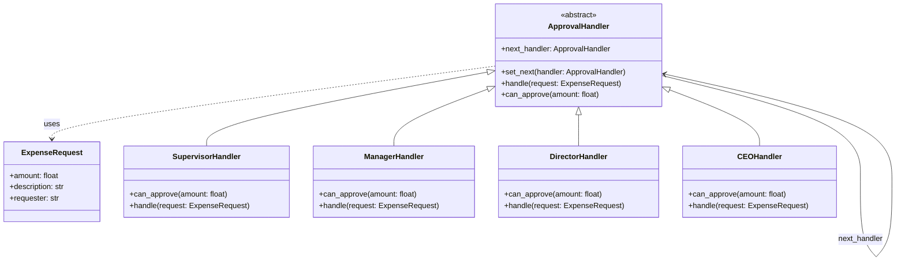

# Chain of Responsibility (Cadeia de Responsabilidade)

## 1. Introdução e Contexto

O Chain of Responsibility é um pattern comportamental que permite passar requisições ao longo de uma cadeia de handlers potenciais. Cada handler na cadeia decide se pode processar a requisição ou se deve passá-la para o próximo handler na sequência.

Este pattern é inspirado em estruturas organizacionais reais, onde uma solicitação percorre uma hierarquia até encontrar a pessoa ou departamento apropriado para lidar com ela. Por exemplo, uma requisição de compra pode passar pelo supervisor imediato, depois pelo gerente, diretor e finalmente pelo CEO, dependendo do valor envolvido.

O pattern estabelece uma cadeia de objetos receptores e permite que a requisição seja passada ao longo desta cadeia até que algum objeto a processe. O remetente da requisição não precisa conhecer qual objeto específico irá processá-la, promovendo baixo acoplamento entre remetente e receptor.

## 2. Que Problema Resolve

O Chain of Responsibility aborda várias questões fundamentais no design de software:

**Acoplamento Forte entre Remetente e Receptor**: Sem este pattern, o código cliente precisaria conhecer exatamente qual objeto pode processar cada tipo de requisição, criando dependências rígidas.

**Lógica Condicional Complexa**: Evita longas cadeias de if-else ou switch-case que verificam qual handler usar para cada tipo de requisição.

**Flexibilidade de Processamento**: Permite que múltiplos objetos tenham a chance de processar uma requisição, ou que a mesma requisição seja processada por vários handlers em sequência.

**Configuração Dinâmica**: Possibilita modificar a ordem dos handlers ou adicionar/remover handlers em tempo de execução sem alterar o código cliente.

**Responsabilidade Distribuída**: Distribui a responsabilidade de processamento entre múltiplos objetos, seguindo o princípio da responsabilidade única.

## 3. Quando Usar

O Chain of Responsibility é apropriado nas seguintes situações:

**Múltiplos Candidatos para Processar**: Quando mais de um objeto pode processar uma requisição, mas você não sabe qual será até o momento da execução.

**Processamento Hierárquico**: Em cenários onde existe uma hierarquia natural de processamento, como aprovações, escalações ou níveis de autorização.

**Desacoplamento Necessário**: Quando você quer evitar que o remetente conheça os receptores específicos das requisições.

**Configuração Dinâmica**: Quando a ordem ou conjunto de handlers pode mudar durante a execução do programa.

**Processamento Opcional**: Quando nem todas as requisições precisam ser processadas, ou quando o processamento pode falhar sem causar problemas.

**Pipeline de Transformações**: Para implementar uma série de transformações ou validações que devem ser aplicadas sequencialmente.

## 4. Quando Não Usar

Evite o Chain of Responsibility nas seguintes situações:

**Processamento Garantido**: Quando você precisa garantir que toda requisição será processada por algum handler específico. O pattern permite que requisições passem por toda a cadeia sem serem processadas.

**Performance Crítica**: O pattern introduz overhead devido ao percurso da cadeia. Em sistemas onde performance é crítica, pode ser inadequado.

**Lógica Simples**: Para casos simples onde um simples if-else seria mais claro e direto. Over-engineering pode tornar o código desnecessariamente complexo.

**Poucos Handlers**: Quando há apenas 2-3 handlers possíveis, uma estrutura mais simples pode ser mais apropriada.

**Debugging Crítico**: O fluxo através da cadeia pode dificultar o debugging, especialmente em sistemas onde rastreabilidade é fundamental.

**Estado Compartilhado**: Quando os handlers precisam compartilhar muito estado entre si, outros patterns podem ser mais adequados.

**Ordem Rígida**: Se a ordem de processamento é sempre a mesma e não muda, uma implementação mais direta pode ser preferível.

## 5. Exemplo Prático: Sistema de Aprovação de Despesas

### Contexto do Problema

Uma empresa precisa implementar um sistema de aprovação de despesas onde diferentes níveis hierárquicos podem aprovar gastos baseados em valores específicos:

- Supervisor: até R$ 1.000
- Gerente: até R$ 5.000  
- Diretor: até R$ 20.000
- CEO: acima de R$ 20.000

O sistema atual possui uma lógica condicional complexa que verifica o valor e determina quem deve aprovar, criando forte acoplamento e dificultando mudanças nas regras de aprovação.

### Solução com Chain of Responsibility

O pattern resolve este problema criando uma cadeia de aprovadores onde cada um verifica se pode processar a despesa baseado no valor. Se não puder, passa para o próximo na hierarquia.

### Diagrama da Solução



### Implementação em Python

```python
from abc import ABC, abstractmethod
from typing import Optional

class ExpenseRequest:
    def __init__(self, amount: float, description: str, requester: str):
        self.amount = amount
        self.description = description
        self.requester = requester

    def __str__(self):
        return f"Despesa: R$ {self.amount:.2f} - {self.description} (Solicitante: {self.requester})"

class ApprovalHandler(ABC):
    def __init__(self):
        self._next_handler: Optional[ApprovalHandler] = None
    
    def set_next(self, handler: 'ApprovalHandler') -> 'ApprovalHandler':
        self._next_handler = handler
        return handler
    
    def handle(self, request: ExpenseRequest) -> str:
        if self.can_approve(request.amount):
            return self._approve(request)
        elif self._next_handler:
            return self._next_handler.handle(request)
        else:
            return f"Despesa de R$ {request.amount:.2f} rejeitada - valor acima do limite autorizado"
    
    @abstractmethod
    def can_approve(self, amount: float) -> bool:
        pass
    
    @abstractmethod
    def _approve(self, request: ExpenseRequest) -> str:
        pass

class SupervisorHandler(ApprovalHandler):
    def can_approve(self, amount: float) -> bool:
        return amount <= 1000.00
    
    def _approve(self, request: ExpenseRequest) -> str:
        return f"APROVADO pelo Supervisor: {request}"

class ManagerHandler(ApprovalHandler):
    def can_approve(self, amount: float) -> bool:
        return amount <= 5000.00
    
    def _approve(self, request: ExpenseRequest) -> str:
        return f"APROVADO pelo Gerente: {request}"

class DirectorHandler(ApprovalHandler):
    def can_approve(self, amount: float) -> bool:
        return amount <= 20000.00
    
    def _approve(self, request: ExpenseRequest) -> str:
        return f"APROVADO pelo Diretor: {request}"

class CEOHandler(ApprovalHandler):
    def can_approve(self, amount: float) -> bool:
        return amount <= 100000.00
    
    def _approve(self, request: ExpenseRequest) -> str:
        return f"APROVADO pelo CEO: {request}"

# Configuração da cadeia
def create_approval_chain() -> ApprovalHandler:
    supervisor = SupervisorHandler()
    manager = ManagerHandler()
    director = DirectorHandler()
    ceo = CEOHandler()
    
    supervisor.set_next(manager).set_next(director).set_next(ceo)
    
    return supervisor

# Exemplo de uso
def main():
    approval_chain = create_approval_chain()
    
    # Casos de teste
    requests = [
        ExpenseRequest(800.00, "Material de escritório", "João Silva"),
        ExpenseRequest(3500.00, "Notebook para desenvolvimento", "Maria Santos"),
        ExpenseRequest(15000.00, "Software de infraestrutura", "Pedro Costa"),
        ExpenseRequest(50000.00, "Servidor para datacenter", "Ana Oliveira"),
        ExpenseRequest(150000.00, "Aquisição de empresa", "Carlos Lima")
    ]
    
    for request in requests:
        result = approval_chain.handle(request)
        print(result)
        print("-" * 80)

if __name__ == "__main__":
    main()
```

### Vantagens da Implementação

**Flexibilidade**: Novos níveis de aprovação podem ser adicionados facilmente sem modificar código existente.

**Desacoplamento**: O cliente não precisa conhecer a estrutura hierárquica específica.

**Configuração Dinâmica**: A ordem dos aprovadores pode ser alterada em tempo de execução.

**Extensibilidade**: Novos tipos de validação podem ser inseridos na cadeia sem impacto.

### Limitações da Implementação

**Performance**: Requisições de valores altos percorrem toda a cadeia antes de serem aprovadas.

**Garantia de Processamento**: Não há garantia de que uma requisição será aprovada (pode ser rejeitada).

**Debugging**: O fluxo através da cadeia pode ser mais difícil de rastrear em caso de problemas.