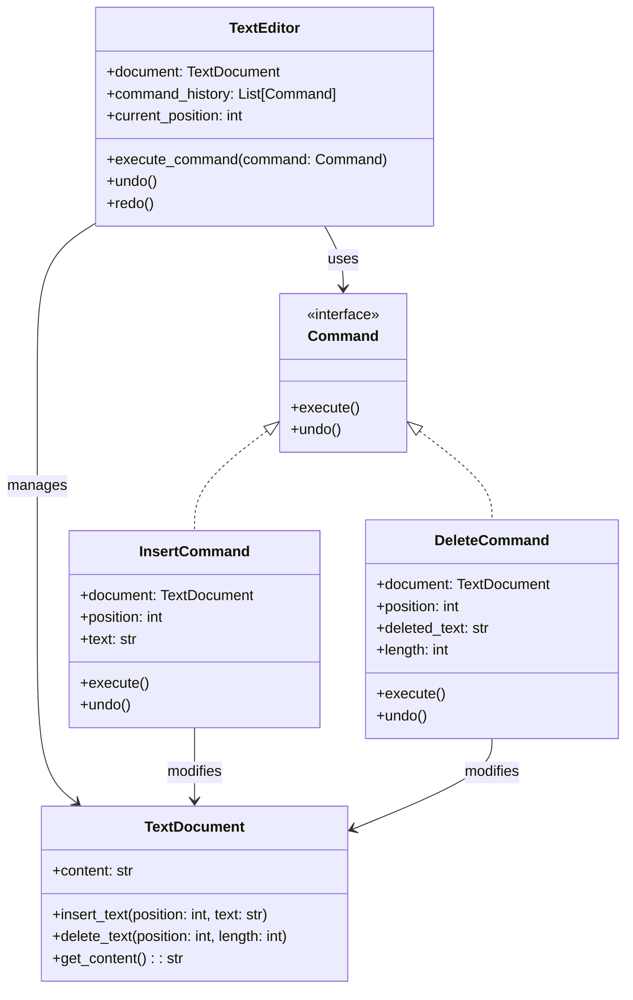

# Command Pattern (Padrão Comando)

## 1. Introdução e Contexto

O Command Pattern é um pattern comportamental que transforma uma requisição em um objeto independente contendo todas as informações sobre essa requisição. Esta transformação permite parametrizar métodos com diferentes requisições, atrasar ou enfileirar a execução de uma requisição e suportar operações que podem ser desfeitas.

O pattern é inspirado no conceito de comandos do mundo real. Quando você vai a um restaurante, o garçom anota seu pedido em um papel - esse papel se torna um comando que encapsula sua requisição. O papel pode ser passado para a cozinha, colocado em uma fila, ou até mesmo cancelado antes da execução. O garçom (cliente) não precisa saber como a comida é preparada, apenas entrega o comando para quem pode executá-lo.

No contexto de software, o Command pattern desacopla o objeto que invoca a operação do objeto que a executa. O comando se torna um objeto de primeira classe que pode ser armazenado, passado como parâmetro, executado em momentos diferentes e até mesmo desfeito.

## 2. Que Problema Resolve

O Command Pattern aborda várias questões fundamentais no design de software:

**Acoplamento Direto entre Invocador e Receptor**: Sem este pattern, objetos que precisam executar operações devem conhecer diretamente os objetos receptores e seus métodos específicos, criando dependências rígidas.

**Impossibilidade de Desfazer Operações**: Operações executadas diretamente são difíceis de reverter, pois não há registro do estado anterior ou dos parâmetros utilizados.

**Dificuldade de Logging e Auditoria**: Sem encapsular operações como objetos, é complexo registrar, auditar ou replicar sequências de operações.

**Inflexibilidade para Operações em Lote**: Executar múltiplas operações ou criar macros torna-se complicado quando as operações estão fortemente acopladas.

**Impossibilidade de Enfileiramento**: Operações não podem ser facilmente enfileiradas, agendadas ou executadas de forma assíncrona.

**Configuração Dinâmica Limitada**: É difícil configurar diferentes operações em tempo de execução ou permitir que usuários personalizem comportamentos.

## 3. Quando Usar

O Command Pattern é apropriado nas seguintes situações:

**Operações Undo/Redo**: Quando você precisa implementar funcionalidades de desfazer e refazer operações, como em editores de texto ou softwares de design.

**Operações em Fila**: Para enfileirar operações, executá-las em momentos específicos ou implementar sistemas de jobs/tasks.

**Logging e Persistência**: Quando é necessário registrar operações para auditoria, replay ou recuperação de falhas.

**Transações e Rollback**: Para implementar transações que podem ser revertidas em caso de erro.

**Macros e Batch Operations**: Quando usuários precisam gravar e reproduzir sequências de operações.

**Desacoplamento de UI**: Para separar elementos de interface (botões, menus) da lógica de negócio que eles executam.

**Operações Parametrizáveis**: Quando você quer parametrizar objetos com operações diferentes.

**Callbacks Complexos**: Para implementar callbacks que carregam informações contextuais além da simples função a ser executada.

## 4. Quando Não Usar

Evite o Command Pattern nas seguintes situações:

**Operações Simples e Diretas**: Para operações simples que não precisam ser desfeitas, registradas ou enfileiradas, o pattern adiciona complexidade desnecessária.

**Performance Crítica**: O overhead de criar objetos comando pode ser significativo em sistemas onde performance é extremamente crítica.

**Operações Stateless Simples**: Quando as operações não carregam estado e são puramente funcionais, uma abordagem mais direta pode ser preferível.

**Sistemas com Poucos Comandos**: Se o sistema possui apenas algumas operações fixas que nunca mudam, o pattern pode ser over-engineering.

**Memoria Limitada**: Em sistemas com restrições severas de memória, armazenar objetos comando pode ser proibitivo.

**Operações sem Contexto**: Quando operações não precisam carregar parâmetros ou estado adicional além da execução básica.

**Debugging Simples Necessário**: O pattern pode complicar o debugging ao introduzir uma camada adicional de indireção.

## 5. Exemplo Prático: Editor de Texto com Undo/Redo

### Contexto do Problema

Um editor de texto precisa implementar funcionalidades básicas como inserir texto, deletar texto e operações de undo/redo. O sistema atual executa operações diretamente no documento, tornando impossível implementar undo/redo eficiente. Além disso, adicionar novas operações requer modificações em múltiplas partes do código.

### Solução com Command Pattern

O pattern resolve este problema encapsulando cada operação (inserir, deletar, etc.) como um objeto comando que conhece como executar e desfazer a operação. O editor mantém uma pilha de comandos executados para implementar undo/redo.

### Diagrama da Solução



### Implementação em Python

```python
from abc import ABC, abstractmethod
from typing import List

class Command(ABC):
    @abstractmethod
    def execute(self) -> None:
        pass
    
    @abstractmethod
    def undo(self) -> None:
        pass

class TextDocument:
    def __init__(self):
        self._content = ""
    
    def insert_text(self, position: int, text: str) -> None:
        if 0 <= position <= len(self._content):
            self._content = self._content[:position] + text + self._content[position:]
        else:
            raise ValueError(f"Posição {position} inválida para documento de tamanho {len(self._content)}")
    
    def delete_text(self, position: int, length: int) -> str:
        if position < 0 or position + length > len(self._content):
            raise ValueError(f"Tentativa de deletar texto fora dos limites do documento")
        
        deleted_text = self._content[position:position + length]
        self._content = self._content[:position] + self._content[position + length:]
        return deleted_text
    
    def get_content(self) -> str:
        return self._content
    
    def get_length(self) -> int:
        return len(self._content)

class InsertCommand(Command):
    def __init__(self, document: TextDocument, position: int, text: str):
        self._document = document
        self._position = position
        self._text = text
        self._executed = False
    
    def execute(self) -> None:
        if self._executed:
            raise RuntimeError("Comando já foi executado")
        
        self._document.insert_text(self._position, self._text)
        self._executed = True
    
    def undo(self) -> None:
        if not self._executed:
            raise RuntimeError("Comando não foi executado ainda")
        
        self._document.delete_text(self._position, len(self._text))
        self._executed = False
    
    def __str__(self) -> str:
        return f"InsertCommand(pos={self._position}, text='{self._text}')"

class DeleteCommand(Command):
    def __init__(self, document: TextDocument, position: int, length: int):
        self._document = document
        self._position = position
        self._length = length
        self._deleted_text = ""
        self._executed = False
    
    def execute(self) -> None:
        if self._executed:
            raise RuntimeError("Comando já foi executado")
        
        self._deleted_text = self._document.delete_text(self._position, self._length)
        self._executed = True
    
    def undo(self) -> None:
        if not self._executed:
            raise RuntimeError("Comando não foi executado ainda")
        
        self._document.insert_text(self._position, self._deleted_text)
        self._executed = False
    
    def __str__(self) -> str:
        return f"DeleteCommand(pos={self._position}, length={self._length})"

class MacroCommand(Command):
    def __init__(self, commands: List[Command]):
        self._commands = commands.copy()
        self._executed = False
    
    def execute(self) -> None:
        if self._executed:
            raise RuntimeError("Macro já foi executado")
        
        for command in self._commands:
            command.execute()
        self._executed = True
    
    def undo(self) -> None:
        if not self._executed:
            raise RuntimeError("Macro não foi executado ainda")
        
        # Desfaz na ordem inversa
        for command in reversed(self._commands):
            command.undo()
        self._executed = False
    
    def __str__(self) -> str:
        return f"MacroCommand({len(self._commands)} comandos)"

class TextEditor:
    def __init__(self):
        self._document = TextDocument()
        self._command_history: List[Command] = []
        self._current_position = -1  # Posição do último comando executado
    
    def execute_command(self, command: Command) -> None:
        # Remove comandos após a posição atual (para casos de undo seguido de nova operação)
        self._command_history = self._command_history[:self._current_position + 1]
        
        # Executa o comando
        command.execute()
        
        # Adiciona à história
        self._command_history.append(command)
        self._current_position += 1
        
        print(f"Executado: {command}")
        print(f"Documento: '{self._document.get_content()}'")
    
    def undo(self) -> bool:
        if self._current_position < 0:
            print("Nada para desfazer")
            return False
        
        command = self._command_history[self._current_position]
        command.undo()
        self._current_position -= 1
        
        print(f"Desfeito: {command}")
        print(f"Documento: '{self._document.get_content()}'")
        return True
    
    def redo(self) -> bool:
        if self._current_position >= len(self._command_history) - 1:
            print("Nada para refazer")
            return False
        
        self._current_position += 1
        command = self._command_history[self._current_position]
        command.execute()
        
        print(f"Refeito: {command}")
        print(f"Documento: '{self._document.get_content()}'")
        return True
    
    def get_content(self) -> str:
        return self._document.get_content()
    
    def create_macro(self, commands: List[Command]) -> MacroCommand:
        return MacroCommand(commands)

# Exemplo de uso
def main():
    editor = TextEditor()
    
    print("=== Demonstração do Editor de Texto ===\n")
    
    # Operações básicas
    print("1. Inserindo texto...")
    editor.execute_command(InsertCommand(editor._document, 0, "Olá"))
    editor.execute_command(InsertCommand(editor._document, 3, " Mundo"))
    editor.execute_command(InsertCommand(editor._document, 9, "!"))
    
    print("\n2. Deletando texto...")
    editor.execute_command(DeleteCommand(editor._document, 4, 5))  # Remove "Mundo"
    
    print("\n3. Testando Undo...")
    editor.undo()  # Desfaz delete
    editor.undo()  # Desfaz insert "!"
    
    print("\n4. Testando Redo...")
    editor.redo()  # Refaz insert "!"
    
    print("\n5. Nova operação após undo...")
    editor.execute_command(InsertCommand(editor._document, 9, " Python"))
    
    print("\n6. Testando Macro...")
    macro_commands = [
        InsertCommand(editor._document, 16, " é"),
        InsertCommand(editor._document, 18, " incrível")
    ]
    macro = editor.create_macro(macro_commands)
    editor.execute_command(macro)
    
    print("\n7. Desfazendo macro...")
    editor.undo()
    
    print("\n8. Estado final do editor...")
    print(f"Conteúdo: '{editor.get_content()}'")
    print(f"Comandos na história: {len(editor._command_history)}")

if __name__ == "__main__":
    main()
```

### Vantagens da Implementação

**Undo/Redo Robusto**: Cada comando sabe como se desfazer, permitindo implementação eficiente de undo/redo.

**Extensibilidade**: Novos tipos de comando podem ser adicionados sem modificar código existente.

**Macros**: Comandos podem ser compostos para criar operações complexas.

**Logging**: Todas as operações são automaticamente registradas na história.

**Desacoplamento**: A interface do editor não precisa conhecer detalhes de implementação dos comandos.

### Limitações da Implementação

**Uso de Memória**: Manter histórico de comandos consome memória, especialmente para operações com muito texto.

**Complexidade**: Para operações simples, o padrão adiciona overhead de código.

**Estado Complexo**: Comandos que dependem de estado externo podem ser mais difíceis de implementar corretamente.