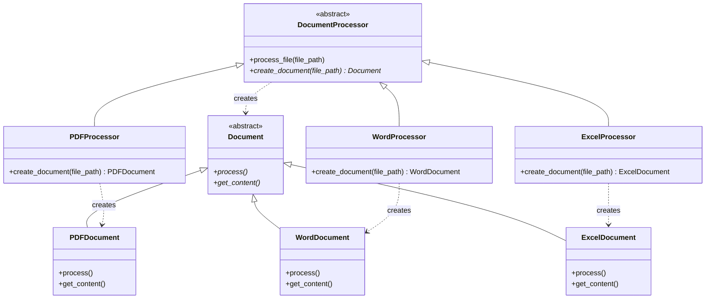

# Factory Method Pattern

## Introdução

O **Factory Method** é um padrão criacional que fornece uma interface para criar objetos em uma superclasse, mas permite que as subclasses alterem o tipo de objetos que serão criados. Este padrão promove o princípio da inversão de dependência, onde o código de alto nível não depende de implementações concretas, mas sim de abstrações.

O padrão surgiu da necessidade de desacoplar a criação de objetos do código que os utiliza, permitindo que diferentes implementações sejam escolhidas dinamicamente sem modificar o código cliente.

## Problema que Resolve

### Cenário Problemático
Imagine que você está desenvolvendo um sistema de processamento de documentos que inicialmente trabalha apenas com arquivos PDF. Seu código está repleto de instanciações diretas da classe `PDFDocument`:

```python
# Código problemático
pdf_doc = PDFDocument()  # Acoplamento forte
pdf_doc.process()
```

Agora surge a necessidade de suportar documentos Word e Excel. Sem o Factory Method, você precisaria:
- Modificar todo o código existente
- Adicionar lógica condicional espalhada pelo sistema
- Criar forte acoplamento entre o código cliente e as classes concretas

### Problemas Específicos
- **Acoplamento forte**: Código cliente conhece classes concretas
- **Violação do princípio Aberto/Fechado**: Adicionar novos tipos requer modificar código existente
- **Dificuldade de teste**: Hard-coded dependencies dificultam mocking
- **Código duplicado**: Lógica de criação repetida em vários locais

## Quando Usar

### Cenários Ideais
- **Família de produtos relacionados**: Quando você tem diferentes implementações de uma mesma interface
- **Decisão runtime**: Quando o tipo de objeto a ser criado deve ser determinado em tempo de execução
- **Extensibilidade**: Quando novos tipos podem ser adicionados frequentemente
- **Desacoplamento**: Quando você quer separar a criação do uso dos objetos
- **Bibliotecas e frameworks**: Quando você está criando código que será estendido por outros

### Indicadores de Necessidade
- Múltiplas instruções `if/else` ou `switch` para criação de objetos
- Necessidade de configurar objetos de formas diferentes
- Diferentes algoritmos ou implementações para a mesma operação
- Requisitos de extensibilidade futura

## Quando NÃO Usar

### Cenários Inadequados
- **Sistemas simples**: Quando você tem apenas uma implementação
- **Criação trivial**: Quando a criação de objetos é simples e direta
- **Performance crítica**: Quando a indireção pode impactar performance
- **Overhead desnecessário**: Quando a flexibilidade não é necessária

### Sinais de Over-engineering
- Apenas uma implementação concreta existente
- Nenhuma previsão de extensibilidade
- Equipe inexperiente com padrões
- Requisitos muito estáveis e bem definidos

## Exemplo Prático: Sistema de Processamento de Documentos

### Contexto
Uma empresa precisa de um sistema que processe diferentes tipos de documentos (PDF, Word, Excel) de forma uniforme, mas cada tipo tem sua própria lógica de processamento.

### Problema
Sem o Factory Method, o código ficaria assim:

```python
# Código problemático
def process_document(doc_type, file_path):
    if doc_type == "pdf":
        doc = PDFDocument(file_path)
    elif doc_type == "word":
        doc = WordDocument(file_path)
    elif doc_type == "excel":
        doc = ExcelDocument(file_path)
    else:
        raise ValueError("Tipo não suportado")
    
    doc.process()  # Lógica espalhada e acoplada
```

### Solução com Factory Method

#### Diagrama da Solução



## Implementação em Python

```python
from abc import ABC, abstractmethod
from typing import Dict, Type

# Produto abstrato
class Document(ABC):
    def __init__(self, file_path: str):
        self.file_path = file_path
    
    @abstractmethod
    def process(self) -> str:
        """Processa o documento e retorna o conteúdo"""
        pass
    
    @abstractmethod
    def get_metadata(self) -> Dict[str, str]:
        """Retorna metadados do documento"""
        pass

# Produtos concretos
class PDFDocument(Document):
    def process(self) -> str:
        return f"Processando PDF: {self.file_path} com OCR e extração de texto"
    
    def get_metadata(self) -> Dict[str, str]:
        return {
            "type": "PDF",
            "pages": "25",
            "size": "2.5MB"
        }

class WordDocument(Document):
    def process(self) -> str:
        return f"Processando Word: {self.file_path} com análise de estrutura"
    
    def get_metadata(self) -> Dict[str, str]:
        return {
            "type": "Word",
            "words": "1500",
            "version": "Office 365"
        }

class ExcelDocument(Document):
    def process(self) -> str:
        return f"Processando Excel: {self.file_path} com análise de planilhas"
    
    def get_metadata(self) -> Dict[str, str]:
        return {
            "type": "Excel",
            "sheets": "3",
            "formulas": "45"
        }

# Creator abstrato
class DocumentProcessor(ABC):
    def process_file(self, file_path: str) -> Dict[str, str]:
        """Template method que usa o factory method"""
        document = self.create_document(file_path)
        
        # Lógica comum de processamento
        print(f"Iniciando processamento...")
        result = document.process()
        metadata = document.get_metadata()
        
        print(f"Resultado: {result}")
        print(f"Metadados: {metadata}")
        
        return {
            "status": "success",
            "result": result,
            "metadata": metadata
        }
    
    @abstractmethod
    def create_document(self, file_path: str) -> Document:
        """Factory method - deve ser implementado pelas subclasses"""
        pass

# Creators concretos
class PDFProcessor(DocumentProcessor):
    def create_document(self, file_path: str) -> Document:
        return PDFDocument(file_path)

class WordProcessor(DocumentProcessor):
    def create_document(self, file_path: str) -> Document:
        return WordDocument(file_path)

class ExcelProcessor(DocumentProcessor):
    def create_document(self, file_path: str) -> Document:
        return ExcelDocument(file_path)

# Factory para escolher o processor adequado
class ProcessorFactory:
    _processors: Dict[str, Type[DocumentProcessor]] = {
        'pdf': PDFProcessor,
        'docx': WordProcessor,
        'xlsx': ExcelProcessor
    }
    
    @classmethod
    def get_processor(cls, file_extension: str) -> DocumentProcessor:
        processor_class = cls._processors.get(file_extension.lower())
        if not processor_class:
            raise ValueError(f"Tipo de arquivo não suportado: {file_extension}")
        return processor_class()
    
    @classmethod
    def register_processor(cls, extension: str, processor_class: Type[DocumentProcessor]):
        """Permite registrar novos tipos de processadores"""
        cls._processors[extension] = processor_class

# Exemplo de uso
def main():
    files = [
        ("documento.pdf", "pdf"),
        ("relatorio.docx", "docx"),
        ("planilha.xlsx", "xlsx")
    ]
    
    for file_path, extension in files:
        try:
            processor = ProcessorFactory.get_processor(extension)
            result = processor.process_file(file_path)
            print(f"Processamento concluído para {file_path}")
            print("-" * 50)
        except ValueError as e:
            print(f"Erro: {e}")

if __name__ == "__main__":
    main()
```

### Vantagens da Implementação

1. **Extensibilidade**: Novos tipos podem ser adicionados sem modificar código existente
2. **Desacoplamento**: Cliente não conhece classes concretas
3. **Reutilização**: Lógica comum no template method
4. **Testabilidade**: Fácil de criar mocks e testes unitários
5. **Configurabilidade**: Factory permite registro dinâmico de novos tipos

### Extensão Exemplo

```python
# Adicionando suporte a PowerPoint sem modificar código existente
class PowerPointDocument(Document):
    def process(self) -> str:
        return f"Processando PowerPoint: {self.file_path} com análise de slides"
    
    def get_metadata(self) -> Dict[str, str]:
        return {"type": "PowerPoint", "slides": "12", "animations": "5"}

class PowerPointProcessor(DocumentProcessor):
    def create_document(self, file_path: str) -> Document:
        return PowerPointDocument(file_path)

# Registrando o novo tipo
ProcessorFactory.register_processor('pptx', PowerPointProcessor)
```

O Factory Method pattern proporcionou uma solução elegante e extensível para o problema de criação de diferentes tipos de documentos, mantendo o código limpo, testável e fácil de estender.