# Abstract Factory Pattern

## Introdução

O **Abstract Factory Pattern** é um padrão criacional que fornece uma interface para criar famílias de objetos relacionados ou dependentes sem especificar suas classes concretas. Este padrão é essencialmente uma "fábrica de fábricas" - ele abstrai a criação de múltiplos produtos que devem trabalhar juntos de forma consistente.

O padrão surgiu da necessidade de criar conjuntos de objetos que pertencem à mesma família ou plataforma, garantindo que todos os componentes criados sejam compatíveis entre si. É amplamente usado em sistemas que precisam suportar múltiplas plataformas, temas visuais ou variantes de produtos mantendo consistência interna.

## Problema que Resolve

### Cenário Problemático
Imagine que você está desenvolvendo uma aplicação GUI que deve funcionar em diferentes sistemas operacionais (Windows, Mac, Linux). Cada plataforma tem seu próprio estilo visual e comportamento para componentes como botões, janelas e menus.

```python
# Código problemático - acoplamento forte e inconsistências
class Application:
    def __init__(self, platform):
        if platform == "windows":
            self.button = WindowsButton()
            self.window = MacWindow()      # ERRO! Mistura de plataformas
            self.menu = LinuxMenu()        # ERRO! Mais inconsistência
        elif platform == "mac":
            self.button = MacButton()
            self.window = WindowsWindow()  # ERRO! Componentes incompatíveis
            self.menu = MacMenu()
        # Lógica de criação espalhada e propensa a erros
```

### Problemas Específicos
- **Inconsistência entre famílias**: Fácil misturar componentes de diferentes plataformas
- **Acoplamento forte**: Código cliente conhece classes concretas de todas as plataformas
- **Violação do princípio DRY**: Lógica de criação duplicada
- **Manutenibilidade**: Adicionar nova plataforma requer modificar múltiplos locais
- **Validação complexa**: Difícil garantir compatibilidade entre componentes
- **Testabilidade**: Hard-coded dependencies dificultam testes

## Quando Usar

### Cenários Ideais
- **Múltiplas plataformas**: Aplicações que devem funcionar em diferentes sistemas operacionais
- **Famílias de produtos**: Quando você tem conjuntos de produtos que devem trabalhar juntos
- **Temas visuais**: Diferentes aparências (dark mode, light mode, high contrast)
- **Variantes de configuração**: Diferentes versões do produto (básica, premium, enterprise)
- **Compatibilidade garantida**: Quando é crítico que componentes sejam da mesma família
- **Extensibilidade**: Facilidade para adicionar novas famílias de produtos

### Indicadores de Necessidade
- Código com múltiplas condicionais baseadas em "tipo" ou "plataforma"
- Necessidade de criar grupos de objetos relacionados
- Requisitos de compatibilidade entre componentes
- Suporte a múltiplas variantes do mesmo sistema
- Previsão de crescimento em número de plataformas/temas

## Quando NÃO Usar

### Cenários Inadequados
- **Sistema simples**: Apenas uma plataforma ou variante
- **Poucos produtos**: Quando há apenas 1-2 tipos de objetos
- **Variações triviais**: Diferenças mínimas entre famílias
- **Performance crítica**: Overhead de abstrações pode ser significativo
- **Equipe inexperiente**: Complexidade adicional pode prejudicar produtividade

### Sinais de Over-engineering
- Apenas uma família de produtos implementada
- Diferenças cosméticas entre variantes
- Nenhuma previsão de expansão
- Criação de objetos muito simples

## Exemplo Prático: Sistema de Interface Gráfica Multiplataforma

### Contexto
Uma empresa está desenvolvendo um editor de texto que deve ter aparência nativa em Windows, Mac e Linux, mantendo consistência visual e comportamental dentro de cada plataforma.

### Problema
Sem o Abstract Factory, o código ficaria assim:

```python
# Código problemático
class TextEditor:
    def __init__(self, platform):
        # Lógica condicional espalhada
        if platform == "windows":
            self.button = WindowsButton()
            self.window = WindowsWindow()
            self.menu = WindowsMenu()
        elif platform == "mac":
            self.button = MacButton()
            self.window = MacWindow() 
            self.menu = MacMenu()
        # Fácil cometer erros de inconsistência
        # Difícil adicionar nova plataforma
```

### Solução com Abstract Factory

#### Diagrama da Solução

```mermaid
classDiagram
    class UIFactory {
        <<abstract>>
        +create_button() Button
        +create_window() Window
        +create_menu() Menu
        +create_dialog() Dialog
    }
    
    class WindowsUIFactory {
        +create_button() WindowsButton
        +create_window() WindowsWindow
        +create_menu() WindowsMenu
        +create_dialog() WindowsDialog
    }
    
    class MacUIFactory {
        +create_button() MacButton
        +create_window() MacWindow
        +create_menu() MacMenu
        +create_dialog() MacDialog
    }
    
    class LinuxUIFactory {
        +create_button() LinuxButton
        +create_window() LinuxWindow
        +create_menu() LinuxMenu
        +create_dialog() LinuxDialog
    }
    
    class Button {
        <<abstract>>
        +render()
        +on_click()
    }
    
    class Window {
        <<abstract>>
        +show()
        +hide()
        +set_title()
    }
    
    class Menu {
        <<abstract>>
        +add_item()
        +show_context_menu()
    }
    
    class Dialog {
        <<abstract>>
        +show_modal()
        +get_result()
    }
    
    class WindowsButton {
        +render()
        +on_click()
    }
    
    class MacButton {
        +render()
        +on_click()
    }
    
    class LinuxButton {
        +render()
        +on_click()
    }
    
    class WindowsWindow {
        +show()
        +hide()
        +set_title()
    }
    
    class MacWindow {
        +show()
        +hide()
        +set_title()
    }
    
    class LinuxWindow {
        +show()
        +hide()
        +set_title()
    }
    
    class WindowsMenu {
        +add_item()
        +show_context_menu()
    }
    
    class MacMenu {
        +add_item()
        +show_context_menu()
    }
    
    class LinuxMenu {
        +add_item()
        +show_context_menu()
    }
    
    class WindowsDialog {
        +show_modal()
        +get_result()
    }
    
    class MacDialog {
        +show_modal()
        +get_result()
    }
    
    class LinuxDialog {
        +show_modal()
        +get_result()
    }
    
    class Application {
        -ui_factory: UIFactory
        +create_ui()
        +run()
    }
    
    UIFactory <|-- WindowsUIFactory
    UIFactory <|-- MacUIFactory
    UIFactory <|-- LinuxUIFactory
    
    Button <|-- WindowsButton
    Button <|-- MacButton
    Button <|-- LinuxButton
    
    Window <|-- WindowsWindow
    Window <|-- MacWindow
    Window <|-- LinuxWindow
    
    Menu <|-- WindowsMenu
    Menu <|-- MacMenu
    Menu <|-- LinuxMenu
    
    Dialog <|-- WindowsDialog
    Dialog <|-- MacDialog
    Dialog <|-- LinuxDialog
    
    Application --> UIFactory
    UIFactory ..> Button : creates
    UIFactory ..> Window : creates
    UIFactory ..> Menu : creates
    UIFactory ..> Dialog : creates
```



## Implementação em Python

```python
from abc import ABC, abstractmethod
from enum import Enum
from typing import List, Dict, Any
import platform

# Enums para melhor type safety
class Platform(Enum):
    WINDOWS = "windows"
    MAC = "mac"
    LINUX = "linux"

class ButtonStyle(Enum):
    PRIMARY = "primary"
    SECONDARY = "secondary"
    DANGER = "danger"

# Produtos abstratos
class Button(ABC):
    def __init__(self, text: str, style: ButtonStyle = ButtonStyle.PRIMARY):
        self.text = text
        self.style = style
        self.enabled = True
    
    @abstractmethod
    def render(self) -> str:
        """Renderiza o botão"""
        pass
    
    @abstractmethod
    def on_click(self) -> str:
        """Ação ao clicar"""
        pass
    
    def set_enabled(self, enabled: bool):
        self.enabled = enabled

class Window(ABC):
    def __init__(self, title: str, width: int = 800, height: int = 600):
        self.title = title
        self.width = width
        self.height = height
        self.visible = False
        self.components: List[Any] = []
    
    @abstractmethod
    def show(self) -> str:
        """Exibe a janela"""
        pass
    
    @abstractmethod
    def hide(self) -> str:
        """Oculta a janela"""
        pass
    
    @abstractmethod
    def set_title(self, title: str) -> str:
        """Define o título"""
        pass
    
    def add_component(self, component):
        self.components.append(component)

class Menu(ABC):
    def __init__(self):
        self.items: List[Dict[str, str]] = []
    
    @abstractmethod
    def add_item(self, label: str, action: str) -> str:
        """Adiciona item ao menu"""
        pass
    
    @abstractmethod
    def show_context_menu(self, x: int, y: int) -> str:
        """Exibe menu de contexto"""
        pass

class Dialog(ABC):
    def __init__(self, title: str, message: str):
        self.title = title
        self.message = message
        self.result = None
    
    @abstractmethod
    def show_modal(self) -> str:
        """Exibe diálogo modal"""
        pass
    
    @abstractmethod
    def get_result(self) -> bool:
        """Retorna resultado do diálogo"""
        pass

# Implementações Windows
class WindowsButton(Button):
    def render(self) -> str:
        style_map = {
            ButtonStyle.PRIMARY: "blue",
            ButtonStyle.SECONDARY: "white",
            ButtonStyle.DANGER: "red"
        }
        icon = style_map.get(self.style, "white")
        state = "enabled" if self.enabled else "disabled"
        return f"[Windows {icon} {self.text}] ({state})"
    
    def on_click(self) -> str:
        if not self.enabled:
            return "Button is disabled"
        return f"Windows button '{self.text}' clicked with system sound"

class WindowsWindow(Window):
    def show(self) -> str:
        self.visible = True
        return f"Windows window '{self.title}' shown with Aero effects ({self.width}x{self.height})"
    
    def hide(self) -> str:
        self.visible = False
        return f"Windows window '{self.title}' hidden with fade animation"
    
    def set_title(self, title: str) -> str:
        old_title = self.title
        self.title = title
        return f"Windows title bar updated: '{old_title}' → '{title}'"

class WindowsMenu(Menu):
    def add_item(self, label: str, action: str) -> str:
        self.items.append({"label": label, "action": action, "separator": False})
        return f"Windows menu item added: {label} (with keyboard shortcut)"
    
    def show_context_menu(self, x: int, y: int) -> str:
        return f"Windows context menu shown at ({x}, {y}) with drop shadow"

class WindowsDialog(Dialog):
    def show_modal(self) -> str:
        return f"Windows modal dialog: '{self.title}' - {self.message} (with system icon)"
    
    def get_result(self) -> bool:
        self.result = True  # Simula interação do usuário
        return self.result

# Implementações Mac
class MacButton(Button):
    def render(self) -> str:
        style_map = {
            ButtonStyle.PRIMARY: "blue",
            ButtonStyle.SECONDARY: "gray",
            ButtonStyle.DANGER: "orange"
        }
        icon = style_map.get(self.style, "◽")
        state = "enabled" if self.enabled else "disabled"
        return f"({icon} {self.text}) [{state}]"
    
    def on_click(self) -> str:
        if not self.enabled:
            return "Button is disabled"
        return f"Mac button '{self.text}' clicked with subtle haptic feedback"

class MacWindow(Window):
    def show(self) -> str:
        self.visible = True
        return f"Mac window '{self.title}' shown with smooth animation ({self.width}x{self.height})"
    
    def hide(self) -> str:
        self.visible = False
        return f"Mac window '{self.title}' hidden with genie effect"
    
    def set_title(self, title: str) -> str:
        old_title = self.title
        self.title = title
        return f"Mac title bar updated with elegant transition: '{old_title}' → '{title}'"

class MacMenu(Menu):
    def add_item(self, label: str, action: str) -> str:
        self.items.append({"label": label, "action": action, "separator": False})
        return f"Mac menu item added: {label} (with Cmd+ shortcut)"
    
    def show_context_menu(self, x: int, y: int) -> str:
        return f"Mac context menu shown at ({x}, {y}) with rounded corners"

class MacDialog(Dialog):
    def show_modal(self) -> str:
        return f"Mac modal dialog: '{self.title}' - {self.message} (with smooth backdrop)"
    
    def get_result(self) -> bool:
        self.result = True
        return self.result

# Implementações Linux
class LinuxButton(Button):
    def render(self) -> str:
        style_map = {
            ButtonStyle.PRIMARY: "green",
            ButtonStyle.SECONDARY: "yellow",
            ButtonStyle.DANGER: "red"
        }
        icon = style_map.get(self.style, "grey")
        state = "enabled" if self.enabled else "disabled"
        return f"[{icon} {self.text}] <{state}>"
    
    def on_click(self) -> str:
        if not self.enabled:
            return "Button is disabled"
        return f"Linux button '{self.text}' clicked with GTK/Qt theming"

class LinuxWindow(Window):
    def show(self) -> str:
        self.visible = True
        return f"Linux window '{self.title}' shown with desktop environment theme ({self.width}x{self.height})"
    
    def hide(self) -> str:
        self.visible = False
        return f"Linux window '{self.title}' hidden with compositor effects"
    
    def set_title(self, title: str) -> str:
        old_title = self.title
        self.title = title
        return f"Linux title bar updated: '{old_title}' → '{title}'"

class LinuxMenu(Menu):
    def add_item(self, label: str, action: str) -> str:
        self.items.append({"label": label, "action": action, "separator": False})
        return f"Linux menu item added: {label} (with Ctrl+ shortcut)"
    
    def show_context_menu(self, x: int, y: int) -> str:
        return f"Linux context menu shown at ({x}, {y}) with desktop theme"

class LinuxDialog(Dialog):
    def show_modal(self) -> str:
        return f"Linux modal dialog: '{self.title}' - {self.message} (with native theme)"
    
    def get_result(self) -> bool:
        self.result = True
        return self.result

# Abstract Factory
class UIFactory(ABC):
    @abstractmethod
    def create_button(self, text: str, style: ButtonStyle = ButtonStyle.PRIMARY) -> Button:
        """Cria um botão"""
        pass
    
    @abstractmethod
    def create_window(self, title: str, width: int = 800, height: int = 600) -> Window:
        """Cria uma janela"""
        pass
    
    @abstractmethod
    def create_menu(self) -> Menu:
        """Cria um menu"""
        pass
    
    @abstractmethod
    def create_dialog(self, title: str, message: str) -> Dialog:
        """Cria um diálogo"""
        pass
    
    @abstractmethod
    def get_platform_info(self) -> Dict[str, str]:
        """Retorna informações da plataforma"""
        pass

# Concrete Factories
class WindowsUIFactory(UIFactory):
    def create_button(self, text: str, style: ButtonStyle = ButtonStyle.PRIMARY) -> Button:
        return WindowsButton(text, style)
    
    def create_window(self, title: str, width: int = 800, height: int = 600) -> Window:
        return WindowsWindow(title, width, height)
    
    def create_menu(self) -> Menu:
        return WindowsMenu()
    
    def create_dialog(self, title: str, message: str) -> Dialog:
        return WindowsDialog(title, message)
    
    def get_platform_info(self) -> Dict[str, str]:
        return {
            "platform": "Windows",
            "theme": "Fluent Design",
            "shortcuts": "Ctrl+",
            "animations": "Aero effects"
        }

class MacUIFactory(UIFactory):
    def create_button(self, text: str, style: ButtonStyle = ButtonStyle.PRIMARY) -> Button:
        return MacButton(text, style)
    
    def create_window(self, title: str, width: int = 800, height: int = 600) -> Window:
        return MacWindow(title, width, height)
    
    def create_menu(self) -> Menu:
        return MacMenu()
    
    def create_dialog(self, title: str, message: str) -> Dialog:
        return MacDialog(title, message)
    
    def get_platform_info(self) -> Dict[str, str]:
        return {
            "platform": "macOS",
            "theme": "Aqua/Human Interface",
            "shortcuts": "Cmd+",
            "animations": "Core Animation"
        }

class LinuxUIFactory(UIFactory):
    def create_button(self, text: str, style: ButtonStyle = ButtonStyle.PRIMARY) -> Button:
        return LinuxButton(text, style)
    
    def create_window(self, title: str, width: int = 800, height: int = 600) -> Window:
        return LinuxWindow(title, width, height)
    
    def create_menu(self) -> Menu:
        return LinuxMenu()
    
    def create_dialog(self, title: str, message: str) -> Dialog:
        return LinuxDialog(title, message)
    
    def get_platform_info(self) -> Dict[str, str]:
        return {
            "platform": "Linux",
            "theme": "GTK/Qt",
            "shortcuts": "Ctrl+",
            "animations": "Compositor effects"
        }

# Factory Provider
class UIFactoryProvider:
    _factories = {
        Platform.WINDOWS: WindowsUIFactory,
        Platform.MAC: MacUIFactory,
        Platform.LINUX: LinuxUIFactory
    }
    
    @classmethod
    def get_factory(cls, platform: Platform) -> UIFactory:
        """Retorna a factory apropriada para a plataforma"""
        factory_class = cls._factories.get(platform)
        if not factory_class:
            raise ValueError(f"Plataforma não suportada: {platform}")
        return factory_class()
    
    @classmethod
    def auto_detect_factory(cls) -> UIFactory:
        """Detecta automaticamente a plataforma atual"""
        system = platform.system().lower()
        if "windows" in system:
            return cls.get_factory(Platform.WINDOWS)
        elif "darwin" in system:  # macOS
            return cls.get_factory(Platform.MAC)
        elif "linux" in system:
            return cls.get_factory(Platform.LINUX)
        else:
            # Default para Linux em sistemas desconhecidos
            return cls.get_factory(Platform.LINUX)
    
    @classmethod
    def register_factory(cls, platform: Platform, factory_class):
        """Permite registrar novas factories"""
        cls._factories[platform] = factory_class

# Cliente - Application
class TextEditor:
    def __init__(self, ui_factory: UIFactory):
        self.ui_factory = ui_factory
        self.main_window = None
        self.components = {}
        self.platform_info = ui_factory.get_platform_info()
    
    def create_ui(self):
        """Cria toda a interface usando a factory"""
        print(f"Criando interface para {self.platform_info['platform']}")
        print(f"Tema: {self.platform_info['theme']}")
        print("-" * 50)
        
        # Cria janela principal
        self.main_window = self.ui_factory.create_window("Text Editor Pro", 1200, 800)
        print(self.main_window.show())
        
        # Cria componentes da interface
        self.components['save_btn'] = self.ui_factory.create_button("Save", ButtonStyle.PRIMARY)
        self.components['open_btn'] = self.ui_factory.create_button("Open", ButtonStyle.SECONDARY)
        self.components['delete_btn'] = self.ui_factory.create_button("Delete", ButtonStyle.DANGER)
        
        # Cria menu
        self.components['main_menu'] = self.ui_factory.create_menu()
        
        # Adiciona componentes à janela
        for component in self.components.values():
            self.main_window.add_component(component)
        
        return self.components
    
    def setup_menu(self):
        """Configura o menu da aplicação"""
        menu = self.components['main_menu']
        shortcuts = self.platform_info['shortcuts']
        
        print(f"\nConfigurando menu com atalhos {shortcuts}:")
        print(menu.add_item(f"New File ({shortcuts}N)", "file_new"))
        print(menu.add_item(f"Open File ({shortcuts}O)", "file_open"))
        print(menu.add_item(f"Save File ({shortcuts}S)", "file_save"))
        print(menu.add_item(f"Exit ({shortcuts}Q)", "app_exit"))
    
    def simulate_user_interaction(self):
        """Simula interação do usuário"""
        print(f"\nSimulando interações do usuário:")
        
        # Renderiza e clica nos botões
        for name, component in self.components.items():
            if isinstance(component, Button):
                print(f"Renderizando: {component.render()}")
                print(f"Ação: {component.on_click()}")
        
        # Mostra menu de contexto
        if 'main_menu' in self.components:
            print(self.components['main_menu'].show_context_menu(100, 200))
        
        # Mostra diálogo
        dialog = self.ui_factory.create_dialog("Save Changes", "Do you want to save your changes?")
        print(f"\n{dialog.show_modal()}")
        print(f"User choice: {'Yes' if dialog.get_result() else 'No'}")
    
    def run(self):
        """Executa a aplicação"""
        self.create_ui()
        self.setup_menu()
        self.simulate_user_interaction()
        print(f"\nText Editor executando em {self.platform_info['platform']}")

# Exemplo de uso
def main():
    print("=== Abstract Factory Pattern - Sistema de UI Multiplataforma ===\n")
    
    # 1. Teste em diferentes plataformas
    platforms = [Platform.WINDOWS, Platform.MAC, Platform.LINUX]
    
    for platform in platforms:
        print(f"Testando em {platform.value.upper()}")
        print("=" * 60)
        
        # Obtém factory específica da plataforma
        factory = UIFactoryProvider.get_factory(platform)
        
        # Cria e executa aplicação
        app = TextEditor(factory)
        app.run()
        print("\n" + "="*60 + "\n")
    
    # 2. Auto-detecção de plataforma
    print("Auto-detecção de plataforma:")
    auto_factory = UIFactoryProvider.auto_detect_factory()
    auto_app = TextEditor(auto_factory)
    platform_info = auto_factory.get_platform_info()
    print(f"Plataforma detectada: {platform_info['platform']}")
    
    # 3. Demonstração de consistência entre famílias
    print(f"\nDemonstração de consistência entre componentes:")
    print("Todos os componentes criados pela mesma factory são compatíveis:")
    
    mac_factory = UIFactoryProvider.get_factory(Platform.MAC)
    mac_button = mac_factory.create_button("Mac Button")
    mac_window = mac_factory.create_window("Mac Window")
    mac_menu = mac_factory.create_menu()
    
    print(f"- {mac_button.render()}")
    print(f"- {mac_window.show()}")
    print(f"- {mac_menu.add_item('Mac Menu Item', 'action')}")

if __name__ == "__main__":
    main()
```

### Vantagens da Implementação

1. **Consistência garantida**: Todos os componentes de uma família são compatíveis
2. **Extensibilidade**: Fácil adicionar novas plataformas sem modificar código existente
3. **Desacoplamento**: Cliente não conhece classes concretas
4. **Facilidade de troca**: Mudança de plataforma requer apenas trocar a factory
5. **Testabilidade**: Fácil criar mock factories para testes
6. **Manutenibilidade**: Cada família isolada em sua própria factory

### Diferença Prática do Factory Method

```python
# Factory Method - cria UM tipo de produto
class DocumentProcessor:
    def create_document(self) -> Document:  # UM método
        pass

# Abstract Factory - cria FAMÍLIAS de produtos
class UIFactory:
    def create_button(self) -> Button:      # MÚLTIPLOS métodos
        pass                                 # para MÚLTIPLOS produtos
    def create_window(self) -> Window:       # que trabalham JUNTOS
        pass
    def create_menu(self) -> Menu:
        pass
```

O Abstract Factory Pattern fornece uma solução robusta para criar famílias consistentes de objetos relacionados, garantindo compatibilidade e facilitando o suporte a múltiplas plataformas de forma elegante e extensível.