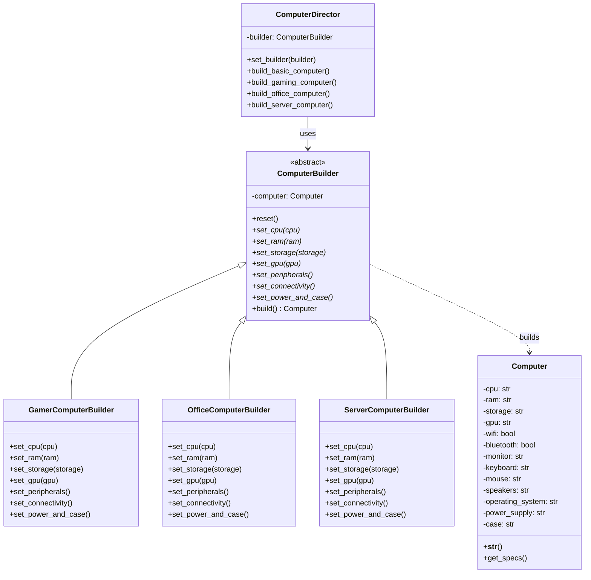

# Builder Pattern

## Introdução

O **Builder Pattern** é um padrão criacional que permite construir objetos complexos passo a passo. Este padrão separa a construção de um objeto complexo de sua representação, permitindo que o mesmo processo de construção possa criar diferentes representações do objeto.

O padrão surgiu da necessidade de criar objetos que possuem muitos parâmetros opcionais ou que requerem uma sequência específica de inicialização. Em vez de usar construtores telescópicos (múltiplos construtores com diferentes combinações de parâmetros) ou objetos com muitos setters, o Builder fornece uma interface fluente e controlada para a construção de objetos.

## Problema que Resolve

### Cenário Problemático
Imagine que você precisa criar objetos `Computer` com muitas configurações possíveis. Sem o Builder Pattern, você enfrentaria:

```python
# Problema 1: Construtor telescópico
class Computer:
    def __init__(self, cpu, ram, storage, gpu=None, wifi=True, bluetooth=True, 
                 monitor=None, keyboard=None, mouse=None, speakers=None, 
                 operating_system="Windows", power_supply=None):
        # Muitos parâmetros, difícil de lembrar a ordem
        pass

# Problema 2: Objeto mutável com setters
computer = Computer()
computer.set_cpu("Intel i7")
computer.set_ram("16GB")
computer.set_storage("1TB SSD")
# Objeto pode estar em estado inconsistente durante a construção
computer.validate()  # E se esquecer de chamar?
```

### Problemas Específicos
- **Construtores telescópicos**: Muitos parâmetros tornam o código difícil de ler e manter
- **Ordem dos parâmetros**: Fácil de confundir a ordem, especialmente com tipos similares
- **Parâmetros opcionais**: Combinações explosivas de construtores para diferentes configurações
- **Validação complexa**: Dificuldade em validar dependências entre parâmetros
- **Estado inconsistente**: Objetos podem ficar em estado inválido durante a construção
- **Imutabilidade**: Dificuldade em criar objetos imutáveis com muitas propriedades

## Quando Usar

### Cenários Ideais
- **Objetos complexos**: Quando o objeto tem muitos parâmetros (geralmente 4+ parâmetros)
- **Configurações opcionais**: Muitos parâmetros são opcionais com valores padrão
- **Validação complexa**: Quando há dependências e regras de validação entre parâmetros
- **Diferentes representações**: Mesmo processo de construção para diferentes variações
- **Construção passo a passo**: Quando a ordem de construção importa
- **Objetos imutáveis**: Quando você quer criar objetos imutáveis complexos

### Indicadores de Necessidade
- Construtores com mais de 4 parâmetros
- Múltiplos construtores para diferentes combinações
- Código de criação repetitivo e verboso
- Necessidade de validação durante a construção
- Objetos que precisam ser configurados em etapas

## Quando NÃO Usar

### Cenários Inadequados
- **Objetos simples**: Quando o objeto tem poucos parâmetros obrigatórios
- **Construção trivial**: Quando a criação é direta e simples
- **Performance crítica**: O overhead adicional pode ser significativo
- **Objetos raramente criados**: Quando a complexidade não se justifica
- **Equipe inexperiente**: Pode introduzir complexidade desnecessária

### Sinais de Over-engineering
- Apenas 2-3 parâmetros simples
- Nenhuma lógica de validação especial
- Objetos criados em poucos locais
- Requisitos de configuração muito estáveis

## Exemplo Prático: Sistema de Configuração de Computadores

### Contexto
Uma loja de informática precisa de um sistema para configurar diferentes tipos de computadores (Gamer, Escritório, Servidor) com validações específicas e possibilidade de personalização detalhada.

### Problema
Sem o Builder Pattern, o código ficaria assim:

```python
# Código problemático
class Computer:
    def __init__(self, cpu, ram, storage, gpu, wifi, bluetooth, monitor, 
                 keyboard, mouse, speakers, os, power_supply, case):
        # 13 parâmetros! Impossível de gerenciar
        pass

# Criação confusa e propensa a erros
gamer_pc = Computer("Intel i9", "32GB", "2TB SSD", "RTX 4080", True, True,
                   "4K Monitor", "Gaming Keyboard", "Gaming Mouse", 
                   "5.1 Speakers", "Windows 11", "850W", "RGB Case")
```

### Solução com Builder Pattern

#### Diagrama da Solução



## Implementação em Python

```python
from abc import ABC, abstractmethod
from typing import Optional, Dict, Any
from dataclasses import dataclass
from enum import Enum

# Produto complexo
@dataclass(frozen=True)  # Imutável após criação
class Computer:
    cpu: str
    ram: str
    storage: str
    gpu: Optional[str] = None
    wifi: bool = True
    bluetooth: bool = True
    monitor: Optional[str] = None
    keyboard: Optional[str] = None
    mouse: Optional[str] = None
    speakers: Optional[str] = None
    operating_system: str = "Windows 11"
    power_supply: Optional[str] = None
    case: Optional[str] = None
    
    def __post_init__(self):
        """Validações após a criação"""
        self._validate_configuration()
    
    def _validate_configuration(self):
        """Valida se a configuração é consistente"""
        # Validação de RAM
        ram_value = int(self.ram.replace('GB', ''))
        if ram_value < 4:
            raise ValueError("RAM mínima é 4GB")
        
        # Validação de GPU para gaming
        if self.gpu and "RTX" in self.gpu and ram_value < 16:
            raise ValueError("Placas RTX requerem pelo menos 16GB de RAM")
        
        # Validação de fonte
        if self.gpu and ("RTX 4080" in self.gpu or "RTX 4090" in self.gpu):
            if not self.power_supply or int(self.power_supply.replace('W', '')) < 850:
                raise ValueError("GPU high-end requer fonte de pelo menos 850W")
    
    def get_specs(self) -> Dict[str, Any]:
        """Retorna especificações como dicionário"""
        return {
            "cpu": self.cpu,
            "ram": self.ram,
            "storage": self.storage,
            "gpu": self.gpu,
            "peripherals": {
                "monitor": self.monitor,
                "keyboard": self.keyboard,
                "mouse": self.mouse,
                "speakers": self.speakers
            },
            "connectivity": {
                "wifi": self.wifi,
                "bluetooth": self.bluetooth
            },
            "system": {
                "os": self.operating_system,
                "power_supply": self.power_supply,
                "case": self.case
            }
        }
    
    def __str__(self) -> str:
        return f"Computer({self.cpu}, {self.ram}, {self.storage})"

# Builder abstrato
class ComputerBuilder(ABC):
    def __init__(self):
        self.reset()
    
    def reset(self):
        """Reseta o builder para uma nova construção"""
        self._cpu: Optional[str] = None
        self._ram: Optional[str] = None
        self._storage: Optional[str] = None
        self._gpu: Optional[str] = None
        self._wifi: bool = True
        self._bluetooth: bool = True
        self._monitor: Optional[str] = None
        self._keyboard: Optional[str] = None
        self._mouse: Optional[str] = None
        self._speakers: Optional[str] = None
        self._operating_system: str = "Windows 11"
        self._power_supply: Optional[str] = None
        self._case: Optional[str] = None
    
    @abstractmethod
    def set_cpu(self, cpu: str) -> 'ComputerBuilder':
        """Define o processador"""
        pass
    
    @abstractmethod
    def set_ram(self, ram: str) -> 'ComputerBuilder':
        """Define a memória RAM"""
        pass
    
    @abstractmethod
    def set_storage(self, storage: str) -> 'ComputerBuilder':
        """Define o armazenamento"""
        pass
    
    def set_gpu(self, gpu: str) -> 'ComputerBuilder':
        """Define a placa de vídeo (opcional)"""
        self._gpu = gpu
        return self
    
    def set_peripherals(self, monitor: str = None, keyboard: str = None, 
                       mouse: str = None, speakers: str = None) -> 'ComputerBuilder':
        """Define periféricos"""
        if monitor:
            self._monitor = monitor
        if keyboard:
            self._keyboard = keyboard
        if mouse:
            self._mouse = mouse
        if speakers:
            self._speakers = speakers
        return self
    
    def set_connectivity(self, wifi: bool = True, bluetooth: bool = True) -> 'ComputerBuilder':
        """Define conectividade"""
        self._wifi = wifi
        self._bluetooth = bluetooth
        return self
    
    def set_power_and_case(self, power_supply: str = None, case: str = None) -> 'ComputerBuilder':
        """Define fonte e gabinete"""
        if power_supply:
            self._power_supply = power_supply
        if case:
            self._case = case
        return self
    
    def set_operating_system(self, os: str) -> 'ComputerBuilder':
        """Define sistema operacional"""
        self._operating_system = os
        return self
    
    def build(self) -> Computer:
        """Constrói o computador final"""
        if not all([self._cpu, self._ram, self._storage]):
            raise ValueError("CPU, RAM e Storage são obrigatórios")
        
        return Computer(
            cpu=self._cpu,
            ram=self._ram,
            storage=self._storage,
            gpu=self._gpu,
            wifi=self._wifi,
            bluetooth=self._bluetooth,
            monitor=self._monitor,
            keyboard=self._keyboard,
            mouse=self._mouse,
            speakers=self._speakers,
            operating_system=self._operating_system,
            power_supply=self._power_supply,
            case=self._case
        )

# Builders concretos
class GamerComputerBuilder(ComputerBuilder):
    def set_cpu(self, cpu: str = "Intel i7-13700K") -> 'ComputerBuilder':
        self._cpu = cpu
        return self
    
    def set_ram(self, ram: str = "32GB DDR5") -> 'ComputerBuilder':
        self._ram = ram
        return self
    
    def set_storage(self, storage: str = "1TB NVMe SSD") -> 'ComputerBuilder':
        self._storage = storage
        return self
    
    def set_gaming_defaults(self) -> 'ComputerBuilder':
        """Aplica configurações padrão para gaming"""
        return (self
                .set_gpu("RTX 4070")
                .set_peripherals(
                    monitor="27'' 144Hz Gaming Monitor",
                    keyboard="Mechanical RGB Keyboard",
                    mouse="Gaming Mouse 12000 DPI",
                    speakers="Gaming 2.1 Speakers"
                )
                .set_power_and_case("750W 80+ Gold", "RGB Gaming Case")
                .set_operating_system("Windows 11 Pro"))

class OfficeComputerBuilder(ComputerBuilder):
    def set_cpu(self, cpu: str = "Intel i5-13400") -> 'ComputerBuilder':
        self._cpu = cpu
        return self
    
    def set_ram(self, ram: str = "16GB DDR4") -> 'ComputerBuilder':
        self._ram = ram
        return self
    
    def set_storage(self, storage: str = "512GB SSD") -> 'ComputerBuilder':
        self._storage = storage
        return self
    
    def set_office_defaults(self) -> 'ComputerBuilder':
        """Aplica configurações padrão para escritório"""
        return (self
                .set_peripherals(
                    monitor="24'' Full HD Monitor",
                    keyboard="Wireless Keyboard",
                    mouse="Wireless Mouse"
                )
                .set_power_and_case("500W 80+ Bronze", "Compact Office Case")
                .set_operating_system("Windows 11 Home"))

class ServerComputerBuilder(ComputerBuilder):
    def set_cpu(self, cpu: str = "Intel Xeon Silver") -> 'ComputerBuilder':
        self._cpu = cpu
        return self
    
    def set_ram(self, ram: str = "64GB ECC DDR4") -> 'ComputerBuilder':
        self._ram = ram
        return self
    
    def set_storage(self, storage: str = "2TB Enterprise SSD RAID") -> 'ComputerBuilder':
        self._storage = storage
        return self
    
    def set_server_defaults(self) -> 'ComputerBuilder':
        """Aplica configurações padrão para servidor"""
        return (self
                .set_connectivity(wifi=False, bluetooth=False)  # Servidor usa cabo
                .set_power_and_case("1200W Redundant PSU", "4U Rack Case")
                .set_operating_system("Windows Server 2022"))

# Director (opcional)
class ComputerDirector:
    def __init__(self, builder: ComputerBuilder):
        self.builder = builder
    
    def set_builder(self, builder: ComputerBuilder):
        self.builder = builder
    
    def build_basic_computer(self) -> Computer:
        """Constrói um computador básico"""
        return (self.builder
                .reset()
                .set_cpu("Intel i3-12100")
                .set_ram("8GB DDR4")
                .set_storage("256GB SSD")
                .build())
    
    def build_gaming_computer(self) -> Computer:
        """Constrói um computador gamer completo"""
        if not isinstance(self.builder, GamerComputerBuilder):
            raise ValueError("Use GamerComputerBuilder para PCs gamer")
        
        return (self.builder
                .reset()
                .set_cpu()  # Usa padrões
                .set_ram()
                .set_storage()
                .set_gaming_defaults()
                .build())
    
    def build_workstation(self) -> Computer:
        """Constrói uma workstation customizada"""
        return (self.builder
                .reset()
                .set_cpu("Intel i9-13900K")
                .set_ram("64GB DDR5")
                .set_storage("2TB NVMe SSD")
                .set_gpu("RTX 4090")
                .set_peripherals(
                    monitor="32'' 4K Professional Monitor",
                    keyboard="Professional Keyboard"
                )
                .set_power_and_case("1000W 80+ Platinum", "Workstation Case")
                .build())

# Factory para builders (combina padrões)
class ComputerBuilderFactory:
    @staticmethod
    def get_gamer_builder() -> GamerComputerBuilder:
        return GamerComputerBuilder()
    
    @staticmethod
    def get_office_builder() -> OfficeComputerBuilder:
        return OfficeComputerBuilder()
    
    @staticmethod
    def get_server_builder() -> ServerComputerBuilder:
        return ServerComputerBuilder()

# Exemplo de uso
def main():
    print("=== Builder Pattern - Sistema de Configuração de Computadores ===\n")
    
    # 1. Construção manual fluente
    print("1. Construção manual fluente:")
    gamer_builder = ComputerBuilderFactory.get_gamer_builder()
    custom_gamer = (gamer_builder
                   .set_cpu("Intel i9-13900K")
                   .set_ram("64GB DDR5")
                   .set_storage("2TB NVMe SSD")
                   .set_gpu("RTX 4090")
                   .set_gaming_defaults()
                   .build())
    
    print(f"PC Gamer Customizado: {custom_gamer}")
    print(f"Especificações: {custom_gamer.get_specs()}")
    print()
    
    # 2. Usando Director com padrões
    print("2. Usando Director com configurações padrão:")
    director = ComputerDirector(ComputerBuilderFactory.get_gamer_builder())
    
    standard_gamer = director.build_gaming_computer()
    print(f"PC Gamer Padrão: {standard_gamer}")
    
    workstation = director.build_workstation()
    print(f"Workstation: {workstation}")
    print()
    
    # 3. Construção de diferentes tipos
    print("3. Diferentes tipos de computadores:")
    
    # Computador de escritório
    office_builder = ComputerBuilderFactory.get_office_builder()
    office_pc = (office_builder
                .set_cpu()  # Usa padrão
                .set_ram()
                .set_storage()
                .set_office_defaults()
                .build())
    print(f"PC Escritório: {office_pc}")
    
    # Servidor
    server_builder = ComputerBuilderFactory.get_server_builder()
    server = (server_builder
             .set_cpu()
             .set_ram()
             .set_storage()
             .set_server_defaults()
             .build())
    print(f"Servidor: {server}")
    print()
    
    # 4. Demonstração de validação
    print("4. Demonstração de validação:")
    try:
        invalid_builder = ComputerBuilderFactory.get_gamer_builder()
        invalid_computer = (invalid_builder
                           .set_cpu("Intel i5")
                           .set_ram("8GB")  # Pouca RAM para RTX
                           .set_storage("500GB")
                           .set_gpu("RTX 4080")  # Requer mais RAM
                           .build())
    except ValueError as e:
        print(f"Erro de validação capturado: {e}")
    
    # Construção válida
    valid_builder = ComputerBuilderFactory.get_gamer_builder()
    valid_computer = (valid_builder
                     .set_cpu("Intel i7")
                     .set_ram("32GB")  # RAM adequada
                     .set_storage("1TB SSD")
                     .set_gpu("RTX 4080")
                     .set_power_and_case("850W", "Gaming Case")  # Fonte adequada
                     .build())
    print(f"Computador válido criado: {valid_computer}")

if __name__ == "__main__":
    main()
```

### Vantagens da Implementação

1. **Interface fluente**: Métodos encadeados tornam o código legível
2. **Validação centralizada**: Regras de negócio aplicadas na construção
3. **Imutabilidade**: Objeto final é imutável e consistente
4. **Flexibilidade**: Diferentes builders para diferentes propósitos
5. **Reutilização**: Director permite configurações padronizadas
6. **Extensibilidade**: Fácil adicionar novos tipos de builders

### Variações do Pattern

```python
# Builder com validação step-by-step
class StepByStepComputerBuilder:
    def __init__(self):
        self._steps_completed = set()
    
    def set_cpu(self, cpu: str):
        self._cpu = cpu
        self._steps_completed.add('cpu')
        return self
    
    def set_ram(self, ram: str):
        if 'cpu' not in self._steps_completed:
            raise ValueError("CPU deve ser definido antes da RAM")
        self._ram = ram
        self._steps_completed.add('ram')
        return self
    
    def build(self):
        required_steps = {'cpu', 'ram', 'storage'}
        if not required_steps.issubset(self._steps_completed):
            missing = required_steps - self._steps_completed
            raise ValueError(f"Passos obrigatórios faltando: {missing}")
        return Computer(self._cpu, self._ram, self._storage)
```

O Builder Pattern fornece uma solução elegante para a criação de objetos complexos, permitindo configurações flexíveis, validação robusta e código altamente legível através de sua interface fluente.