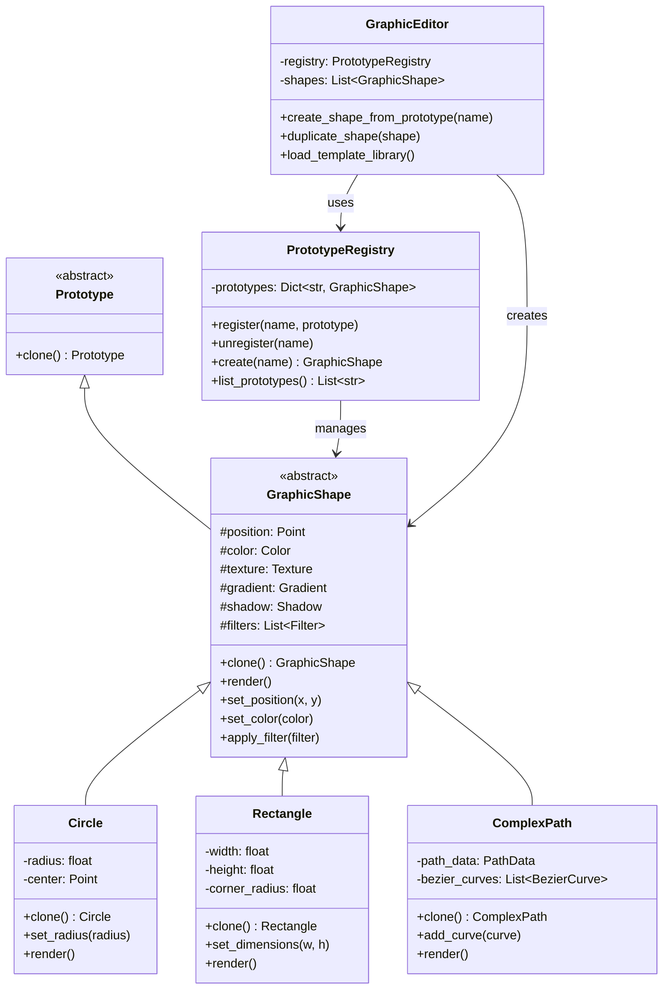

# Prototype Pattern

## Introdução

O **Prototype Pattern** é um padrão criacional que permite criar novos objetos clonando instâncias existentes (protótipos) em vez de construir objetos do zero. Este padrão especifica os tipos de objetos a serem criados usando uma instância prototípica, e cria novos objetos copiando este protótipo.

O padrão surgiu da necessidade de criar objetos quando a criação direta é custosa em termos de recursos ou tempo, ou quando você tem configurações complexas que deseja reutilizar. É amplamente utilizado em editores gráficos, jogos, configurações de sistema e qualquer situação onde duplicar um objeto existente é mais eficiente que criá-lo do zero.

## Problema que Resolve

### Cenário Problemático
Imagine que você está desenvolvendo um editor gráfico onde usuarios criam formas complexas com muitas propriedades (cor, gradiente, sombra, bordas, transformações, etc.). Sem o Prototype Pattern:

```python
# Código problemático - recriação custosa
class ComplexShape:
    def __init__(self):
        # Inicialização custosa
        self.load_textures()      # Carrega texturas do disco
        self.setup_gradients()    # Calcula gradientes complexos
        self.initialize_mesh()    # Cria malha 3D
        self.apply_filters()      # Aplica filtros custosos
        
def create_similar_shape():
    shape1 = ComplexShape()  # Criação custosa
    shape1.set_color("blue")
    shape1.set_position(100, 100)
    
    shape2 = ComplexShape()  # REPETE criação custosa!
    shape2.set_color("red")   # Só muda cor
    shape2.set_position(200, 100)  # E posição
    
    # 90% da configuração é igual, mas refaz tudo!
```

### Problemas Específicos
- **Criação custosa**: Reinicialização demorada de recursos (texturas, modelos 3D, configurações)
- **Desperdício de recursos**: Recalcular propriedades que poderiam ser reutilizadas
- **Acoplamento com classes concretas**: Cliente precisa conhecer todas as classes para instanciar
- **Configurações complexas**: Difícil recriar objetos com muitas propriedades configuradas
- **Performance**: Gargalo na criação de muitos objetos similares
- **Manutenibilidade**: Lógica de criação espalhada pelo código

## Quando Usar

### Cenários Ideais
- **Criação custosa**: Quando instanciar objeto é caro (I/O, rede, processamento)
- **Objetos similares**: Quando você cria muitos objetos com pequenas variações
- **Configurações complexas**: Objetos com muitas propriedades para configurar
- **Runtime object creation**: Quando tipos de objetos são determinados em runtime
- **Evitar subclasses**: Alternativa à criação de muitas subclasses de Factory
- **Estado complexo**: Quando objetos têm estado interno difícil de recriar

### Indicadores de Necessidade
- Operações caras de inicialização (load de arquivos, conexões de rede)
- Muitas variações de um objeto base
- Configurações que levam tempo para serem estabelecidas
- Necessidade de criar objetos sem conhecer suas classes concretas
- Objetos que mantêm estado complexo ou cache interno

## Quando NÃO Usar

### Cenários Inadequados
- **Objetos simples**: Quando criação é trivial e rápida
- **Objetos únicos**: Quando cada instância é fundamentalmente diferente
- **Referências circulares**: Problemas complexos com deep copy
- **Objetos imutáveis simples**: Strings, números, enums básicos
- **Memory constraints**: Quando manter protótipos ocupa muita memória

### Sinais de Over-engineering
- Criação de objetos já é rápida e simples
- Objetos têm pouco estado ou configuração
- Nenhuma reutilização de configurações
- Apenas um tipo de objeto sendo criado

## Exemplo Prático: Editor Gráfico com Formas Complexas

### Contexto
Um editor gráfico profissional onde usuarios criam formas complexas (logos, ilustrações) com texturas, gradientes, sombras e efeitos custosos de renderizar. Os usuarios frequentemente duplicam formas existentes para criar variações.

### Problema
Sem o Prototype Pattern, o código ficaria assim:

```python
# Código problemático
class GraphicShape:
    def __init__(self, shape_type):
        # Operações custosas a cada criação
        self.load_textures_from_disk()     # 2-3 segundos
        self.calculate_complex_gradients() # CPU intensivo
        self.setup_3d_mesh()              # GPU intensive
        self.apply_advanced_filters()     # Processamento pesado
        
        # Usuario tem que reconfigurar tudo novamente
        self.configure_all_properties()

# Usuário quer criar 100 formas similares - muito lento!
shapes = []
for i in range(100):
    shape = GraphicShape("circle")  # Recria tudo do zero!
    shape.set_color(colors[i])      # Só muda cor
    shapes.append(shape)
```

### Solução com Prototype Pattern

#### Diagrama da Solução



## Implementação em Python

```python
import copy
from abc import ABC, abstractmethod
from typing import Dict, List, Any, Optional, Tuple
from dataclasses import dataclass, field
from enum import Enum
import time
import uuid

# Estruturas de dados auxiliares
@dataclass
class Point:
    x: float
    y: float
    
    def __str__(self):
        return f"({self.x}, {self.y})"

@dataclass
class Color:
    r: int
    g: int
    b: int
    a: float = 1.0
    
    def __str__(self):
        return f"RGBA({self.r}, {self.g}, {self.b}, {self.a})"

@dataclass
class Texture:
    name: str
    data: bytes = field(default_factory=lambda: b"texture_data")
    loaded_time: float = field(default_factory=time.time)
    
    def __post_init__(self):
        # Simula carregamento custoso de textura
        print(f"Loading texture '{self.name}' (expensive operation)")
        time.sleep(0.1)  # Simula operação custosa

@dataclass 
class Gradient:
    start_color: Color
    end_color: Color
    angle: float = 0.0
    calculation_time: float = field(default_factory=time.time)
    
    def __post_init__(self):
        # Simula cálculo custoso de gradiente
        print(f"Calculating gradient (CPU intensive)")
        time.sleep(0.05)

@dataclass
class Shadow:
    offset_x: float
    offset_y: float
    blur_radius: float
    color: Color
    
class FilterType(Enum):
    BLUR = "blur"
    SHARPEN = "sharpen"
    EMBOSS = "emboss"
    GLOW = "glow"

@dataclass
class Filter:
    filter_type: FilterType
    intensity: float
    processed: bool = field(default=False, init=False)
    
    def __post_init__(self):
        # Simula processamento custoso de filtro
        print(f"Processing {self.filter_type.value} filter (GPU intensive)")
        time.sleep(0.03)
        self.processed = True

# Prototype base
class Prototype(ABC):
    @abstractmethod
    def clone(self) -> 'Prototype':
        """Clona o objeto atual"""
        pass

# Implementação base das formas gráficas
class GraphicShape(Prototype):
    def __init__(self, name: str):
        self.id = str(uuid.uuid4())
        self.name = name
        self.position = Point(0, 0)
        self.color = Color(0, 0, 0)
        self.texture: Optional[Texture] = None
        self.gradient: Optional[Gradient] = None
        self.shadow: Optional[Shadow] = None
        self.filters: List[Filter] = []
        self.metadata: Dict[str, Any] = {}
        self.creation_time = time.time()
        
        # Simula inicialização custosa
        print(f"🔨 Creating {self.__class__.__name__}: '{name}' (expensive initialization)")
        self._expensive_initialization()
    
    def _expensive_initialization(self):
        """Simula operações custosas de inicialização"""
        print("  Setting up 3D mesh...")
        time.sleep(0.02)
        print("  Initializing rendering engine...")
        time.sleep(0.02)
        print("  Calculating base properties...")
        time.sleep(0.02)
    
    def clone(self) -> 'GraphicShape':
        """Clona a forma usando deep copy"""
        print(f"Cloning {self.__class__.__name__}: '{self.name}' (fast operation)")
        
        # Deep copy mantém estado complexo mas cria nova instância
        cloned = copy.deepcopy(self)
        
        # Gera novo ID para o clone
        cloned.id = str(uuid.uuid4())
        cloned.name = f"{self.name}_copy"
        cloned.creation_time = time.time()
        
        return cloned
    
    def shallow_clone(self) -> 'GraphicShape':
        """Clona compartilhando referências (para objetos imutáveis)"""
        print(f"Shallow cloning {self.__class__.__name__}: '{self.name}'")
        
        cloned = copy.copy(self)
        cloned.id = str(uuid.uuid4()) 
        cloned.name = f"{self.name}_shallow_copy"
        cloned.creation_time = time.time()
        
        # Copia apenas lista de filtros (referências aos filtros são compartilhadas)
        cloned.filters = self.filters.copy()
        
        return cloned
    
    def set_position(self, x: float, y: float):
        self.position = Point(x, y)
        return self
    
    def set_color(self, color: Color):
        self.color = color
        return self
    
    def set_texture(self, texture: Texture):
        self.texture = texture
        return self
    
    def set_gradient(self, gradient: Gradient):
        self.gradient = gradient
        return self
    
    def add_filter(self, filter_obj: Filter):
        self.filters.append(filter_obj)
        return self
    
    def set_shadow(self, shadow: Shadow):
        self.shadow = shadow
        return self
    
    def get_info(self) -> Dict[str, Any]:
        """Retorna informações da forma"""
        return {
            "id": self.id,
            "name": self.name,
            "type": self.__class__.__name__,
            "position": str(self.position),
            "color": str(self.color),
            "has_texture": self.texture is not None,
            "has_gradient": self.gradient is not None,
            "has_shadow": self.shadow is not None,
            "filters_count": len(self.filters),
            "creation_time": self.creation_time
        }
    
    @abstractmethod
    def render(self) -> str:
        """Renderiza a forma"""
        pass
    
    def __str__(self):
        return f"{self.__class__.__name__}('{self.name}' at {self.position})"

# Implementações concretas
class Circle(GraphicShape):
    def __init__(self, name: str, radius: float = 50.0):
        super().__init__(name)
        self.radius = radius
        self.center = Point(0, 0)
    
    def set_radius(self, radius: float):
        self.radius = radius
        return self
    
    def set_center(self, x: float, y: float):
        self.center = Point(x, y)
        return self
    
    def render(self) -> str:
        effects = []
        if self.texture:
            effects.append(f"texture:{self.texture.name}")
        if self.gradient:
            effects.append("gradient")
        if self.shadow:
            effects.append("shadow")
        if self.filters:
            effects.append(f"{len(self.filters)} filters")
        
        effects_str = f" with {', '.join(effects)}" if effects else ""
        return f"Circle '{self.name}' (r={self.radius}) at {self.center}{effects_str}"

class Rectangle(GraphicShape):
    def __init__(self, name: str, width: float = 100.0, height: float = 60.0):
        super().__init__(name)
        self.width = width
        self.height = height
        self.corner_radius = 0.0
    
    def set_dimensions(self, width: float, height: float):
        self.width = width
        self.height = height
        return self
    
    def set_corner_radius(self, radius: float):
        self.corner_radius = radius
        return self
    
    def render(self) -> str:
        effects = []
        if self.texture:
            effects.append(f"texture:{self.texture.name}")
        if self.gradient:
            effects.append("gradient")
        if self.shadow:
            effects.append("shadow")
        if self.filters:
            effects.append(f"{len(self.filters)} filters")
        
        effects_str = f" with {', '.join(effects)}" if effects else ""
        corner_str = f", corner_radius={self.corner_radius}" if self.corner_radius > 0 else ""
        return f"Rectangle '{self.name}' ({self.width}x{self.height}{corner_str}){effects_str}"

class ComplexPath(GraphicShape):
    def __init__(self, name: str):
        super().__init__(name)
        self.path_points: List[Point] = []
        self.bezier_curves: List[Tuple[Point, Point, Point]] = []  # control points
        self.is_closed = False
    
    def add_point(self, x: float, y: float):
        self.path_points.append(Point(x, y))
        return self
    
    def add_bezier_curve(self, control1: Point, control2: Point, end: Point):
        self.bezier_curves.append((control1, control2, end))
        return self
    
    def close_path(self):
        self.is_closed = True
        return self
    
    def render(self) -> str:
        effects = []
        if self.texture:
            effects.append(f"texture:{self.texture.name}")
        if self.gradient:
            effects.append("gradient")
        if self.shadow:
            effects.append("shadow")
        if self.filters:
            effects.append(f"{len(self.filters)} filters")
        
        effects_str = f" with {', '.join(effects)}" if effects else ""
        path_info = f"({len(self.path_points)} points, {len(self.bezier_curves)} curves)"
        closed_str = " [closed]" if self.is_closed else " [open]"
        return f"ComplexPath '{self.name}' {path_info}{closed_str}{effects_str}"

# Registry para gerenciar protótipos
class PrototypeRegistry:
    def __init__(self):
        self._prototypes: Dict[str, GraphicShape] = {}
        self._initialize_default_prototypes()
    
    def _initialize_default_prototypes(self):
        """Inicializa protótipos padrão do sistema"""
        print("Initializing default prototypes...")
        
        # Círculo básico
        basic_circle = Circle("BasicCircle", 30)
        basic_circle.set_color(Color(100, 150, 200))
        self.register("circle_basic", basic_circle)
        
        # Círculo com efeitos
        fancy_circle = Circle("FancyCircle", 50)
        fancy_circle.set_color(Color(255, 100, 50))
        fancy_circle.set_gradient(Gradient(
            Color(255, 100, 50), 
            Color(255, 200, 100), 
            45
        ))
        fancy_circle.add_filter(Filter(FilterType.GLOW, 0.8))
        fancy_circle.set_shadow(Shadow(5, 5, 10, Color(0, 0, 0, 0.5)))
        self.register("circle_fancy", fancy_circle)
        
        # Retângulo básico
        basic_rect = Rectangle("BasicRect", 80, 50)
        basic_rect.set_color(Color(50, 100, 150))
        self.register("rect_basic", basic_rect)
        
        # Retângulo com bordas arredondadas
        rounded_rect = Rectangle("RoundedRect", 120, 80)
        rounded_rect.set_color(Color(150, 75, 200))
        rounded_rect.set_corner_radius(15)
        rounded_rect.set_texture(Texture("wood_texture"))
        self.register("rect_rounded", rounded_rect)
        
        print(f"{len(self._prototypes)} default prototypes initialized\n")
    
    def register(self, name: str, prototype: GraphicShape):
        """Registra um protótipo"""
        self._prototypes[name] = prototype
        print(f"Prototype '{name}' registered")
    
    def unregister(self, name: str):
        """Remove um protótipo"""
        if name in self._prototypes:
            del self._prototypes[name]
            print(f"Prototype '{name}' unregistered")
        else:
            print(f"Prototype '{name}' not found")
    
    def create(self, name: str) -> Optional[GraphicShape]:
        """Cria uma nova instância clonando o protótipo"""
        prototype = self._prototypes.get(name)
        if not prototype:
            print(f"Prototype '{name}' not found")
            return None
        
        return prototype.clone()
    
    def create_shallow(self, name: str) -> Optional[GraphicShape]:
        """Cria clone shallow do protótipo"""
        prototype = self._prototypes.get(name)
        if not prototype:
            print(f"Prototype '{name}' not found")
            return None
        
        return prototype.shallow_clone()
    
    def list_prototypes(self) -> List[str]:
        """Lista todos os protótipos disponíveis"""
        return list(self._prototypes.keys())
    
    def get_prototype_info(self, name: str) -> Optional[Dict[str, Any]]:
        """Retorna informações do protótipo"""
        prototype = self._prototypes.get(name)
        return prototype.get_info() if prototype else None

# Editor gráfico
class GraphicEditor:
    def __init__(self):
        self.registry = PrototypeRegistry()
        self.shapes: List[GraphicShape] = []
        self.canvas_size = (1920, 1080)
    
    def create_shape_from_prototype(self, prototype_name: str, x: float = 0, y: float = 0) -> Optional[GraphicShape]:
        """Cria forma a partir de protótipo"""
        shape = self.registry.create(prototype_name)
        if shape:
            shape.set_position(x, y)
            self.shapes.append(shape)
            print(f"Shape created from prototype '{prototype_name}' at ({x}, {y})")
        return shape
    
    def duplicate_shape(self, shape_index: int, offset_x: float = 50, offset_y: float = 50) -> Optional[GraphicShape]:
        """Duplica uma forma existente"""
        if 0 <= shape_index < len(self.shapes):
            original = self.shapes[shape_index]
            cloned = original.clone()
            cloned.set_position(
                original.position.x + offset_x,
                original.position.y + offset_y
            )
            self.shapes.append(cloned)
            print(f"Shape duplicated with offset ({offset_x}, {offset_y})")
            return cloned
        else:
            print(f"Invalid shape index: {shape_index}")
            return None
    
    def create_shape_series(self, prototype_name: str, count: int, spacing: float = 100):
        """Cria série de formas baseadas em protótipo"""
        print(f"🏗️ Creating series of {count} shapes from '{prototype_name}'...")
        start_time = time.time()
        
        for i in range(count):
            self.create_shape_from_prototype(
                prototype_name, 
                i * spacing, 
                0
            )
        
        end_time = time.time()
        print(f"⚡ Series creation completed in {end_time - start_time:.3f} seconds")
    
    def save_as_prototype(self, shape_index: int, prototype_name: str):
        """Salva forma existente como protótipo"""
        if 0 <= shape_index < len(self.shapes):
            shape = self.shapes[shape_index]
            self.registry.register(prototype_name, shape)
            print(f"Shape saved as prototype '{prototype_name}'")
        else:
            print(f"Invalid shape index: {shape_index}")
    
    def load_template_library(self):
        """Carrega biblioteca de templates pré-definidos"""
        print("Loading template library...")
        
        # Logo template
        logo_circle = Circle("LogoCircle", 40)
        logo_circle.set_gradient(Gradient(Color(0, 100, 200), Color(100, 200, 255), 90))
        logo_circle.add_filter(Filter(FilterType.GLOW, 0.6))
        logo_circle.set_shadow(Shadow(3, 3, 8, Color(0, 0, 0, 0.3)))
        self.registry.register("logo_circle", logo_circle)
        
        # Button template
        button_rect = Rectangle("ButtonRect", 120, 40)
        button_rect.set_color(Color(70, 130, 180))
        button_rect.set_corner_radius(8)
        button_rect.add_filter(Filter(FilterType.EMBOSS, 0.4))
        self.registry.register("button_basic", button_rect)
        
        # Complex path template
        complex_shape = ComplexPath("DecoPattern")
        complex_shape.add_point(0, 0).add_point(50, 25).add_point(100, 0)
        complex_shape.add_bezier_curve(Point(100, 30), Point(50, 60), Point(0, 30))
        complex_shape.close_path()
        complex_shape.set_texture(Texture("pattern_texture"))
        self.registry.register("pattern_complex", complex_shape)
        
        print("Template library loaded")
    
    def render_canvas(self):
        """Renderiza todo o canvas"""
        print(f"\nRendering canvas ({self.canvas_size[0]}x{self.canvas_size[1]}):")
        print("-" * 60)
        
        if not self.shapes:
            print("Canvas is empty")
            return
        
        for i, shape in enumerate(self.shapes):
            print(f"{i+1:2d}. {shape.render()}")
        
        print(f"\nTotal shapes: {len(self.shapes)}")
    
    def get_canvas_stats(self) -> Dict[str, Any]:
        """Retorna estatísticas do canvas"""
        shape_types = {}
        total_filters = 0
        
        for shape in self.shapes:
            shape_type = shape.__class__.__name__
            shape_types[shape_type] = shape_types.get(shape_type, 0) + 1
            total_filters += len(shape.filters)
        
        return {
            "total_shapes": len(self.shapes),
            "shape_types": shape_types,
            "total_filters": total_filters,
            "canvas_size": self.canvas_size,
            "available_prototypes": len(self.registry.list_prototypes())
        }

# Exemplo de uso
def main():
    print("=== Prototype Pattern - Editor Gráfico ===\n")
    
    # 1. Inicialização do editor
    editor = GraphicEditor()
    editor.load_template_library()
    
    # 2. Mostra protótipos disponíveis
    print("Available prototypes:")
    for prototype_name in editor.registry.list_prototypes():
        info = editor.registry.get_prototype_info(prototype_name)
        print(f"  - {prototype_name}: {info['type']} '{info['name']}'")
    print()
    
    # 3. Demonstração de clonagem vs criação do zero
    print("⚡ Performance comparison: Cloning vs Creating from scratch")
    print("-" * 50)
    
    # Criação do zero (lenta)
    print("Creating 5 complex shapes from scratch:")
    start_time = time.time()
    for i in range(5):
        circle = Circle(f"NewCircle_{i}", 30)
        circle.set_gradient(Gradient(Color(255, 100, 50), Color(255, 200, 100), 45))
        circle.add_filter(Filter(FilterType.GLOW, 0.8))
        circle.set_shadow(Shadow(5, 5, 10, Color(0, 0, 0, 0.5)))
    creation_time = time.time() - start_time
    print(f"Creation from scratch: {creation_time:.3f} seconds\n")
    
    # Clonagem (rápida)
    print("Creating 5 shapes by cloning prototype:")
    start_time = time.time()
    for i in range(5):
        editor.create_shape_from_prototype("circle_fancy", i * 60, 0)
    cloning_time = time.time() - start_time
    print(f"Cloning time: {cloning_time:.3f} seconds")
    print(f"Speedup: {creation_time/cloning_time:.1f}x faster!\n")
    
    # 4. Criação de diferentes tipos de formas
    print("Creating various shapes from prototypes:")
    editor.create_shape_from_prototype("rect_basic", 200, 100)
    editor.create_shape_from_prototype("rect_rounded", 350, 100)
    editor.create_shape_from_prototype("logo_circle", 500, 150)
    editor.create_shape_from_prototype("button_basic", 200, 200)
    
    # 5. Duplicação de formas existentes
    print("\nDuplicating existing shapes:")
    editor.duplicate_shape(0, 100, 50)  # Duplica primeira forma
    editor.duplicate_shape(2, -50, 100) # Duplica terceira forma
    
    # 6. Criação em série
    print("\nCreating shape series:")
    editor.create_shape_series("circle_basic", 8, 80)
    
    # 7. Salvando forma como novo protótipo
    print("\nCreating custom prototype:")
    custom_rect = Rectangle("CustomTemplate", 150, 100)
    custom_rect.set_color(Color(200, 50, 150))
    custom_rect.set_corner_radius(20)
    custom_rect.add_filter(Filter(FilterType.BLUR, 0.3))
    custom_rect.add_filter(Filter(FilterType.GLOW, 0.7))
    editor.shapes.append(custom_rect)
    editor.save_as_prototype(len(editor.shapes) - 1, "custom_fancy_rect")
    
    # Usa o protótipo customizado
    editor.create_shape_from_prototype("custom_fancy_rect", 600, 250)
    
    # 8. Renderização final
    editor.render_canvas()
    
    # 9. Estatísticas
    print("\nCanvas Statistics:")
    stats = editor.get_canvas_stats()
    for key, value in stats.items():
        print(f"  {key}: {value}")
    
    # 10. Demonstração de shallow vs deep clone
    print(f"\nShallow vs Deep Clone demonstration:")
    original = editor.registry._prototypes["circle_fancy"]
    
    # Deep clone (padrão)
    deep_clone = original.clone()
    deep_clone.color = Color(255, 0, 0)  # Muda cor do clone
    
    # Shallow clone
    shallow_clone = original.shallow_clone()
    
    print(f"Original color: {original.color}")
    print(f"Deep clone color: {deep_clone.color}")
    print(f"Shallow clone color: {shallow_clone.color}")
    print("Deep clone permite modificações independentes!")

if __name__ == "__main__":
    main()
```

### Vantagens da Implementação

1. **Performance significativa**: Clonagem é muito mais rápida que criação do zero
2. **Reutilização de configurações**: Templates complexos podem ser reutilizados
3. **Flexibilidade**: Suporte a deep e shallow cloning conforme necessário
4. **Registry pattern**: Gerenciamento centralizado de protótipos
5. **Extensibilidade**: Fácil adicionar novos tipos de formas
6. **Memória eficiente**: Compartilhamento de recursos quando apropriado

### Variações do Pattern

```python
# Prototype com cache inteligente
class CachedPrototype(GraphicShape):
    _cache = {}
    
    def clone(self):
        cache_key = f"{self.__class__.__name__}_{hash(str(self.get_info()))}"
        if cache_key not in self._cache:
            self._cache[cache_key] = copy.deepcopy(self)
        return copy.copy(self._cache[cache_key])

# Prototype com lazy loading
class LazyPrototype(GraphicShape):
    def __init__(self, name: str):
        self.name = name
        self._initialized = False
    
    def _ensure_initialized(self):
        if not self._initialized:
            self._expensive_initialization()
            self._initialized = True
    
    def clone(self):
        self._ensure_initialized()
        return copy.deepcopy(self)
```

O Prototype Pattern fornece uma solução eficiente para criação de objetos complexos, demonstrando significativa melhoria de performance e reutilização de configurações em um contexto realista de editor gráfico.