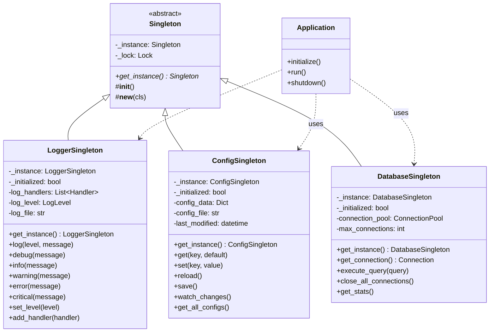

# Singleton Pattern

## Introdução

O **Singleton Pattern** é um padrão criacional que garante que uma classe tenha apenas uma instância e fornece um ponto de acesso global a essa instância. Este padrão restringe a instanciação de uma classe a um único objeto, sendo útil quando exatamente uma instância é necessária para coordenar ações em todo o sistema.

O padrão surgiu da necessidade de controlar rigorosamente o acesso a recursos compartilhados, como arquivos de configuração, conexões de banco de dados, pools de threads ou sistemas de logging. O Singleton garante que estes recursos críticos sejam acessados de forma consistente e coordenada em toda a aplicação.

## Problema que Resolve

### Cenário Problemático
Imagine que você está desenvolvendo uma aplicação corporativa que precisa de um sistema de configuração centralizado. Sem o Singleton Pattern:

```python
# Código problemático - múltiplas instâncias
class AppConfig:
    def __init__(self):
        self.settings = self.load_from_file()  # Operação custosa
        self.database_url = ""
        self.api_keys = {}
        self.feature_flags = {}

# Problema: múltiplas instâncias criadas
config1 = AppConfig()  # Carrega configurações
config2 = AppConfig()  # Carrega novamente (desperdício)
config3 = AppConfig()  # Mais uma vez

# Inconsistências possíveis
config1.database_url = "prod_database"
config2.database_url = "dev_database"  # Configurações diferentes!

# Qual é a configuração correta?
if config1.database_url != config2.database_url:
    # Estado inconsistente!
    pass
```

### Problemas Específicos
- **Múltiplas instâncias**: Desperdício de memória e recursos
- **Inconsistência de estado**: Diferentes instâncias podem ter estados diferentes
- **Operações custosas repetidas**: Recarregamento desnecessário de dados
- **Acesso não coordenado**: Modificações concorrentes podem causar problemas
- **Dificuldade de sincronização**: Estado global difícil de manter consistente
- **Recursos limitados**: Conexões de banco, handlers de arquivo podem ser desperdiçados

## Quando Usar

### Cenários Ideais
- **Recursos únicos**: Quando o recurso deve ser único por natureza (logger, configuração)
- **Ponto de acesso global**: Quando você precisa de acesso global consistente
- **Controle de instâncias**: Quando múltiplas instâncias causariam problemas
- **Estado compartilhado**: Quando o estado deve ser compartilhado globalmente
- **Operações custosas**: Quando a inicialização é cara e deve ser feita uma vez
- **Coordenação centralizada**: Cache, pools de recursos, gerenciadores de estado

### Indicadores de Necessidade
- Necessidade de exatamente uma instância
- Acesso global a um recurso ou serviço
- Estado que deve ser compartilhado em toda aplicação
- Inicialização custosa que deve ser feita apenas uma vez
- Recursos que devem ser acessados de forma coordenada

## Quando NÃO Usar

### Cenários Inadequados
- **Testabilidade**: Dificulta testes unitários e mocking
- **Acoplamento forte**: Cria dependências globais implícitas
- **Concorrência**: Pode criar gargalos em aplicações multi-thread
- **Flexibilidade**: Dificulta mudanças futuras na arquitetura
- **Estado mutável global**: Considerado anti-pattern por muitos desenvolvedores

### Sinais de Over-engineering
- Usar para conveniência em vez de necessidade real
- Múltiplas responsabilidades em uma classe Singleton
- Estado que poderia ser passado por dependência
- Quando injeção de dependência seria mais apropriada

### Críticas Comuns
- **Global state**: Introduz estado global, considerado problemático
- **Testing difficulties**: Dificulta isolamento em testes
- **Hidden dependencies**: Dependências não explícitas no código
- **Single Responsibility violation**: Gerencia tanto estado quanto acesso

## Exemplo Prático: Sistema de Logging e Configuração Corporativo

### Contexto
Uma aplicação empresarial que precisa de logging centralizado e configurações consistentes em todos os módulos, com controle de acesso e auditoria de mudanças.

### Problema
Sem o Singleton Pattern, o código ficaria assim:

```python
# Código problemático
class Logger:
    def __init__(self):
        self.setup_file_handlers()  # Operação custosa
        self.configure_formatters()
        self.load_config()

class ConfigManager:
    def __init__(self):
        self.load_from_database()   # Operação custosa
        self.setup_watchers()

# Cada módulo cria suas próprias instâncias
def module_a():
    logger = Logger()  # Nova instância
    config = ConfigManager()  # Nova instância
    
def module_b():
    logger = Logger()  # Outra instância (logs duplicados!)
    config = ConfigManager()  # Configurações possivelmente diferentes
```

### Solução com Singleton Pattern

#### Diagrama da Solução



## Implementação em Python

```python
import threading
import time
import json
import logging
import sqlite3
from abc import ABC, abstractmethod
from typing import Dict, Any, Optional, List
from datetime import datetime
from pathlib import Path
import os
from contextlib import contextmanager

# Base Singleton usando metaclass (thread-safe)
class SingletonMeta(type):
    """Metaclass que implementa o padrão Singleton de forma thread-safe"""
    _instances = {}
    _lock = threading.Lock()
    
    def __call__(cls, *args, **kwargs):
        # Double-checked locking pattern
        if cls not in cls._instances:
            with cls._lock:
                if cls not in cls._instances:
                    instance = super().__call__(*args, **kwargs)
                    cls._instances[cls] = instance
        return cls._instances[cls]

# Implementação alternativa usando decorator
def singleton(cls):
    """Decorator que converte uma classe em Singleton"""
    instances = {}
    lock = threading.Lock()
    
    def get_instance(*args, **kwargs):
        if cls not in instances:
            with lock:
                if cls not in instances:
                    instances[cls] = cls(*args, **kwargs)
        return instances[cls]
    
    return get_instance

# Logger Singleton
class LoggerSingleton(metaclass=SingletonMeta):
    def __init__(self):
        if hasattr(self, '_initialized'):
            return
        
        self._initialized = True
        self._lock = threading.Lock()
        self.log_handlers = []
        self.log_level = logging.INFO
        self.log_file = "app.log"
        self._setup_logging()
        
        print("LoggerSingleton initialized - expensive operation performed once")
    
    def _setup_logging(self):
        """Configuração custosa do sistema de logging"""
        # Simula operação custosa
        time.sleep(0.1)
        
        # Configura formatters
        formatter = logging.Formatter(
            '%(asctime)s - %(name)s - %(levelname)s - %(message)s'
        )
        
        # File handler
        file_handler = logging.FileHandler(self.log_file)
        file_handler.setFormatter(formatter)
        self.log_handlers.append(file_handler)
        
        # Console handler
        console_handler = logging.StreamHandler()
        console_handler.setFormatter(formatter)
        self.log_handlers.append(console_handler)
        
        # Configura logger interno
        self._logger = logging.getLogger('AppLogger')
        self._logger.setLevel(self.log_level)
        
        for handler in self.log_handlers:
            self._logger.addHandler(handler)
    
    def log(self, level: int, message: str):
        """Log genérico com nível especificado"""
        with self._lock:
            self._logger.log(level, message)
    
    def debug(self, message: str):
        """Log de debug"""
        self.log(logging.DEBUG, message)
    
    def info(self, message: str):
        """Log de informação"""
        self.log(logging.INFO, message)
    
    def warning(self, message: str):
        """Log de aviso"""
        self.log(logging.WARNING, message)
    
    def error(self, message: str):
        """Log de erro"""
        self.log(logging.ERROR, message)
    
    def critical(self, message: str):
        """Log crítico"""
        self.log(logging.CRITICAL, message)
    
    def set_level(self, level: int):
        """Define nível de log"""
        with self._lock:
            self.log_level = level
            self._logger.setLevel(level)
            self.info(f"Log level changed to {logging.getLevelName(level)}")
    
    def add_custom_handler(self, handler: logging.Handler):
        """Adiciona handler customizado"""
        with self._lock:
            self.log_handlers.append(handler)
            self._logger.addHandler(handler)
            self.info("Custom handler added to logger")
    
    def get_stats(self) -> Dict[str, Any]:
        """Retorna estatísticas do logger"""
        return {
            "handlers_count": len(self.log_handlers),
            "log_level": logging.getLevelName(self.log_level),
            "log_file": self.log_file,
            "initialized": self._initialized
        }

# Configuration Singleton
class ConfigSingleton(metaclass=SingletonMeta):
    def __init__(self):
        if hasattr(self, '_initialized'):
            return
        
        self._initialized = True
        self._lock = threading.Lock()
        self.config_file = "app_config.json"
        self.config_data = {}
        self.last_modified = None
        self._watchers = []
        
        self._load_config()
        self._setup_file_watcher()
        
        print("ConfigSingleton initialized - configuration loaded from file")
    
    def _load_config(self):
        """Carrega configuração do arquivo"""
        # Simula operação custosa de carregamento
        time.sleep(0.05)
        
        try:
            if Path(self.config_file).exists():
                with open(self.config_file, 'r') as f:
                    self.config_data = json.load(f)
                self.last_modified = datetime.fromtimestamp(
                    os.path.getmtime(self.config_file)
                )
            else:
                # Configurações padrão
                self.config_data = {
                    "database_url": "sqlite:///app.db",
                    "api_timeout": 30,
                    "max_retries": 3,
                    "debug_mode": False,
                    "feature_flags": {
                        "new_ui": True,
                        "beta_features": False
                    },
                    "cache_settings": {
                        "ttl": 3600,
                        "max_size": 1000
                    }
                }
                self.save()
        except Exception as e:
            print(f"Error loading config: {e}")
            self.config_data = {}
    
    def _setup_file_watcher(self):
        """Configura monitoramento de mudanças no arquivo"""
        # Em uma implementação real, usaria watchdog ou similar
        self._watch_thread = threading.Thread(target=self._watch_config_changes, daemon=True)
        self._watch_thread.start()
    
    def _watch_config_changes(self):
        """Monitora mudanças no arquivo de configuração"""
        while True:
            try:
                if Path(self.config_file).exists():
                    current_modified = datetime.fromtimestamp(
                        os.path.getmtime(self.config_file)
                    )
                    if self.last_modified and current_modified > self.last_modified:
                        self.reload()
                        for watcher in self._watchers:
                            watcher("config_changed")
                time.sleep(1)  # Check every second
            except Exception:
                time.sleep(5)  # Retry after error
    
    def get(self, key: str, default: Any = None) -> Any:
        """Obtém valor de configuração"""
        with self._lock:
            keys = key.split('.')
            value = self.config_data
            
            try:
                for k in keys:
                    value = value[k]
                return value
            except (KeyError, TypeError):
                return default
    
    def set(self, key: str, value: Any) -> None:
        """Define valor de configuração"""
        with self._lock:
            keys = key.split('.')
            config = self.config_data
            
            # Navega até o penúltimo nível
            for k in keys[:-1]:
                if k not in config:
                    config[k] = {}
                config = config[k]
            
            # Define o valor
            config[keys[-1]] = value
            
            # Log da mudança
            logger = LoggerSingleton()
            logger.info(f"Configuration changed: {key} = {value}")
    
    def reload(self):
        """Recarrega configuração do arquivo"""
        with self._lock:
            old_data = self.config_data.copy()
            self._load_config()
            
            logger = LoggerSingleton()
            logger.info("Configuration reloaded from file")
            
            # Notifica sobre mudanças específicas
            changes = self._detect_changes(old_data, self.config_data)
            if changes:
                logger.info(f"Configuration changes detected: {changes}")
    
    def _detect_changes(self, old: Dict, new: Dict) -> List[str]:
        """Detecta mudanças entre duas configurações"""
        changes = []
        
        def compare_dict(old_dict, new_dict, prefix=""):
            for key in set(old_dict.keys()) | set(new_dict.keys()):
                full_key = f"{prefix}.{key}" if prefix else key
                
                if key not in old_dict:
                    changes.append(f"added: {full_key}")
                elif key not in new_dict:
                    changes.append(f"removed: {full_key}")
                elif old_dict[key] != new_dict[key]:
                    if isinstance(old_dict[key], dict) and isinstance(new_dict[key], dict):
                        compare_dict(old_dict[key], new_dict[key], full_key)
                    else:
                        changes.append(f"changed: {full_key}")
        
        compare_dict(old, new)
        return changes
    
    def save(self):
        """Salva configuração no arquivo"""
        with self._lock:
            try:
                with open(self.config_file, 'w') as f:
                    json.dump(self.config_data, f, indent=2)
                self.last_modified = datetime.now()
                
                logger = LoggerSingleton()
                logger.info("Configuration saved to file")
            except Exception as e:
                logger = LoggerSingleton()
                logger.error(f"Error saving config: {e}")
    
    def add_watcher(self, callback):
        """Adiciona callback para mudanças de configuração"""
        self._watchers.append(callback)
    
    def get_all_configs(self) -> Dict[str, Any]:
        """Retorna todas as configurações"""
        with self._lock:
            return self.config_data.copy()
    
    def get_stats(self) -> Dict[str, Any]:
        """Retorna estatísticas da configuração"""
        return {
            "config_file": self.config_file,
            "last_modified": self.last_modified.isoformat() if self.last_modified else None,
            "total_keys": len(self.config_data),
            "watchers_count": len(self._watchers),
            "initialized": self._initialized
        }

# Database Connection Singleton
class DatabaseSingleton(metaclass=SingletonMeta):
    def __init__(self):
        if hasattr(self, '_initialized'):
            return
        
        self._initialized = True
        self._lock = threading.Lock()
        self.connection_pool = []
        self.max_connections = 10
        self.active_connections = 0
        
        config = ConfigSingleton()
        self.database_url = config.get("database_url", "sqlite:///app.db")
        
        self._initialize_connection_pool()
        
        print("DatabaseSingleton initialized - connection pool created")
    
    def _initialize_connection_pool(self):
        """Inicializa pool de conexões"""
        # Simula operação custosa
        time.sleep(0.1)
        
        logger = LoggerSingleton()
        logger.info(f"Initializing database connection pool for {self.database_url}")
        
        # Para demonstração, usa SQLite
        if "sqlite" in self.database_url:
            try:
                # Cria conexões iniciais
                for _ in range(min(3, self.max_connections)):
                    conn = sqlite3.connect(self.database_url.replace("sqlite:///", ""))
                    conn.row_factory = sqlite3.Row  # Para acessar colunas por nome
                    self.connection_pool.append(conn)
                
                # Cria tabela de exemplo
                with self.get_connection() as conn:
                    conn.execute("""
                        CREATE TABLE IF NOT EXISTS app_logs (
                            id INTEGER PRIMARY KEY AUTOINCREMENT,
                            timestamp DATETIME DEFAULT CURRENT_TIMESTAMP,
                            level TEXT,
                            message TEXT
                        )
                    """)
                    conn.commit()
                
                logger.info(f"Database pool initialized with {len(self.connection_pool)} connections")
            except Exception as e:
                logger.error(f"Error initializing database: {e}")
    
    @contextmanager
    def get_connection(self):
        """Context manager para obter conexão do pool"""
        conn = None
        try:
            with self._lock:
                if self.connection_pool:
                    conn = self.connection_pool.pop()
                else:
                    # Cria nova conexão se pool está vazio
                    conn = sqlite3.connect(self.database_url.replace("sqlite:///", ""))
                    conn.row_factory = sqlite3.Row
                
                self.active_connections += 1
            
            yield conn
            
        except Exception as e:
            logger = LoggerSingleton()
            logger.error(f"Database error: {e}")
            raise
        finally:
            if conn:
                with self._lock:
                    self.active_connections -= 1
                    if len(self.connection_pool) < self.max_connections:
                        self.connection_pool.append(conn)
                    else:
                        conn.close()
    
    def execute_query(self, query: str, params: tuple = ()) -> List[Dict]:
        """Executa query e retorna resultados"""
        with self.get_connection() as conn:
            cursor = conn.execute(query, params)
            if query.strip().upper().startswith('SELECT'):
                return [dict(row) for row in cursor.fetchall()]
            else:
                conn.commit()
                return []
    
    def log_to_database(self, level: str, message: str):
        """Log específico para banco de dados"""
        self.execute_query(
            "INSERT INTO app_logs (level, message) VALUES (?, ?)",
            (level, message)
        )
    
    def get_recent_logs(self, limit: int = 10) -> List[Dict]:
        """Obtém logs recentes do banco"""
        return self.execute_query(
            "SELECT * FROM app_logs ORDER BY timestamp DESC LIMIT ?",
            (limit,)
        )
    
    def close_all_connections(self):
        """Fecha todas as conexões"""
        with self._lock:
            for conn in self.connection_pool:
                conn.close()
            self.connection_pool.clear()
            
            logger = LoggerSingleton()
            logger.info("All database connections closed")
    
    def get_stats(self) -> Dict[str, Any]:
        """Retorna estatísticas do banco"""
        return {
            "database_url": self.database_url,
            "pool_size": len(self.connection_pool),
            "active_connections": self.active_connections,
            "max_connections": self.max_connections,
            "initialized": self._initialized
        }

# Aplicação principal demonstrando uso dos Singletons
class CorporateApplication:
    def __init__(self):
        self.modules = []
        self.running = False
    
    def initialize(self):
        """Inicializa aplicação e seus singletons"""
        print("Corporate Application starting...")
        print("-" * 50)
        
        # Inicializa singletons (operações custosas só executam uma vez)
        logger = LoggerSingleton()
        config = ConfigSingleton()
        db = DatabaseSingleton()
        
        # Configura logger baseado na configuração
        if config.get("debug_mode", False):
            logger.set_level(logging.DEBUG)
        
        # Adiciona watcher de configuração
        config.add_watcher(self._on_config_change)
        
        logger.info("Corporate Application initialized")
        print("Initialization complete!")
        print()
    
    def _on_config_change(self, event_type: str):
        """Callback para mudanças de configuração"""
        logger = LoggerSingleton()
        logger.info(f"Configuration change detected: {event_type}")
    
    def simulate_modules(self):
        """Simula múltiplos módulos usando os mesmos singletons"""
        print("Simulating multiple modules accessing singletons...")
        print("-" * 50)
        
        # Módulo A
        self._module_a()
        
        # Módulo B  
        self._module_b()
        
        # Módulo C
        self._module_c()
        
        print("All modules completed their work!")
        print()
    
    def _module_a(self):
        """Módulo A - Processamento de dados"""
        # Todos os módulos obtêm as MESMAS instâncias
        logger = LoggerSingleton()
        config = ConfigSingleton()
        db = DatabaseSingleton()
        
        logger.info("Module A started - processing data")
        
        # Usa configuração
        timeout = config.get("api_timeout", 30)
        logger.debug(f"Using API timeout: {timeout}s")
        
        # Simula processamento
        time.sleep(0.1)
        
        # Log para banco
        db.log_to_database("INFO", "Module A completed data processing")
        
        logger.info("Module A completed")
    
    def _module_b(self):
        """Módulo B - Interface de usuário"""
        logger = LoggerSingleton()
        config = ConfigSingleton()
        
        logger.info("Module B started - setting up UI")
        
        # Verifica feature flags
        new_ui = config.get("feature_flags.new_ui", False)
        if new_ui:
            logger.info("Using new UI features")
        else:
            logger.info("Using legacy UI")
        
        # Simula operação de UI
        time.sleep(0.05)
        
        logger.info("Module B completed")
    
    def _module_c(self):
        """Módulo C - Relatórios"""
        logger = LoggerSingleton()
        config = ConfigSingleton()
        db = DatabaseSingleton()
        
        logger.info("Module C started - generating reports")
        
        # Obtém configurações de cache
        cache_ttl = config.get("cache_settings.ttl", 3600)
        logger.debug(f"Using cache TTL: {cache_ttl}s")
        
        # Obtém logs recentes do banco
        recent_logs = db.get_recent_logs(5)
        logger.info(f"Retrieved {len(recent_logs)} recent logs for report")
        
        # Log para banco
        db.log_to_database("INFO", "Module C generated reports")
        
        logger.info("Module C completed")
    
    def demonstrate_singleton_behavior(self):
        """Demonstra que sempre a mesma instância é retornada"""
        print("Demonstrating Singleton behavior...")
        print("-" * 50)
        
        # Múltiplas 'criações' retornam a mesma instância
        logger1 = LoggerSingleton()
        logger2 = LoggerSingleton()
        logger3 = LoggerSingleton()
        
        config1 = ConfigSingleton()
        config2 = ConfigSingleton()
        
        db1 = DatabaseSingleton()
        db2 = DatabaseSingleton()
        
        # Verifica se são a mesma instância
        print(f"Logger instances are same: {logger1 is logger2 is logger3}")
        print(f"Config instances are same: {config1 is config2}")
        print(f"Database instances are same: {db1 is db2}")
        
        # IDs de objeto devem ser iguais
        print(f"Logger object IDs: {id(logger1)}, {id(logger2)}, {id(logger3)}")
        print(f"Config object IDs: {id(config1)}, {id(config2)}")
        print(f"Database object IDs: {id(db1)}, {id(db2)}")
        print()
    
    def show_statistics(self):
        """Mostra estatísticas de todos os singletons"""
        print("Singleton Statistics:")
        print("-" * 50)
        
        logger = LoggerSingleton()
        config = ConfigSingleton()
        db = DatabaseSingleton()
        
        print("Logger Stats:")
        logger_stats = logger.get_stats()
        for key, value in logger_stats.items():
            print(f"  {key}: {value}")
        
        print("\nConfig Stats:")
        config_stats = config.get_stats()
        for key, value in config_stats.items():
            print(f"  {key}: {value}")
        
        print("\nDatabase Stats:")
        db_stats = db.get_stats()
        for key, value in db_stats.items():
            print(f"  {key}: {value}")
        
        print("\nRecent Database Logs:")
        recent_logs = db.get_recent_logs(3)
        for log in recent_logs:
            print(f"  [{log['timestamp']}] {log['level']}: {log['message']}")
        print()
    
    def test_thread_safety(self):
        """Testa thread safety dos singletons"""
        print("Testing thread safety...")
        print("-" * 50)
        
        results = {"logger_ids": set(), "config_ids": set(), "db_ids": set()}
        
        def worker():
            # Cada thread obtém singletons
            logger = LoggerSingleton()
            config = ConfigSingleton()
            db = DatabaseSingleton()
            
            # Coleta IDs das instâncias
            results["logger_ids"].add(id(logger))
            results["config_ids"].add(id(config))
            results["db_ids"].add(id(db))
            
            # Simula trabalho
            logger.info(f"Thread {threading.current_thread().name} working")
            time.sleep(0.01)
        
        # Cria e executa threads
        threads = []
        for i in range(10):
            thread = threading.Thread(target=worker, name=f"Worker-{i}")
            threads.append(thread)
            thread.start()
        
        # Aguarda conclusão
        for thread in threads:
            thread.join()
        
        # Verifica resultados
        print(f"Logger unique instances: {len(results['logger_ids'])} (should be 1)")
        print(f"Config unique instances: {len(results['config_ids'])} (should be 1)")
        print(f"Database unique instances: {len(results['db_ids'])} (should be 1)")
        
        success = all(len(ids) == 1 for ids in results.values())
        print(f"Thread safety test: {'PASSED' if success else 'FAILED'}")
        print()
    
    def run(self):
        """Executa a aplicação"""
        self.running = True
        
        self.initialize()
        self.demonstrate_singleton_behavior()
        self.simulate_modules()
        self.test_thread_safety()
        self.show_statistics()
        
        print("Application completed successfully!")
    
    def shutdown(self):
        """Encerra aplicação limpamente"""
        if self.running:
            logger = LoggerSingleton()
            db = DatabaseSingleton()
            
            logger.info("Application shutting down...")
            db.close_all_connections()
            
            self.running = False
            print("Application shutdown complete!")

# Exemplo de uso com diferentes implementações
def demonstrate_implementation_variations():
    """Demonstra diferentes formas de implementar Singleton"""
    print("Different Singleton implementations:")
    print("-" * 50)
    
    # 1. Usando decorator
    @singleton
    class DecoratorSingleton:
        def __init__(self):
            self.value = "decorator_singleton"
    
    # 2. Implementação clássica com __new__
    class ClassicSingleton:
        _instance = None
        _lock = threading.Lock()
        
        def __new__(cls):
            if cls._instance is None:
                with cls._lock:
                    if cls._instance is None:
                        cls._instance = super().__new__(cls)
            return cls._instance
        
        def __init__(self):
            if not hasattr(self, 'initialized'):
                self.value = "classic_singleton"
                self.initialized = True
    
    # 3. Módulo Python como singleton natural
    # (app_state.py seria importado como singleton natural)
    
    # Testa implementações
    dec1 = DecoratorSingleton()
    dec2 = DecoratorSingleton()
    print(f"Decorator Singleton same instance: {dec1 is dec2}")
    
    classic1 = ClassicSingleton()
    classic2 = ClassicSingleton()
    print(f"Classic Singleton same instance: {classic1 is classic2}")
    
    print()

# Exemplo principal
def main():
    print("=== Singleton Pattern - Corporate Application System ===")
    print()
    
    # Demonstra diferentes implementações
    demonstrate_implementation_variations()
    
    # Executa aplicação principal
    app = CorporateApplication()
    
    try:
        app.run()
    except KeyboardInterrupt:
        print("\nInterrupted by user")
    finally:
        app.shutdown()

if __name__ == "__main__":
    main()
```

### Vantagens da Implementação

1. **Controle rigoroso**: Garante uma única instância de recursos críticos
2. **Acesso global**: Ponto de acesso consistente em toda aplicação
3. **Lazy initialization**: Instância criada apenas quando necessária
4. **Thread safety**: Implementação thread-safe com locks
5. **Resource management**: Controle eficiente de recursos limitados
6. **Configuration consistency**: Estado global consistente

### Desvantagens e Limitações

1. **Global state**: Introduz estado global, dificultando testes
2. **Hidden dependencies**: Dependências implícitas não declaradas
3. **Testing challenges**: Dificulta mocking e isolamento de testes
4. **Tight coupling**: Cria acoplamento forte entre componentes
5. **Scalability issues**: Pode se tornar gargalo em sistemas concorrentes

### Alternativas Modernas

```python
# Dependency Injection (preferível)
class Application:
    def __init__(self, logger, config, database):
        self.logger = logger      # Injetado explicitamente
        self.config = config      # Dependências claras
        self.database = database  # Fácil de testar

# Module-level singleton (Pythonic)
# config.py
_config_instance = None

def get_config():
    global _config_instance
    if _config_instance is None:
        _config_instance = Config()
    return _config_instance
```

## Conclusão

O Singleton Pattern fornece uma solução eficaz para controle de instâncias únicas, mas deve ser usado com cuidado devido às suas limitações em testabilidade e acoplamento. Em sistemas modernos, padrões como Dependency Injection são frequentemente preferidos.