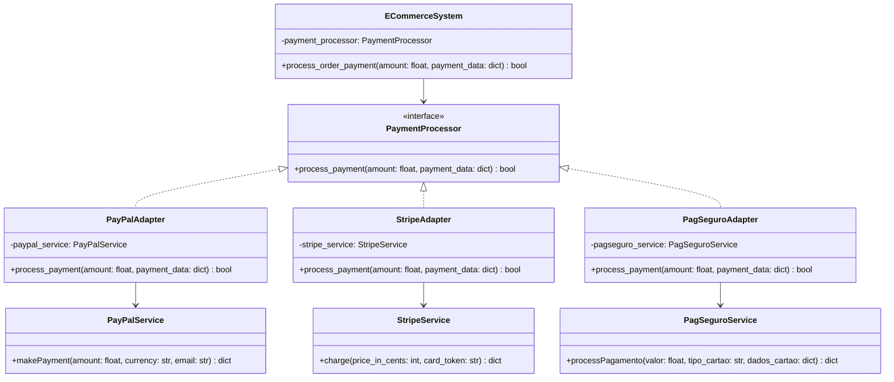

# Design Pattern: Adapter (Adaptador)

## 1. Introdução e Contexto

O padrão Adapter é um dos patterns estruturais mais utilizados na engenharia de software, especialmente em cenários de integração e evolução de sistemas. Este padrão atua como uma ponte entre interfaces incompatíveis, permitindo que classes que normalmente não poderiam trabalhar juntas colaborem de forma harmoniosa.

O conceito do Adapter é inspirado em adaptadores do mundo real, como os adaptadores de tomada que permitem conectar dispositivos com plugues diferentes em tomadas de formatos variados. Na programação, o Adapter funciona de maneira similar, convertendo a interface de uma classe existente em uma interface que o cliente espera utilizar.

Este padrão é fundamental em arquiteturas modernas, onde frequentemente precisamos integrar sistemas legados, bibliotecas de terceiros, APIs externas ou componentes desenvolvidos independentemente. O Adapter permite essa integração sem modificar o código existente, mantendo o princípio Open/Closed do SOLID.

## 2. Que Problema Resolve

O padrão Adapter resolve problemas fundamentais relacionados à incompatibilidade de interfaces:

### Incompatibilidade de Interface
Quando você tem uma classe existente com uma interface útil, mas que não corresponde à interface que sua aplicação precisa. Modificar a classe existente pode não ser possível ou desejável, especialmente se ela faz parte de uma biblioteca externa ou sistema legado.

### Integração de Sistemas Heterogêneos
Em ambientes corporativos, é comum ter sistemas desenvolvidos em épocas diferentes, por equipes distintas ou utilizando tecnologias variadas. Esses sistemas frequentemente possuem interfaces incompatíveis, e o Adapter permite sua integração sem refatoração massiva.

### Reutilização de Código Legado
Sistemas legados muitas vezes contêm lógica de negócio valiosa, mas suas interfaces podem estar desatualizadas ou incompatíveis com padrões modernos. O Adapter permite reaproveitar essa funcionalidade sem reescrevê-la.

### Abstração de Implementações Específicas
Quando você quer usar diferentes implementações de uma funcionalidade através de uma interface unificada, o Adapter permite tratar todas essas implementações de forma consistente.

## 3. Quando Usar o Padrão Adapter

### Cenários Ideais de Aplicação

**Integração de APIs Externas**: Quando você precisa integrar múltiplas APIs de terceiros que possuem interfaces diferentes, mas oferecem funcionalidades similares.

**Migração Gradual de Sistemas**: Durante processos de modernização, quando você quer introduzir novas interfaces gradualmente sem quebrar o sistema existente.

**Biblioteca de Terceiros**: Quando uma biblioteca externa possui uma interface útil, mas incompatível com o design do seu sistema.

**Sistemas Legados**: Para permitir que sistemas antigos interajam com componentes modernos sem modificação do código legado.

**Padronização de Interfaces**: Quando você tem múltiplas implementações de uma funcionalidade com interfaces diferentes e quer tratá-las de forma uniforme.

### Indicadores de Necessidade

- Você tem classes úteis, mas com interfaces incompatíveis
- Precisa integrar componentes externos sem modificá-los
- Quer isolar sua aplicação de mudanças em dependências externas
- Precisa de uma interface comum para implementações heterogêneas
- Está realizando migração ou evolução gradual de sistemas

## 4. Quando NÃO Usar o Padrão Adapter

### Cenários Inadequados

**Over-Engineering em Casos Simples**: Se a diferença entre interfaces é mínima e pode ser resolvida com refatoração simples, o Adapter pode adicionar complexidade desnecessária.

**Controle Total Sobre o Código**: Quando você tem controle total sobre todas as classes envolvidas, pode ser melhor padronizar as interfaces diretamente.

**Performance Crítica**: O Adapter introduz uma camada adicional que pode impactar performance em operações críticas. Em sistemas com requisitos rígidos de performance, essa sobrecarga pode ser inaceitável.

**Transformações Complexas**: Se a adaptação requer transformações muito complexas de dados ou lógica, pode ser melhor criar uma nova implementação específica.

### Sinais de Alerta

- A lógica de adaptação é mais complexa que a funcionalidade original
- Você está criando múltiplas camadas de Adapters encadeados
- A adaptação requer conhecimento profundo da implementação interna
- O Adapter precisa ser atualizado constantemente devido a mudanças nas interfaces adaptadas

## 5. Exemplo Prático: Sistema de Pagamentos

### Contexto do Problema

Imagine que você está desenvolvendo um e-commerce que precisa integrar múltiplos provedores de pagamento. Cada provedor possui sua própria API com métodos e estruturas de dados diferentes:

- **PayPal**: utiliza métodos como `makePayment(amount, currency, email)`
- **Stripe**: utiliza métodos como `charge(price_in_cents, card_token)`
- **PagSeguro**: utiliza métodos como `processPagamento(valor, tipo_cartao, dados_cartao)`

Seu sistema precisa processar pagamentos de forma unificada, sem conhecer os detalhes específicos de cada provedor.

### Diagrama da Solução



### Implementação em Python

```python
from abc import ABC, abstractmethod
from typing import Dict, Any


# Interface comum para processamento de pagamentos
class PaymentProcessor(ABC):
    @abstractmethod
    def process_payment(self, amount: float, payment_data: Dict[str, Any]) -> bool:
        pass


# Serviços externos com interfaces diferentes
class PayPalService:
    def makePayment(self, amount: float, currency: str, email: str) -> Dict[str, Any]:
        # Simulação da API do PayPal
        print(f"PayPal: Processing ${amount} {currency} for {email}")
        return {"status": "success", "transaction_id": "pp_12345"}


class StripeService:
    def charge(self, price_in_cents: int, card_token: str) -> Dict[str, Any]:
        # Simulação da API do Stripe
        print(f"Stripe: Charging {price_in_cents} cents with token {card_token}")
        return {"paid": True, "id": "ch_1234567890"}


class PagSeguroService:
    def processPagamento(self, valor: float, tipo_cartao: str, dados_cartao: Dict[str, str]) -> Dict[str, Any]:
        # Simulação da API do PagSeguro
        print(f"PagSeguro: Processando R${valor} via {tipo_cartao}")
        return {"sucesso": True, "codigo_transacao": "ps_98765"}


# Adapters para cada serviço
class PayPalAdapter(PaymentProcessor):
    def __init__(self, paypal_service: PayPalService):
        self.paypal_service = paypal_service
    
    def process_payment(self, amount: float, payment_data: Dict[str, Any]) -> bool:
        try:
            email = payment_data.get("email")
            currency = payment_data.get("currency", "USD")
            
            result = self.paypal_service.makePayment(amount, currency, email)
            return result.get("status") == "success"
        except Exception as e:
            print(f"PayPal payment failed: {e}")
            return False


class StripeAdapter(PaymentProcessor):
    def __init__(self, stripe_service: StripeService):
        self.stripe_service = stripe_service
    
    def process_payment(self, amount: float, payment_data: Dict[str, Any]) -> bool:
        try:
            card_token = payment_data.get("card_token")
            price_in_cents = int(amount * 100)  # Converter para centavos
            
            result = self.stripe_service.charge(price_in_cents, card_token)
            return result.get("paid", False)
        except Exception as e:
            print(f"Stripe payment failed: {e}")
            return False


class PagSeguroAdapter(PaymentProcessor):
    def __init__(self, pagseguro_service: PagSeguroService):
        self.pagseguro_service = pagseguro_service
    
    def process_payment(self, amount: float, payment_data: Dict[str, Any]) -> bool:
        try:
            tipo_cartao = payment_data.get("card_type", "credito")
            dados_cartao = {
                "numero": payment_data.get("card_number"),
                "cvv": payment_data.get("cvv"),
                "titular": payment_data.get("cardholder_name")
            }
            
            result = self.pagseguro_service.processPagamento(amount, tipo_cartao, dados_cartao)
            return result.get("sucesso", False)
        except Exception as e:
            print(f"PagSeguro payment failed: {e}")
            return False


# Sistema principal que usa os adapters
class ECommerceSystem:
    def __init__(self, payment_processor: PaymentProcessor):
        self.payment_processor = payment_processor
    
    def process_order_payment(self, amount: float, payment_data: Dict[str, Any]) -> bool:
        print(f"Processing payment of ${amount}")
        success = self.payment_processor.process_payment(amount, payment_data)
        
        if success:
            print("Payment processed successfully!")
        else:
            print("Payment failed!")
        
        return success


# Exemplo de uso
def main():
    # Criando instâncias dos serviços externos
    paypal = PayPalService()
    stripe = StripeService()
    pagseguro = PagSeguroService()
    
    # Criando adapters
    paypal_adapter = PayPalAdapter(paypal)
    stripe_adapter = StripeAdapter(stripe)
    pagseguro_adapter = PagSeguroAdapter(pagseguro)
    
    # Testando PayPal
    ecommerce_paypal = ECommerceSystem(paypal_adapter)
    paypal_data = {"email": "user@example.com", "currency": "USD"}
    ecommerce_paypal.process_order_payment(100.0, paypal_data)
    
    print("-" * 50)
    
    # Testando Stripe
    ecommerce_stripe = ECommerceSystem(stripe_adapter)
    stripe_data = {"card_token": "tok_visa"}
    ecommerce_stripe.process_order_payment(75.50, stripe_data)
    
    print("-" * 50)
    
    # Testando PagSeguro
    ecommerce_pagseguro = ECommerceSystem(pagseguro_adapter)
    pagseguro_data = {
        "card_type": "credito",
        "card_number": "1234567890123456",
        "cvv": "123",
        "cardholder_name": "João Silva"
    }
    ecommerce_pagseguro.process_order_payment(200.0, pagseguro_data)


if __name__ == "__main__":
    main()
```

### Vantagens da Solução

**Flexibilidade**: O sistema pode facilmente alternar entre provedores ou adicionar novos sem modificar o código principal.

**Reutilização**: Cada adapter pode ser reutilizado em diferentes partes do sistema.

**Manutenibilidade**: Mudanças nas APIs dos provedores afetam apenas os adapters correspondentes.

**Testabilidade**: Cada componente pode ser testado independentemente.

### Análise da Implementação

Este exemplo demonstra como o padrão Adapter resolve o problema de incompatibilidade de interfaces de forma elegante. O `ECommerceSystem` trabalha com uma interface unificada (`PaymentProcessor`), sem conhecer os detalhes específicos de cada provedor de pagamento. Os adapters encapsulam a lógica de conversão necessária, permitindo que APIs heterogêneas sejam utilizadas de forma consistente.

A solução mantém o princípio da responsabilidade única, onde cada adapter é responsável apenas por adaptar um serviço específico, e facilita a extensão do sistema para novos provedores de pagamento no futuro.