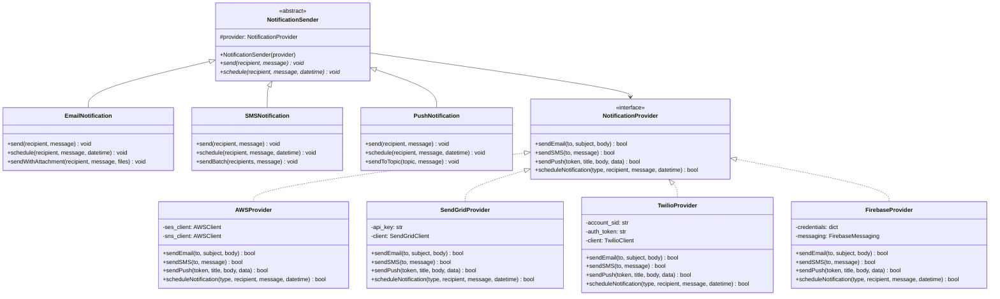

# Design Pattern: Bridge (Ponte)

## 1. Introdução e Contexto

O padrão Bridge é um design pattern estrutural que separa uma abstração de sua implementação, permitindo que ambas variem independentemente. Essa separação é fundamental para criar sistemas flexíveis onde você pode mudar tanto a interface quanto a implementação sem afetar uma à outra.

O conceito do Bridge é inspirado em pontes do mundo real, que conectam duas margens de um rio permitindo que o tráfego flua entre elas, mas cada margem pode ser desenvolvida independentemente. Na programação, o Bridge atua como uma ponte entre a abstração (o que o cliente vê) e a implementação (como as coisas são feitas nos bastidores).

Este padrão é especialmente valioso em arquiteturas onde você precisa suportar múltiplas plataformas, tecnologias ou implementações de uma mesma funcionalidade. Diferente da herança tradicional, que cria uma hierarquia rígida, o Bridge permite composição flexível onde abstrações e implementações podem evoluir separadamente.

O Bridge é frequentemente confundido com o Adapter, mas há uma diferença crucial: enquanto o Adapter trabalha com interfaces incompatíveis existentes, o Bridge é projetado antecipadamente para permitir que abstrações e implementações variem independentemente.

## 2. Que Problema Resolve

O padrão Bridge resolve problemas fundamentais relacionados ao acoplamento entre abstração e implementação:

### Explosão de Classes por Herança
Quando você usa herança para combinar diferentes abstrações com diferentes implementações, pode ocorrer uma explosão combinatorial de classes. Por exemplo, se você tem 3 tipos de formas geométricas e 4 tipos de renderizadores, acabaria com 12 classes (3 × 4) usando herança tradicional.

### Acoplamento Forte Entre Abstração e Implementação
Em designs tradicionais, mudanças na implementação podem afetar a abstração e vice-versa. O Bridge quebra esse acoplamento, permitindo que cada lado evolua independentemente.

### Dificuldade de Extensão
Adicionar uma nova abstração ou implementação em hierarchias tradicionais requer modificações em múltiplas classes. O Bridge permite extensões sem modificar código existente.

### Inflexibilidade em Tempo de Execução
Com herança estática, você não pode trocar implementações em tempo de execução. O Bridge permite essa flexibilidade através de composição.

### Violação do Princípio da Responsabilidade Única
Classes que misturam abstração e implementação violam o SRP, tornando-se difíceis de manter e testar.

## 3. Quando Usar o Padrão Bridge

### Cenários Ideais de Aplicação

**Múltiplas Implementações**: Quando você tem ou planeja ter múltiplas implementações de uma funcionalidade que devem ser intercambiáveis.

**Evolução Independente**: Quando abstração e implementação precisam evoluir independentemente, possivelmente desenvolvidas por equipes diferentes.

**Ocultação de Detalhes de Implementação**: Quando você quer esconder completamente os detalhes de implementação dos clientes.

**Troca em Tempo de Execução**: Quando você precisa trocar implementações dinamicamente durante a execução do programa.

**Suporte a Múltiplas Plataformas**: Para sistemas que precisam funcionar em diferentes plataformas ou ambientes.

### Indicadores de Necessidade

- Você tem uma hierarquia de classes crescendo exponencialmente
- Precisa suportar múltiplas implementações de uma interface
- Abstração e implementação mudam por razões diferentes
- Quer poder testar abstrações com implementações mock
- Precisa de flexibilidade para adicionar novas implementações sem modificar código existente

## 4. Quando NÃO Usar o Padrão Bridge

### Cenários Inadequados

**Interface Única e Estável**: Se você tem apenas uma implementação e não planeja ter outras, o Bridge adiciona complexidade desnecessária.

**Abstração e Implementação Fortemente Acopladas**: Quando a abstração depende intrinsecamente de detalhes específicos da implementação, o Bridge pode não ser adequado.

**Sistemas Simples**: Para aplicações pequenas e simples onde a flexibilidade adicional não justifica a complexidade.

**Performance Crítica**: O Bridge introduz uma camada de indireção que pode impactar performance em sistemas com requisitos extremamente rígidos.

**Implementação Única Definitiva**: Quando você tem certeza absoluta de que nunca haverá implementações alternativas.

### Sinais de Alerta

- A abstração precisa conhecer detalhes específicos da implementação
- Você está criando apenas uma implementação e não vê necessidade de outras
- A comunicação entre abstração e implementação é muito complexa
- O overhead de performance é inaceitável para seu caso de uso

## 5. Exemplo Prático: Sistema de Notificações

### Contexto do Problema

Imagine que você está desenvolvendo um sistema de notificações para uma aplicação enterprise. O sistema precisa suportar diferentes tipos de notificação (Email, SMS, Push) e diferentes provedores de infraestrutura (AWS SES, SendGrid, Twilio, Firebase).

Sem o padrão Bridge, você teria que criar classes como:
- AWSEmailNotification, SendGridEmailNotification
- TwilioSMSNotification, AWSSTNotification  
- FirebasePushNotification, AWSPushNotification

Isso resultaria em uma explosão de classes e acoplamento forte entre o tipo de notificação e o provedor usado.

### Diagrama da Solução



### Implementação em Python

```python
from abc import ABC, abstractmethod
from datetime import datetime
from typing import List, Dict, Any, Optional


# Implementor - Interface para provedores de notificação
class NotificationProvider(ABC):
    @abstractmethod
    def send_email(self, to: str, subject: str, body: str) -> bool:
        pass
    
    @abstractmethod
    def send_sms(self, to: str, message: str) -> bool:
        pass
    
    @abstractmethod
    def send_push(self, token: str, title: str, body: str, data: Dict[str, Any] = None) -> bool:
        pass
    
    @abstractmethod
    def schedule_notification(self, notification_type: str, recipient: str, 
                            message: str, send_at: datetime) -> bool:
        pass


# Concrete Implementors - Diferentes provedores
class AWSProvider(NotificationProvider):
    def __init__(self, region: str = "us-east-1"):
        self.region = region
        print(f"AWS Provider initialized for region {region}")
    
    def send_email(self, to: str, subject: str, body: str) -> bool:
        print(f"AWS SES: Sending email to {to}")
        print(f"Subject: {subject}")
        # Simulação da API do AWS SES
        return True
    
    def send_sms(self, to: str, message: str) -> bool:
        print(f"AWS SNS: Sending SMS to {to}")
        print(f"Message: {message}")
        # Simulação da API do AWS SNS
        return True
    
    def send_push(self, token: str, title: str, body: str, data: Dict[str, Any] = None) -> bool:
        print(f"AWS SNS: Sending push notification to {token}")
        print(f"Title: {title}, Body: {body}")
        return True
    
    def schedule_notification(self, notification_type: str, recipient: str, 
                            message: str, send_at: datetime) -> bool:
        print(f"AWS EventBridge: Scheduling {notification_type} for {send_at}")
        return True


class SendGridProvider(NotificationProvider):
    def __init__(self, api_key: str):
        self.api_key = api_key
        print("SendGrid Provider initialized")
    
    def send_email(self, to: str, subject: str, body: str) -> bool:
        print(f"SendGrid: Sending email to {to}")
        print(f"Subject: {subject}")
        # Simulação da API do SendGrid
        return True
    
    def send_sms(self, to: str, message: str) -> bool:
        print("SendGrid: SMS not supported, delegating to Twilio")
        return False
    
    def send_push(self, token: str, title: str, body: str, data: Dict[str, Any] = None) -> bool:
        print("SendGrid: Push notifications not supported")
        return False
    
    def schedule_notification(self, notification_type: str, recipient: str, 
                            message: str, send_at: datetime) -> bool:
        if notification_type == "email":
            print(f"SendGrid: Scheduling email for {send_at}")
            return True
        return False


class TwilioProvider(NotificationProvider):
    def __init__(self, account_sid: str, auth_token: str):
        self.account_sid = account_sid
        self.auth_token = auth_token
        print("Twilio Provider initialized")
    
    def send_email(self, to: str, subject: str, body: str) -> bool:
        print("Twilio: Email not supported via Twilio directly")
        return False
    
    def send_sms(self, to: str, message: str) -> bool:
        print(f"Twilio: Sending SMS to {to}")
        print(f"Message: {message}")
        # Simulação da API do Twilio
        return True
    
    def send_push(self, token: str, title: str, body: str, data: Dict[str, Any] = None) -> bool:
        print("Twilio: Push notifications not directly supported")
        return False
    
    def schedule_notification(self, notification_type: str, recipient: str, 
                            message: str, send_at: datetime) -> bool:
        if notification_type == "sms":
            print(f"Twilio: Scheduling SMS for {send_at}")
            return True
        return False


class FirebaseProvider(NotificationProvider):
    def __init__(self, project_id: str):
        self.project_id = project_id
        print(f"Firebase Provider initialized for project {project_id}")
    
    def send_email(self, to: str, subject: str, body: str) -> bool:
        print("Firebase: Email not supported, use Firebase Extensions")
        return False
    
    def send_sms(self, to: str, message: str) -> bool:
        print("Firebase: SMS not directly supported")
        return False
    
    def send_push(self, token: str, title: str, body: str, data: Dict[str, Any] = None) -> bool:
        print(f"Firebase FCM: Sending push to {token}")
        print(f"Title: {title}, Body: {body}")
        if data:
            print(f"Data: {data}")
        return True
    
    def schedule_notification(self, notification_type: str, recipient: str, 
                            message: str, send_at: datetime) -> bool:
        if notification_type == "push":
            print(f"Firebase: Scheduling push notification for {send_at}")
            return True
        return False


# Abstraction - Classe base para notificações
class NotificationSender(ABC):
    def __init__(self, provider: NotificationProvider):
        self.provider = provider
    
    @abstractmethod
    def send(self, recipient: str, message: str) -> bool:
        pass
    
    def schedule(self, recipient: str, message: str, send_at: datetime) -> bool:
        return self.provider.schedule_notification(
            self.__class__.__name__.lower().replace('notification', ''), 
            recipient, message, send_at
        )


# Refined Abstractions - Implementações específicas
class EmailNotification(NotificationSender):
    def send(self, recipient: str, message: str, subject: str = "Notification") -> bool:
        return self.provider.send_email(recipient, subject, message)
    
    def send_with_attachment(self, recipient: str, message: str, 
                           subject: str, attachments: List[str]) -> bool:
        print(f"Preparing email with {len(attachments)} attachments")
        return self.send(recipient, message, subject)


class SMSNotification(NotificationSender):
    def send(self, recipient: str, message: str) -> bool:
        # SMS tem limite de caracteres
        if len(message) > 160:
            message = message[:157] + "..."
        return self.provider.send_sms(recipient, message)
    
    def send_batch(self, recipients: List[str], message: str) -> Dict[str, bool]:
        results = {}
        for recipient in recipients:
            results[recipient] = self.send(recipient, message)
        return results


class PushNotification(NotificationSender):
    def send(self, recipient: str, message: str, title: str = "New Notification", 
             data: Dict[str, Any] = None) -> bool:
        return self.provider.send_push(recipient, title, message, data)
    
    def send_to_topic(self, topic: str, message: str, title: str = "Broadcast") -> bool:
        print(f"Sending push notification to topic: {topic}")
        return self.provider.send_push(f"topic:{topic}", title, message)


# Sistema cliente que usa as notificações
class NotificationManager:
    def __init__(self):
        self.notification_senders = {}
    
    def register_sender(self, name: str, sender: NotificationSender):
        self.notification_senders[name] = sender
    
    def send_notification(self, sender_name: str, recipient: str, message: str, **kwargs) -> bool:
        if sender_name not in self.notification_senders:
            print(f"Sender {sender_name} not registered")
            return False
        
        sender = self.notification_senders[sender_name]
        if isinstance(sender, EmailNotification):
            return sender.send(recipient, message, kwargs.get('subject', 'Notification'))
        elif isinstance(sender, PushNotification):
            return sender.send(recipient, message, kwargs.get('title', 'Notification'), 
                             kwargs.get('data'))
        else:
            return sender.send(recipient, message)


# Exemplo de uso
def main():
    # Criando diferentes provedores
    aws_provider = AWSProvider("us-west-2")
    sendgrid_provider = SendGridProvider("sg_api_key_123")
    twilio_provider = TwilioProvider("account_sid", "auth_token")
    firebase_provider = FirebaseProvider("my-project-id")
    
    # Criando notificações com diferentes provedores
    aws_email = EmailNotification(aws_provider)
    sendgrid_email = EmailNotification(sendgrid_provider)
    twilio_sms = SMSNotification(twilio_provider)
    firebase_push = PushNotification(firebase_provider)
    
    # Gerenciador de notificações
    manager = NotificationManager()
    manager.register_sender("aws_email", aws_email)
    manager.register_sender("sendgrid_email", sendgrid_email)
    manager.register_sender("twilio_sms", twilio_sms)
    manager.register_sender("firebase_push", firebase_push)
    
    print("=== Testing Email Notifications ===")
    manager.send_notification("aws_email", "user@example.com", 
                            "Welcome to our service!", subject="Welcome")
    
    print("\n=== Testing SMS Notifications ===")
    manager.send_notification("twilio_sms", "+1234567890", 
                            "Your verification code is: 123456")
    
    print("\n=== Testing Push Notifications ===")
    manager.send_notification("firebase_push", "device_token_123", 
                            "You have a new message!", 
                            title="New Message", 
                            data={"message_id": "msg_001", "sender": "John"})
    
    print("\n=== Testing Batch SMS ===")
    recipients = ["+1111111111", "+2222222222", "+3333333333"]
    twilio_sms.send_batch(recipients, "System maintenance tonight at 2 AM")
    
    print("\n=== Testing Scheduled Notifications ===")
    from datetime import timedelta
    future_time = datetime.now() + timedelta(hours=2)
    aws_email.schedule("user@example.com", "Don't forget your appointment!", future_time)
    
    print("\n=== Demonstrating Provider Flexibility ===")
    # Facilmente trocar provedor para emails
    print("Switching email provider from AWS to SendGrid...")
    manager.register_sender("primary_email", sendgrid_email)
    manager.send_notification("primary_email", "user@example.com", 
                            "This email is now sent via SendGrid!", 
                            subject="Provider Switch")


if __name__ == "__main__":
    main()
```

### Vantagens da Solução

**Flexibilidade**: Você pode combinar qualquer tipo de notificação com qualquer provedor compatível.

**Extensibilidade**: Adicionar novos tipos de notificação ou provedores não requer modificação do código existente.

**Testabilidade**: Cada abstração e implementação pode ser testada independentemente.

**Manutenibilidade**: Mudanças em provedores não afetam os tipos de notificação e vice-versa.

**Reutilização**: Provedores podem ser reutilizados com diferentes tipos de notificação.

### Análise da Implementação

Este exemplo demonstra como o padrão Bridge separa elegantemente a abstração (tipos de notificação) da implementação (provedores de infraestrutura). O `NotificationSender` define a interface comum, enquanto as classes como `EmailNotification`, `SMSNotification` e `PushNotification` fornecem funcionalidades específicas.

Os provedores (`AWSProvider`, `SendGridProvider`, etc.) implementam a interface `NotificationProvider` de forma independente, permitindo que novos provedores sejam adicionados sem afetar as notificações existentes.

A flexibilidade do padrão permite que você:
- Use AWS para emails e Twilio para SMS na mesma aplicação
- Troque provedores facilmente para diferentes ambientes (dev, staging, prod)
- Teste com provedores mock sem modificar a lógica de notificação
- Adicione novos tipos de notificação que funcionam com todos os provedores existentes