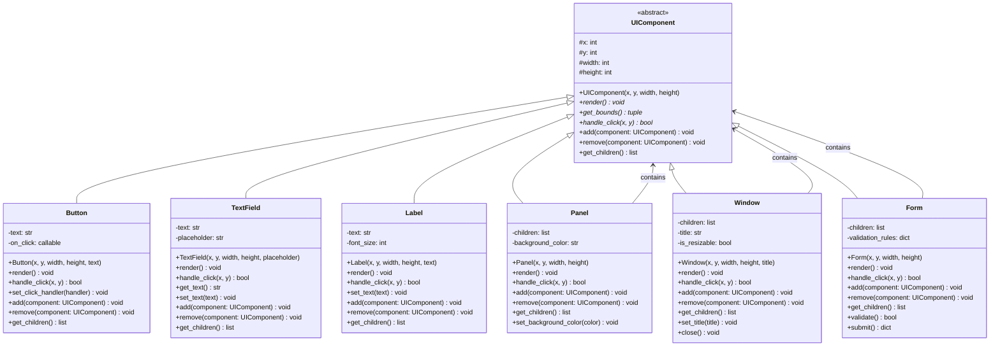

# Design Pattern: Composite (Composto)

## 1. Introdução e Contexto

O padrão Composite é um design pattern estrutural que permite compor objetos em estruturas de árvore para representar hierarquias parte-todo. O aspecto mais poderoso deste padrão é que ele permite que clientes tratem objetos individuais e composições de objetos de forma uniforme, criando uma interface consistente para trabalhar com estruturas complexas e aninhadas.

O conceito do Composite é inspirado em estruturas hierárquicas naturais, como árvores genealógicas, estruturas organizacionais ou sistemas de arquivos, onde tanto os elementos individuais (folhas) quanto os grupos (galhos) podem ser tratados de maneira similar. Na programação, isso se traduz em uma arquitetura onde operações podem ser aplicadas tanto a objetos simples quanto a coleções complexas desses objetos.

Este padrão é fundamental em sistemas que lidam com estruturas recursivas ou hierárquicas, como interfaces gráficas (onde um painel pode conter botões e outros painéis), editores gráficos (onde formas podem ser agrupadas em formas maiores), sistemas de arquivos, estruturas organizacionais, ou qualquer cenário onde você precisa representar relações parte-todo.

O Composite elimina a necessidade de código cliente distinguir entre objetos simples e compostos, promovendo um design mais limpo e flexível. Isso é especialmente valioso quando você não sabe antecipadamente quantos níveis de aninhamento sua estrutura terá.

## 2. Que Problema Resolve

O padrão Composite resolve problemas fundamentais relacionados ao tratamento de estruturas hierárquicas complexas:

### Inconsistência no Tratamento de Objetos Simples e Compostos
Sem o Composite, clientes precisam tratar objetos individuais e coleções de forma diferente, levando a código duplicado e condicionais complexas. Por exemplo, para desenhar um elemento na tela, você teria que verificar se é um objeto simples ou um grupo.

### Dificuldade em Gerenciar Hierarquias Dinâmicas
Estruturas que podem ter níveis arbitrários de aninhamento são difíceis de gerenciar sem uma abordagem uniforme. Adicionar ou remover níveis na hierarquia requer mudanças significativas no código cliente.

### Violação do Princípio Open/Closed
Adicionar novos tipos de componentes ou operações em hierarquias tradicionais frequentemente requer modificação do código existente, violando o princípio de que classes devem estar abertas para extensão mas fechadas para modificação.

### Complexidade de Operações Recursivas
Aplicar operações em estruturas de árvore (como busca, validação, cálculos agregados) se torna complexo quando você precisa tratar folhas e galhos diferentemente.

### Acoplamento Entre Cliente e Estrutura Interna
Clientes ficam acoplados aos detalhes de como distinguir e tratar diferentes tipos de objetos na hierarquia, tornando o código frágil a mudanças.

## 3. Quando Usar o Padrão Composite

### Cenários Ideais de Aplicação

**Estruturas Hierárquicas**: Quando você precisa representar hierarquias parte-todo, como estruturas organizacionais, árvores de categorias, ou hierarquias de componentes.

**Interfaces Gráficas**: Para sistemas de interface onde containers podem conter outros containers e componentes simples, todos tratados uniformemente.

**Editores Gráficos**: Em aplicações onde objetos podem ser agrupados e desagrupados dinamicamente, mantendo operações consistentes.

**Sistemas de Arquivos**: Para representar diretórios e arquivos onde operações como cópia, busca ou cálculo de tamanho se aplicam a ambos.

**Estruturas de Documento**: Em processadores de texto ou editores onde seções podem conter parágrafos, tabelas, ou outras seções.

### Indicadores de Necessidade

- Você tem uma estrutura em árvore onde folhas e galhos devem suportar operações similares
- Precisa aplicar operações recursivamente em hierarquias
- Quer que clientes tratem objetos simples e compostos uniformemente
- Tem estruturas que podem ter níveis arbitrários de aninhamento
- Precisa adicionar novos tipos de componentes sem modificar código cliente

## 4. Quando NÃO Usar o Padrão Composite

### Cenários Inadequados

**Estruturas Simples e Planas**: Se você não tem hierarquias ou aninhamento, o Composite adiciona complexidade desnecessária.

**Operações Muito Diferentes**: Quando objetos simples e compostos requerem operações fundamentalmente diferentes, forçar uma interface comum pode ser inadequado.

**Performance Crítica**: O Composite pode introduzir overhead devido à natureza recursiva das operações e indireção adicional.

**Hierarquias Muito Específicas**: Quando a estrutura hierárquica é altamente específica e improvável de mudar, uma implementação mais direta pode ser melhor.

**Restrições de Tipo Forte**: Em linguagens com sistemas de tipos muito rígidos, implementar o Composite pode ser mais complexo do que beneficioso.

### Sinais de Alerta

- Você está forçando uma interface comum onde não faz sentido natural
- A maioria das operações só se aplica a um tipo de objeto (folha ou composto)
- A estrutura hierárquica é fixa e simples
- O overhead de performance é significativo para seu caso de uso
- Você precisa de verificações de tipo frequentes mesmo com o padrão implementado

## 5. Exemplo Prático: Sistema de Componentes de Interface Gráfica

### Contexto do Problema

Imagine que você está desenvolvendo um framework de interface gráfica onde precisa gerenciar diferentes tipos de componentes: elementos simples como botões e campos de texto, e containers como painéis e janelas que podem conter outros componentes.

Sem o padrão Composite, você teria que tratar cada tipo diferentemente:
- Para desenhar uma tela, teria que verificar se cada elemento é simples ou container
- Para calcular tamanhos, precisaria de lógica específica para cada tipo
- Para processar eventos, teria condicionais complexas
- Adicionar novos tipos de containers exigiria modificar todo o código cliente

### Diagrama da Solução



### Implementação em Python

```python
from abc import ABC, abstractmethod
from typing import List, Tuple, Optional, Callable, Dict, Any


# Component - Interface comum para objetos simples e compostos
class UIComponent(ABC):
    def __init__(self, x: int, y: int, width: int, height: int):
        self.x = x
        self.y = y
        self.width = width
        self.height = height
    
    @abstractmethod
    def render(self) -> None:
        """Renderiza o componente na tela"""
        pass
    
    def get_bounds(self) -> Tuple[int, int, int, int]:
        """Retorna as coordenadas e dimensões do componente"""
        return (self.x, self.y, self.width, self.height)
    
    @abstractmethod
    def handle_click(self, x: int, y: int) -> bool:
        """Processa clique do mouse. Retorna True se o clique foi processado"""
        pass
    
    def is_point_inside(self, x: int, y: int) -> bool:
        """Verifica se um ponto está dentro dos limites do componente"""
        return (self.x <= x <= self.x + self.width and 
                self.y <= y <= self.y + self.height)
    
    # Métodos para composição - implementação padrão para folhas
    def add(self, component: 'UIComponent') -> None:
        """Adiciona um componente filho (para composites)"""
        raise NotImplementedError("Cannot add components to a leaf component")
    
    def remove(self, component: 'UIComponent') -> None:
        """Remove um componente filho (para composites)"""
        raise NotImplementedError("Cannot remove components from a leaf component")
    
    def get_children(self) -> List['UIComponent']:
        """Retorna lista de componentes filhos"""
        return []


# Leaf Components - Componentes simples (folhas)
class Button(UIComponent):
    def __init__(self, x: int, y: int, width: int, height: int, text: str):
        super().__init__(x, y, width, height)
        self.text = text
        self.on_click: Optional[Callable] = None
    
    def render(self) -> None:
        print(f"Rendering Button at ({self.x}, {self.y}) "
              f"size {self.width}x{self.height} with text '{self.text}'")
    
    def handle_click(self, x: int, y: int) -> bool:
        if self.is_point_inside(x, y):
            print(f"Button '{self.text}' clicked at ({x}, {y})")
            if self.on_click:
                self.on_click()
            return True
        return False
    
    def set_click_handler(self, handler: Callable) -> None:
        self.on_click = handler


class TextField(UIComponent):
    def __init__(self, x: int, y: int, width: int, height: int, placeholder: str = ""):
        super().__init__(x, y, width, height)
        self.text = ""
        self.placeholder = placeholder
    
    def render(self) -> None:
        display_text = self.text if self.text else f"[{self.placeholder}]"
        print(f"Rendering TextField at ({self.x}, {self.y}) "
              f"size {self.width}x{self.height} with text '{display_text}'")
    
    def handle_click(self, x: int, y: int) -> bool:
        if self.is_point_inside(x, y):
            print(f"TextField focused at ({x}, {y})")
            return True
        return False
    
    def get_text(self) -> str:
        return self.text
    
    def set_text(self, text: str) -> None:
        self.text = text


class Label(UIComponent):
    def __init__(self, x: int, y: int, width: int, height: int, text: str, font_size: int = 12):
        super().__init__(x, y, width, height)
        self.text = text
        self.font_size = font_size
    
    def render(self) -> None:
        print(f"Rendering Label at ({self.x}, {self.y}) "
              f"size {self.width}x{self.height} with text '{self.text}' (font: {self.font_size}px)")
    
    def handle_click(self, x: int, y: int) -> bool:
        # Labels normalmente não processam cliques
        return False
    
    def set_text(self, text: str) -> None:
        self.text = text


# Composite Components - Containers que podem conter outros componentes
class Panel(UIComponent):
    def __init__(self, x: int, y: int, width: int, height: int, background_color: str = "white"):
        super().__init__(x, y, width, height)
        self.children: List[UIComponent] = []
        self.background_color = background_color
    
    def render(self) -> None:
        print(f"Rendering Panel at ({self.x}, {self.y}) "
              f"size {self.width}x{self.height} (background: {self.background_color})")
        print("  Panel contents:")
        for child in self.children:
            child.render()
    
    def handle_click(self, x: int, y: int) -> bool:
        if not self.is_point_inside(x, y):
            return False
        
        # Propaga o clique para os filhos (do último para o primeiro - z-order)
        for child in reversed(self.children):
            if child.handle_click(x, y):
                return True
        
        print(f"Panel clicked at ({x}, {y}) - no child handled the event")
        return True
    
    def add(self, component: UIComponent) -> None:
        self.children.append(component)
    
    def remove(self, component: UIComponent) -> None:
        if component in self.children:
            self.children.remove(component)
    
    def get_children(self) -> List[UIComponent]:
        return self.children.copy()
    
    def set_background_color(self, color: str) -> None:
        self.background_color = color


class Window(UIComponent):
    def __init__(self, x: int, y: int, width: int, height: int, title: str, is_resizable: bool = True):
        super().__init__(x, y, width, height)
        self.children: List[UIComponent] = []
        self.title = title
        self.is_resizable = is_resizable
    
    def render(self) -> None:
        print(f"Rendering Window '{self.title}' at ({self.x}, {self.y}) "
              f"size {self.width}x{self.height} (resizable: {self.is_resizable})")
        print("  Window contents:")
        for child in self.children:
            child.render()
    
    def handle_click(self, x: int, y: int) -> bool:
        if not self.is_point_inside(x, y):
            return False
        
        # Verifica se clicou na barra de título (primeiros 30 pixels)
        if y <= self.y + 30:
            print(f"Window title bar clicked - focusing window '{self.title}'")
            return True
        
        # Propaga para os filhos
        for child in reversed(self.children):
            if child.handle_click(x, y):
                return True
        
        return True
    
    def add(self, component: UIComponent) -> None:
        self.children.append(component)
    
    def remove(self, component: UIComponent) -> None:
        if component in self.children:
            self.children.remove(component)
    
    def get_children(self) -> List[UIComponent]:
        return self.children.copy()
    
    def set_title(self, title: str) -> None:
        self.title = title
    
    def close(self) -> None:
        print(f"Closing window '{self.title}'")


class Form(UIComponent):
    def __init__(self, x: int, y: int, width: int, height: int):
        super().__init__(x, y, width, height)
        self.children: List[UIComponent] = []
        self.validation_rules: Dict[str, Callable] = {}
    
    def render(self) -> None:
        print(f"Rendering Form at ({self.x}, {self.y}) size {self.width}x{self.height}")
        print("  Form contents:")
        for child in self.children:
            child.render()
    
    def handle_click(self, x: int, y: int) -> bool:
        if not self.is_point_inside(x, y):
            return False
        
        for child in reversed(self.children):
            if child.handle_click(x, y):
                return True
        
        return True
    
    def add(self, component: UIComponent) -> None:
        self.children.append(component)
    
    def remove(self, component: UIComponent) -> None:
        if component in self.children:
            self.children.remove(component)
    
    def get_children(self) -> List[UIComponent]:
        return self.children.copy()
    
    def validate(self) -> bool:
        """Valida todos os campos do formulário"""
        print("Validating form...")
        valid = True
        
        for child in self.children:
            if isinstance(child, TextField):
                field_name = getattr(child, 'name', 'unknown')
                if field_name in self.validation_rules:
                    if not self.validation_rules[field_name](child.get_text()):
                        print(f"  Validation failed for field '{field_name}'")
                        valid = False
                    else:
                        print(f"  Field '{field_name}' is valid")
        
        return valid
    
    def submit(self) -> Dict[str, Any]:
        """Coleta dados do formulário e submete"""
        if not self.validate():
            print("Form submission failed - validation errors")
            return {}
        
        data = {}
        for child in self.children:
            if isinstance(child, TextField):
                field_name = getattr(child, 'name', f'field_{id(child)}')
                data[field_name] = child.get_text()
        
        print(f"Form submitted successfully with data: {data}")
        return data


# Sistema cliente que demonstra o uso do padrão
class UIRenderer:
    def __init__(self):
        self.root_components: List[UIComponent] = []
    
    def add_component(self, component: UIComponent) -> None:
        self.root_components.append(component)
    
    def render_all(self) -> None:
        """Renderiza todos os componentes - trata folhas e composites uniformemente"""
        print("=== Rendering UI ===")
        for component in self.root_components:
            component.render()
            print()
    
    def handle_global_click(self, x: int, y: int) -> None:
        """Processa clique global - propaga para todos os componentes"""
        print(f"\n=== Processing click at ({x}, {y}) ===")
        handled = False
        
        for component in reversed(self.root_components):  # Z-order: último renderizado primeiro
            if component.handle_click(x, y):
                handled = True
                break
        
        if not handled:
            print("Click not handled by any component")
    
    def count_components(self, component: UIComponent) -> int:
        """Conta total de componentes recursivamente"""
        count = 1  # O próprio componente
        for child in component.get_children():
            count += self.count_components(child)
        return count
    
    def get_total_components(self) -> int:
        """Conta todos os componentes na interface"""
        total = 0
        for component in self.root_components:
            total += self.count_components(component)
        return total


# Exemplo de uso
def main():
    # Criando o renderer
    renderer = UIRenderer()
    
    # Criando uma janela principal
    main_window = Window(100, 100, 600, 400, "Main Application")
    
    # Criando um painel de cabeçalho
    header_panel = Panel(10, 40, 580, 60, "lightblue")
    header_label = Label(20, 50, 200, 40, "User Registration", 16)
    header_panel.add(header_label)
    
    # Criando um formulário
    form = Form(10, 120, 580, 200)
    
    # Adicionando campos ao formulário
    name_label = Label(20, 140, 100, 25, "Name:")
    name_field = TextField(130, 140, 200, 25, "Enter your name")
    name_field.name = "name"  # Para validação
    
    email_label = Label(20, 180, 100, 25, "Email:")
    email_field = TextField(130, 180, 200, 25, "Enter your email")
    email_field.name = "email"
    
    # Adicionando componentes ao formulário
    form.add(name_label)
    form.add(name_field)
    form.add(email_label)
    form.add(email_field)
    
    # Criando botões
    submit_button = Button(350, 180, 80, 30, "Submit")
    cancel_button = Button(440, 180, 80, 30, "Cancel")
    
    # Definindo handlers para os botões
    def on_submit():
        form.submit()
    
    def on_cancel():
        print("Form cancelled")
    
    submit_button.set_click_handler(on_submit)
    cancel_button.set_click_handler(on_cancel)
    
    form.add(submit_button)
    form.add(cancel_button)
    
    # Criando painel de rodapé
    footer_panel = Panel(10, 340, 580, 40, "lightgray")
    status_label = Label(20, 350, 300, 20, "Ready", 10)
    footer_panel.add(status_label)
    
    # Montando a janela
    main_window.add(header_panel)
    main_window.add(form)
    main_window.add(footer_panel)
    
    # Criando uma segunda janela simples
    dialog_window = Window(300, 200, 300, 150, "Confirmation Dialog")
    dialog_label = Label(20, 50, 260, 30, "Are you sure you want to proceed?")
    yes_button = Button(50, 100, 60, 30, "Yes")
    no_button = Button(180, 100, 60, 30, "No")
    
    dialog_window.add(dialog_label)
    dialog_window.add(yes_button)
    dialog_window.add(no_button)
    
    # Adicionando ao renderer
    renderer.add_component(main_window)
    renderer.add_component(dialog_window)
    
    # Demonstrando o uso do padrão
    print("=== UI Component Tree Statistics ===")
    print(f"Total components in UI: {renderer.get_total_components()}")
    print(f"Main window components: {renderer.count_components(main_window)}")
    print(f"Dialog window components: {renderer.count_components(dialog_window)}")
    
    # Renderizando toda a interface
    renderer.render_all()
    
    # Simulando interações
    print("\n=== Testing User Interactions ===")
    
    # Preenchendo campos
    name_field.set_text("João Silva")
    email_field.set_text("joao@example.com")
    
    # Testando cliques
    renderer.handle_global_click(450, 180)  # Clique no botão Submit
    renderer.handle_global_click(200, 50)   # Clique no cabeçalho
    renderer.handle_global_click(300, 70)   # Clique na barra de título da janela
    renderer.handle_global_click(220, 100)  # Clique no botão Yes do dialog
    
    # Demonstrando adição dinâmica de componentes
    print("\n=== Dynamic Component Addition ===")
    new_button = Button(200, 280, 100, 30, "New Button")
    form.add(new_button)
    
    print("After adding new button:")
    print(f"Form now has {len(form.get_children())} children")
    form.render()


if __name__ == "__main__":
    main()
```

### Vantagens da Solução

**Uniformidade**: Todos os componentes são tratados através da mesma interface, simplificando o código cliente.

**Flexibilidade**: Componentes podem ser aninhados em qualquer nível, criando estruturas complexas dinamicamente.

**Extensibilidade**: Novos tipos de componentes (folhas ou composites) podem ser adicionados sem modificar código existente.

**Reutilização**: Componentes podem ser reutilizados em diferentes contextos e hierarquias.

**Manutenibilidade**: Operações como renderização e manipulação de eventos são implementadas uma vez e funcionam para toda a hierarquia.

### Análise da Implementação

Este exemplo demonstra como o padrão Composite permite tratar elementos simples (Button, TextField, Label) e containers (Panel, Window, Form) de forma uniforme. O método `render()` funciona recursivamente, renderizando tanto componentes individuais quanto hierarquias complexas com uma única chamada.

A manipulação de eventos (`handle_click`) propaga automaticamente através da árvore de componentes, e operações como contagem de componentes funcionam uniformemente independente da complexidade da estrutura.

O padrão permite que o `UIRenderer` trabalhe com qualquer tipo de componente sem conhecer sua estrutura interna, demonstrando como o Composite promove baixo acoplamento e alta coesão em sistemas hierárquicos.