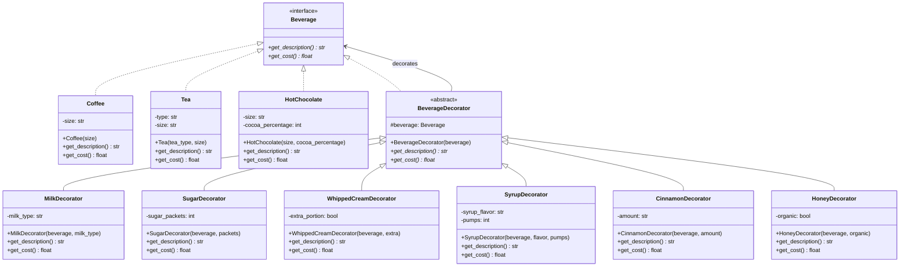

# Design Pattern: Decorator (Decorador)

## 1. Introdução e Contexto

O padrão Decorator é um design pattern estrutural que permite anexar responsabilidades adicionais a um objeto dinamicamente, fornecendo uma alternativa flexível à herança para estender funcionalidades. Este padrão envolve um objeto em uma série de decoradores, cada um adicionando novo comportamento sem alterar o objeto original.

O conceito do Decorator é inspirado em decorações do mundo real, como enfeitar uma árvore de Natal onde você pode adicionar luzes, bolas, fitas e outros ornamentos sem modificar a árvore em si. Cada decoração adiciona uma nova característica visual, mas a árvore permanece intacta por baixo de todas as camadas.

Na programação, o Decorator funciona de maneira similar, permitindo que você "decore" objetos com funcionalidades adicionais em tempo de execução. Isso é especialmente valioso quando você tem um objeto base que pode ser estendido de várias maneiras diferentes, e essas extensões podem ser combinadas livremente.

Este padrão é fundamental em arquiteturas onde você precisa de flexibilidade para adicionar ou remover funcionalidades sem criar uma explosão de subclasses. Diferente da herança tradicional, que define extensões em tempo de compilação, o Decorator permite composição dinâmica de comportamentos, oferecendo maior flexibilidade e controle sobre como os objetos se comportam.

O Decorator mantém a mesma interface do objeto original, garantindo que código cliente existente continue funcionando mesmo quando novos comportamentos são adicionados através de decoração.

## 2. Que Problema Resolve

O padrão Decorator resolve problemas fundamentais relacionados à extensão de funcionalidades de objetos:

### Explosão de Subclasses por Herança
Quando você usa herança para adicionar funcionalidades opcionais, o número de classes cresce exponencialmente. Por exemplo, se você tem uma classe Café e quer adicionar leite, açúcar, chantilly e canela, acabaria com 16 combinações diferentes (2^4) usando herança tradicional.

### Rigidez das Extensões por Herança
A herança define extensões em tempo de compilação, tornando impossível adicionar ou remover funcionalidades dinamicamente. Uma vez que um objeto é instanciado, suas capacidades ficam fixas.

### Violação do Princípio da Responsabilidade Única
Classes que tentam incorporar todas as variações possíveis de funcionalidade violam o SRP, tornando-se complexas e difíceis de manter.

### Dificuldade de Combinação de Funcionalidades
Com herança tradicional, é difícil combinar diferentes funcionalidades de forma flexível. Cada combinação requer uma nova classe específica.

### Acoplamento Forte Entre Funcionalidades Base e Estendidas
Quando funcionalidades são incorporadas diretamente na classe base, criar variações que incluem apenas algumas dessas funcionalidades se torna complexo.

### Impossibilidade de Remoção Dinâmica de Funcionalidades
Uma vez que funcionalidades são adicionadas via herança, não é possível removê-las ou desabilitá-las em tempo de execução.

## 3. Quando Usar o Padrão Decorator

### Cenários Ideais de Aplicação

**Funcionalidades Opcionais e Combinávies**: Quando você tem funcionalidades que podem ser adicionadas ou removidas independentemente e combinadas de várias formas.

**Extensão Dinâmica de Comportamento**: Quando você precisa adicionar responsabilidades a objetos em tempo de execução sem afetar outros objetos da mesma classe.

**Alternativa à Herança Múltipla**: Em linguagens que não suportam herança múltipla, o Decorator oferece uma forma de combinar comportamentos de múltiplas fontes.

**Sistemas de Plugins ou Middleware**: Para criar arquiteturas extensíveis onde novos recursos podem ser adicionados sem modificar o código base.

**Processamento em Pipeline**: Quando você tem uma sequência de processamentos que podem ser aplicados opcionalmente a um objeto.

### Indicadores de Necessidade

- Você tem funcionalidades opcionais que podem ser combinadas livremente
- Precisa adicionar comportamentos em tempo de execução
- Quer evitar explosão de subclasses devido a muitas combinações
- Tem requisitos de processamento que variam dinamicamente
- Precisa de uma arquitetura extensível para novos recursos

## 4. Quando NÃO Usar o Padrão Decorator

### Cenários Inadequados

**Funcionalidades Interdependentes**: Quando as extensões dependem fortemente umas das outras ou da ordem de aplicação, o Decorator pode criar complexidade desnecessária.

**Performance Crítica**: O Decorator introduz camadas de indireção que podem impactar performance em sistemas com requisitos extremamente rígidos.

**Funcionalidades Simples e Fixas**: Se você tem apenas algumas variações bem definidas e estáveis, herança simples pode ser mais apropriada.

**Debugging Complexo**: Múltiplas camadas de decoração podem tornar o debugging e troubleshooting mais difíceis.

**Interface Inadequada**: Quando diferentes decoradores precisam expor métodos completamente diferentes, forçar uma interface comum pode ser inadequado.

### Sinais de Alerta

- Os decoradores dependem da ordem de aplicação de forma crítica
- Você precisa conhecer qual decorador específico está sendo usado
- A cadeia de decoração se torna muito longa e difícil de gerenciar
- Diferentes decoradores requerem interfaces fundamentalmente diferentes
- O overhead de performance é significativo para seu caso de uso

## 5. Exemplo Prático: Sistema de Bebidas Personalizadas

### Contexto do Problema

Imagine que você está desenvolvendo um sistema para uma cafeteria que oferece diferentes tipos de bebidas (café, chá, chocolate quente) e uma variedade de complementos (leite, açúcar, chantilly, canela, xarope). Cada complemento adiciona sabor e custo à bebida.

Sem o padrão Decorator, você precisaria criar classes para cada combinação possível:
- CafeComLeite, CafeComAcucar, CafeComLeiteEAcucar
- ChaComMel, ChaComLimao, ChaComMelELimao
- ChocolateComChantilly, ChocolateComCanela, etc.

Isso resultaria em uma explosão exponencial de classes e seria impossível adicionar complementos dinamicamente baseado na escolha do cliente.

### Diagrama da Solução



### Implementação em Python

```python
from abc import ABC, abstractmethod
from typing import List, Dict, Any
from enum import Enum


# Component - Interface comum para bebidas
class Beverage(ABC):
    @abstractmethod
    def get_description(self) -> str:
        """Retorna a descrição da bebida"""
        pass
    
    @abstractmethod
    def get_cost(self) -> float:
        """Retorna o custo total da bebida"""
        pass


# Enums para padronizar opções
class Size(Enum):
    SMALL = "small"
    MEDIUM = "medium"
    LARGE = "large"


class MilkType(Enum):
    WHOLE = "whole milk"
    SKIM = "skim milk"
    ALMOND = "almond milk"
    SOY = "soy milk"
    OAT = "oat milk"


# Concrete Components - Bebidas base
class Coffee(Beverage):
    def __init__(self, size: Size = Size.MEDIUM):
        self.size = size
        self._base_costs = {
            Size.SMALL: 2.50,
            Size.MEDIUM: 3.00,
            Size.LARGE: 3.50
        }
    
    def get_description(self) -> str:
        return f"{self.size.value.title()} Coffee"
    
    def get_cost(self) -> float:
        return self._base_costs[self.size]


class Tea(Beverage):
    def __init__(self, tea_type: str = "Earl Grey", size: Size = Size.MEDIUM):
        self.tea_type = tea_type
        self.size = size
        self._base_costs = {
            Size.SMALL: 2.00,
            Size.MEDIUM: 2.50,
            Size.LARGE: 3.00
        }
    
    def get_description(self) -> str:
        return f"{self.size.value.title()} {self.tea_type} Tea"
    
    def get_cost(self) -> float:
        return self._base_costs[self.size]


class HotChocolate(Beverage):
    def __init__(self, size: Size = Size.MEDIUM, cocoa_percentage: int = 70):
        self.size = size
        self.cocoa_percentage = cocoa_percentage
        self._base_costs = {
            Size.SMALL: 3.00,
            Size.MEDIUM: 3.75,
            Size.LARGE: 4.50
        }
    
    def get_description(self) -> str:
        return f"{self.size.value.title()} Hot Chocolate ({self.cocoa_percentage}% cocoa)"
    
    def get_cost(self) -> float:
        base_cost = self._base_costs[self.size]
        # Chocolate premium (>85%) custa mais
        if self.cocoa_percentage > 85:
            base_cost += 0.50
        return base_cost


# Base Decorator
class BeverageDecorator(Beverage):
    def __init__(self, beverage: Beverage):
        self.beverage = beverage
    
    @abstractmethod
    def get_description(self) -> str:
        pass
    
    @abstractmethod
    def get_cost(self) -> float:
        pass


# Concrete Decorators - Complementos específicos
class MilkDecorator(BeverageDecorator):
    def __init__(self, beverage: Beverage, milk_type: MilkType = MilkType.WHOLE):
        super().__init__(beverage)
        self.milk_type = milk_type
        self._milk_costs = {
            MilkType.WHOLE: 0.30,
            MilkType.SKIM: 0.30,
            MilkType.ALMOND: 0.60,
            MilkType.SOY: 0.55,
            MilkType.OAT: 0.65
        }
    
    def get_description(self) -> str:
        return f"{self.beverage.get_description()}, {self.milk_type.value}"
    
    def get_cost(self) -> float:
        return self.beverage.get_cost() + self._milk_costs[self.milk_type]


class SugarDecorator(BeverageDecorator):
    def __init__(self, beverage: Beverage, sugar_packets: int = 1):
        super().__init__(beverage)
        self.sugar_packets = sugar_packets
    
    def get_description(self) -> str:
        if self.sugar_packets == 1:
            return f"{self.beverage.get_description()}, sugar"
        else:
            return f"{self.beverage.get_description()}, {self.sugar_packets} sugars"
    
    def get_cost(self) -> float:
        return self.beverage.get_cost() + (0.10 * self.sugar_packets)


class WhippedCreamDecorator(BeverageDecorator):
    def __init__(self, beverage: Beverage, extra_portion: bool = False):
        super().__init__(beverage)
        self.extra_portion = extra_portion
    
    def get_description(self) -> str:
        if self.extra_portion:
            return f"{self.beverage.get_description()}, extra whipped cream"
        else:
            return f"{self.beverage.get_description()}, whipped cream"
    
    def get_cost(self) -> float:
        base_cost = 0.70
        if self.extra_portion:
            base_cost += 0.30
        return self.beverage.get_cost() + base_cost


class SyrupDecorator(BeverageDecorator):
    def __init__(self, beverage: Beverage, syrup_flavor: str = "vanilla", pumps: int = 1):
        super().__init__(beverage)
        self.syrup_flavor = syrup_flavor
        self.pumps = pumps
        self._premium_flavors = {"hazelnut", "caramel", "Irish cream"}
    
    def get_description(self) -> str:
        pump_text = "pump" if self.pumps == 1 else "pumps"
        return f"{self.beverage.get_description()}, {self.pumps} {pump_text} of {self.syrup_flavor} syrup"
    
    def get_cost(self) -> float:
        cost_per_pump = 0.40
        if self.syrup_flavor.lower() in self._premium_flavors:
            cost_per_pump = 0.60
        return self.beverage.get_cost() + (cost_per_pump * self.pumps)


class CinnamonDecorator(BeverageDecorator):
    def __init__(self, beverage: Beverage, amount: str = "light"):
        super().__init__(beverage)
        self.amount = amount  # light, regular, extra
    
    def get_description(self) -> str:
        if self.amount == "regular":
            return f"{self.beverage.get_description()}, cinnamon"
        else:
            return f"{self.beverage.get_description()}, {self.amount} cinnamon"
    
    def get_cost(self) -> float:
        cost_map = {"light": 0.15, "regular": 0.25, "extra": 0.35}
        return self.beverage.get_cost() + cost_map.get(self.amount, 0.25)


class HoneyDecorator(BeverageDecorator):
    def __init__(self, beverage: Beverage, organic: bool = False):
        super().__init__(beverage)
        self.organic = organic
    
    def get_description(self) -> str:
        honey_type = "organic honey" if self.organic else "honey"
        return f"{self.beverage.get_description()}, {honey_type}"
    
    def get_cost(self) -> float:
        cost = 0.50 if self.organic else 0.30
        return self.beverage.get_cost() + cost


# Sistema de pedidos que utiliza os decorators
class BeverageBuilder:
    def __init__(self, base_beverage: Beverage):
        self.beverage = base_beverage
    
    def add_milk(self, milk_type: MilkType = MilkType.WHOLE) -> 'BeverageBuilder':
        self.beverage = MilkDecorator(self.beverage, milk_type)
        return self
    
    def add_sugar(self, packets: int = 1) -> 'BeverageBuilder':
        self.beverage = SugarDecorator(self.beverage, packets)
        return self
    
    def add_whipped_cream(self, extra: bool = False) -> 'BeverageBuilder':
        self.beverage = WhippedCreamDecorator(self.beverage, extra)
        return self
    
    def add_syrup(self, flavor: str = "vanilla", pumps: int = 1) -> 'BeverageBuilder':
        self.beverage = SyrupDecorator(self.beverage, flavor, pumps)
        return self
    
    def add_cinnamon(self, amount: str = "regular") -> 'BeverageBuilder':
        self.beverage = CinnamonDecorator(self.beverage, amount)
        return self
    
    def add_honey(self, organic: bool = False) -> 'BeverageBuilder':
        self.beverage = HoneyDecorator(self.beverage, organic)
        return self
    
    def build(self) -> Beverage:
        return self.beverage


class CoffeeShop:
    def __init__(self, shop_name: str):
        self.shop_name = shop_name
        self.orders: List[Dict[str, Any]] = []
        self.order_counter = 1
    
    def create_custom_beverage(self) -> BeverageBuilder:
        """Factory method para criar bebidas personalizadas"""
        print(f"\nWelcome to {self.shop_name}!")
        print("Available base beverages:")
        print("1. Coffee")
        print("2. Tea") 
        print("3. Hot Chocolate")
        
        return self
    
    def get_coffee_builder(self, size: Size = Size.MEDIUM) -> BeverageBuilder:
        return BeverageBuilder(Coffee(size))
    
    def get_tea_builder(self, tea_type: str = "Earl Grey", size: Size = Size.MEDIUM) -> BeverageBuilder:
        return BeverageBuilder(Tea(tea_type, size))
    
    def get_hot_chocolate_builder(self, size: Size = Size.MEDIUM, cocoa: int = 70) -> BeverageBuilder:
        return BeverageBuilder(HotChocolate(size, cocoa))
    
    def place_order(self, beverage: Beverage, customer_name: str = "Customer") -> Dict[str, Any]:
        order = {
            "order_id": self.order_counter,
            "customer": customer_name,
            "beverage": beverage,
            "description": beverage.get_description(),
            "cost": beverage.get_cost(),
            "timestamp": "now"  # Em um sistema real, seria datetime.now()
        }
        
        self.orders.append(order)
        self.order_counter += 1
        
        print(f"\nOrder #{order['order_id']} for {customer_name}:")
        print(f"  {order['description']}")
        print(f"  Total: ${order['cost']:.2f}")
        
        return order
    
    def get_popular_combinations(self) -> Dict[str, Beverage]:
        """Retorna algumas combinações populares pré-definidas"""
        combinations = {}
        
        # Latte clássico
        combinations["Classic Latte"] = (
            self.get_coffee_builder(Size.LARGE)
            .add_milk(MilkType.WHOLE)
            .build()
        )
        
        # Cappuccino doce
        combinations["Sweet Cappuccino"] = (
            self.get_coffee_builder(Size.MEDIUM)
            .add_milk(MilkType.WHOLE)
            .add_sugar(2)
            .add_cinnamon("light")
            .build()
        )
        
        # Chocolate premium
        combinations["Premium Hot Chocolate"] = (
            self.get_hot_chocolate_builder(Size.LARGE, 85)
            .add_whipped_cream(True)
            .add_syrup("caramel", 2)
            .build()
        )
        
        # Chá saudável
        combinations["Healthy Honey Tea"] = (
            self.get_tea_builder("Green Tea", Size.MEDIUM)
            .add_honey(True)
            .build()
        )
        
        # Café vegano gourmet
        combinations["Vegan Gourmet Coffee"] = (
            self.get_coffee_builder(Size.LARGE)
            .add_milk(MilkType.OAT)
            .add_syrup("hazelnut", 2)
            .add_cinnamon("extra")
            .build()
        )
        
        return combinations
    
    def show_menu_with_prices(self):
        print(f"\n=== {self.shop_name} Menu ===")
        combinations = self.get_popular_combinations()
        
        for name, beverage in combinations.items():
            print(f"{name}")
            print(f"  {beverage.get_description()}")
            print(f"  ${beverage.get_cost():.2f}\n")


# Exemplo de uso
def main():
    # Criando a cafeteria
    shop = CoffeeShop("Decorator Coffee House")
    
    # Mostrando menu com combinações populares
    shop.show_menu_with_prices()
    
    print("=== Custom Order Examples ===")
    
    # Exemplo 1: Café simples
    simple_coffee = shop.get_coffee_builder(Size.SMALL).build()
    shop.place_order(simple_coffee, "Alice")
    
    # Exemplo 2: Latte personalizado
    custom_latte = (
        shop.get_coffee_builder(Size.LARGE)
        .add_milk(MilkType.ALMOND)
        .add_sugar(1)
        .add_syrup("vanilla", 2)
        .build()
    )
    shop.place_order(custom_latte, "Bob")
    
    # Exemplo 3: Chocolate quente premium
    premium_chocolate = (
        shop.get_hot_chocolate_builder(Size.MEDIUM, 90)
        .add_whipped_cream(True)
        .add_syrup("Irish cream", 1)
        .add_cinnamon("extra")
        .build()
    )
    shop.place_order(premium_chocolate, "Carol")
    
    # Exemplo 4: Chá complexo
    complex_tea = (
        shop.get_tea_builder("Chamomile", Size.LARGE)
        .add_honey(True)
        .add_milk(MilkType.OAT)
        .add_cinnamon("light")
        .build()
    )
    shop.place_order(complex_tea, "David")
    
    # Demonstrando flexibilidade: adicionando mais decorações dinamicamente
    print("\n=== Dynamic Decoration Example ===")
    base_coffee = shop.get_coffee_builder(Size.MEDIUM).build()
    print(f"Base: {base_coffee.get_description()} - ${base_coffee.get_cost():.2f}")
    
    # Adicionando decorações uma por uma
    with_milk = MilkDecorator(base_coffee, MilkType.SOY)
    print(f"+ Soy Milk: {with_milk.get_description()} - ${with_milk.get_cost():.2f}")
    
    with_sugar = SugarDecorator(with_milk, 2)
    print(f"+ Sugar: {with_sugar.get_description()} - ${with_sugar.get_cost():.2f}")
    
    final_beverage = SyrupDecorator(with_sugar, "caramel", 1)
    print(f"+ Caramel: {final_beverage.get_description()} - ${final_beverage.get_cost():.2f}")
    
    shop.place_order(final_beverage, "Eve")
    
    # Demonstrando remoção/substituição (criando uma nova cadeia)
    print("\n=== Beverage Modification Example ===")
    original = (
        shop.get_coffee_builder(Size.LARGE)
        .add_milk(MilkType.WHOLE)
        .add_sugar(3)
        .add_whipped_cream()
        .build()
    )
    print(f"Original order: {original.get_description()} - ${original.get_cost():.2f}")
    
    # Cliente quer trocar leite integral por leite de aveia
    modified = (
        shop.get_coffee_builder(Size.LARGE)
        .add_milk(MilkType.OAT)  # Mudança aqui
        .add_sugar(3)
        .add_whipped_cream()
        .build()
    )
    print(f"Modified order: {modified.get_description()} - ${modified.get_cost():.2f}")
    
    shop.place_order(modified, "Frank")
    
    print(f"\nTotal orders processed: {len(shop.orders)}")
    total_revenue = sum(order['cost'] for order in shop.orders)
    print(f"Total revenue: ${total_revenue:.2f}")


if __name__ == "__main__":
    main()
```

### Vantagens da Solução

**Flexibilidade**: Clientes podem criar qualquer combinação de complementos sem limitações pré-definidas.

**Extensibilidade**: Novos tipos de complementos podem ser adicionados sem modificar bebidas existentes ou outros decoradores.

**Reutilização**: Cada decorador pode ser aplicado a qualquer tipo de bebida.

**Composição Dinâmica**: Complementos podem ser adicionados em tempo de execução baseado na escolha do cliente.

**Responsabilidade Única**: Cada decorador tem uma responsabilidade específica e bem definida.

### Análise da Implementação

Este exemplo demonstra como o padrão Decorator permite compor bebidas personalizadas dinamicamente. Cada decorador adiciona funcionalidade (descrição e custo) sem modificar a bebida base. O `BeverageBuilder` fornece uma interface fluente para facilitar a criação de combinações complexas.

A solução permite que a cafeteria ofereça infinitas combinações sem precisar pré-definir cada possibilidade, e novos complementos podem ser adicionados facilmente sem afetar o código existente. O padrão também permite modificações dinâmicas, onde clientes podem alterar seus pedidos adicionando ou substituindo complementos.

O sistema mantém a flexibilidade para precificação complexa (como ingredientes premium custando mais) e pode facilmente suportar novas funcionalidades como descontos, promoções ou validações específicas.