# Design Pattern: Facade (Fachada)

## 1. Introdução e Contexto

O padrão Facade é um design pattern estrutural que fornece uma interface unificada e simplificada para um conjunto de interfaces em um subsistema complexo. O Facade define uma interface de nível mais alto que torna o subsistema mais fácil de usar, escondendo a complexidade dos componentes internos atrás de uma interface elegante e coesa.

O conceito do Facade é inspirado nas fachadas arquitetônicas, que apresentam uma face externa simples e atraente de um edifício, independentemente da complexidade estrutural interna. Na programação, o Facade funciona de maneira similar, oferecendo um ponto de entrada único e intuitivo para funcionalidades que, internamente, podem envolver múltiplos componentes, APIs e fluxos de trabalho complexos.

Este padrão é fundamental em arquiteturas modernas onde sistemas crescem em complexidade através da integração de múltiplos subsistemas especializados. Em vez de forçar clientes a entender e gerenciar as intrincadas dependências entre esses subsistemas, o Facade oferece uma abstração de alto nível que encapsula toda essa complexidade.

O Facade não adiciona nova funcionalidade aos subsistemas; ele simplesmente organiza e coordena as funcionalidades existentes de uma forma mais acessível. Isso promove baixo acoplamento entre clientes e subsistemas complexos, além de facilitar mudanças futuras na implementação interna sem afetar o código cliente.

## 2. Que Problema Resolve

O padrão Facade resolve problemas fundamentais relacionados à complexidade de integração e usabilidade de sistemas:

### Complexidade de Interface para Clientes
Quando um sistema é composto por múltiplos subsistemas especializados, clientes precisam conhecer e interagir com várias APIs diferentes, cada uma com suas próprias peculiaridades, configurações e fluxos de trabalho.

### Acoplamento Forte Entre Cliente e Subsistemas
Sem uma abstração intermediária, clientes ficam diretamente acoplados a múltiplos subsistemas, tornando o código cliente frágil a mudanças internas e dificultando a manutenção.

### Dificuldade de Coordenação Entre Subsistemas
Operações de negócio frequentemente requerem coordenação entre múltiplos subsistemas em uma sequência específica. Sem o Facade, essa lógica de orquestração fica espalhada pelo código cliente.

### Violação do Princípio da Responsabilidade Única
Quando clientes precisam gerenciar múltiplos subsistemas, eles assumem responsabilidades que não deveriam ser suas, violando o SRP e criando código difícil de manter.

### Barreiras de Entrada para Novos Desenvolvedores
Sistemas complexos com múltiplas APIs podem ser intimidantes para novos desenvolvedores, criando uma curva de aprendizado íngreme e reduzindo a produtividade da equipe.

### Inconsistência na Utilização de Subsistemas
Sem uma interface padronizada, diferentes partes do sistema podem usar os mesmos subsistemas de formas inconsistentes, levando a bugs sutis e comportamentos inesperados.

## 3. Quando Usar o Padrão Facade

### Cenários Ideais de Aplicação

**Sistemas com Múltiplos Subsistemas Complexos**: Quando você tem vários subsistemas que precisam trabalhar juntos para realizar operações de negócio comuns.

**APIs Legadas ou de Terceiros**: Para simplificar e modernizar interfaces de sistemas legados ou APIs de terceiros que são complexas ou mal projetadas.

**Redução de Acoplamento**: Quando você quer isolar clientes das complexidades internas e permitir que subsistemas evoluam independentemente.

**Operações de Alto Nível**: Para fornecer operações de negócio de alto nível que coordenam múltiplos subsistemas de forma transparente.

**Padronização de Acesso**: Quando você quer garantir que todos os clientes usem subsistemas de forma consistente e correta.

### Indicadores de Necessidade

- Clientes precisam interagir com múltiplos subsistemas para operações comuns
- Há duplicação de lógica de coordenação entre subsistemas
- Novos desenvolvedores têm dificuldade para entender como usar o sistema
- Mudanças em subsistemas internos afetam frequentemente código cliente
- Você quer modernizar ou simplificar interfaces existentes

## 4. Quando NÃO Usar o Padrão Facade

### Cenários Inadequados

**Sistema Simples com Poucos Componentes**: Se você tem apenas alguns componentes simples, o Facade pode adicionar uma camada desnecessária de abstração.

**Necessidade de Controle Granular**: Quando clientes precisam de acesso detalhado e controle fino sobre subsistemas específicos, o Facade pode esconder funcionalidades importantes.

**Performance Crítica**: O Facade adiciona uma camada de indireção que pode impactar performance em sistemas com requisitos extremamente rígidos.

**Subsistemas Completamente Independentes**: Quando subsistemas não precisam ser coordenados e podem ser usados independentemente com sucesso.

**Over-Abstraction**: Quando você está criando abstrações sobre abstrações, potencialmente criando mais confusão do que simplificação.

### Sinais de Alerta

- O Facade está se tornando muito complexo ou tentando fazer demais
- Você precisa expor muitos detalhes dos subsistemas através do Facade
- Clientes frequentemente precisam burlar o Facade para acessar funcionalidades específicas
- O Facade está criando mais problemas do que solucionando
- A performance está sendo significativamente impactada

## 5. Exemplo Prático: Sistema de E-commerce

### Contexto do Problema

Imagine que você está desenvolvendo um sistema de e-commerce que integra múltiplos subsistemas especializados: catálogo de produtos, gerenciamento de estoque, processamento de pagamentos, cálculo de frete, sistema de notificações e auditoria.

Sem o padrão Facade, para processar um pedido simples, o código cliente precisaria:
1. Consultar o catálogo para verificar se produtos existem
2. Verificar disponibilidade no estoque
3. Calcular preços e impostos
4. Processar pagamento
5. Reservar itens no estoque
6. Calcular e agendar envio
7. Enviar notificações
8. Registrar auditoria

Isso resultaria em código cliente complexo, acoplado a múltiplos subsistemas e difícil de manter.

### Diagrama da Solução

```mermaid
classDiagram
    class ECommerceFacade {
        -catalog_service: ProductCatalogService
        -inventory_service: InventoryService
        -payment_service: PaymentService
        -shipping_service: ShippingService
        -notification_service: NotificationService
        -audit_service: AuditService
        +ECommerceFacade()
        +process_order(customer_id, items, payment_info) OrderResult
        +get_product_details(product_id) ProductInfo
        +check_product_availability(product_id, quantity) bool
        +calculate_order_total(items, shipping_address) OrderTotal
        +track_order(order_id) TrackingInfo
        +cancel_order(order_id, reason) bool
    }
    
    class ProductCatalogService {
        -database: Database
        +get_product(product_id) Product
        +search_products(query) list
        +get_product_price(product_id) float
        +validate_product_exists(product_id) bool
        +get_product_categories(product_id) list
    }
    
    class InventoryService {
        -warehouse_db: Database
        +check_availability(product_id, quantity) bool
        +reserve_items(product_id, quantity, order_id) bool
        +release_reservation(reservation_id) bool
        +update_stock_levels(product_id, quantity) bool
        +get_stock_status(product_id) StockInfo
    }
    
    class PaymentService {
        -payment_gateway: PaymentGateway
        -fraud_detector: FraudDetector
        +process_payment(amount, payment_info) PaymentResult
        +validate_payment_info(payment_info) bool
        +refund_payment(transaction_id, amount) bool
        +get_payment_status(transaction_id) PaymentStatus
    }
    
    class ShippingService {
        -carrier_apis: list
        -address_validator: AddressValidator
        +calculate_shipping_cost(items, address) float
        +estimate_delivery_time(address, shipping_method) int
        +create_shipment(order_id, items, address) ShipmentInfo
        +track_shipment(tracking_number) TrackingInfo
        +cancel_shipment(shipment_id) bool
    }
    
    class NotificationService {
        -email_service: EmailService
        -sms_service: SMSService
        -push_service: PushService
        +send_order_confirmation(customer_id, order_info) bool
        +send_shipping_notification(customer_id, tracking_info) bool
        +send_delivery_notification(customer_id, order_id) bool
        +send_payment_notification(customer_id, payment_info) bool
    }
    
    class AuditService {
        -audit_db: Database
        -logger: Logger
        +log_order_event(order_id, event_type, details) bool
        +log_payment_event(transaction_id, event_type) bool
        +log_inventory_event(product_id, event_type, quantity) bool
        +generate_audit_report(start_date, end_date) Report
    }
    
    class Customer {
        +place_order(items, payment_info, shipping_address) OrderResult
        +view_order_status(order_id) OrderStatus
        +cancel_order(order_id) bool
    }
    
    ECommerceFacade --> ProductCatalogService
    ECommerceFacade --> InventoryService  
    ECommerceFacade --> PaymentService
    ECommerceFacade --> ShippingService
    ECommerceFacade --> NotificationService
    ECommerceFacade --> AuditService
    
    Customer --> ECommerceFacade : uses
```



### Implementação em Python

```python
import uuid
from dataclasses import dataclass
from datetime import datetime, timedelta
from enum import Enum
from typing import Any, Dict, List, Optional


# Data classes para estruturar informações
@dataclass
class Product:
    id: str
    name: str
    price: float
    category: str
    description: str
    weight: float


@dataclass
class OrderItem:
    product_id: str
    quantity: int
    unit_price: float


@dataclass
class PaymentInfo:
    card_number: str
    expiry_date: str
    cvv: str
    cardholder_name: str
    billing_address: Dict[str, str]


@dataclass
class Address:
    street: str
    city: str
    state: str
    zip_code: str
    country: str


@dataclass
class OrderResult:
    success: bool
    order_id: Optional[str]
    total_amount: float
    estimated_delivery: Optional[datetime]
    tracking_number: Optional[str]
    error_message: Optional[str] = None


class OrderStatus(Enum):
    PENDING = "pending"
    CONFIRMED = "confirmed"
    PROCESSING = "processing"
    SHIPPED = "shipped"
    DELIVERED = "delivered"
    CANCELLED = "cancelled"


# Subsistemas complexos (simulados)
class ProductCatalogService:
    def __init__(self):
        # Simulação de um banco de dados de produtos
        self.products = {
            "LAPTOP001": Product("LAPTOP001", "Gaming Laptop", 1299.99, "Electronics", "High-performance gaming laptop", 2.5),
            "MOUSE001": Product("MOUSE001", "Wireless Mouse", 29.99, "Electronics", "Ergonomic wireless mouse", 0.2),
            "BOOK001": Product("BOOK001", "Python Programming", 39.99, "Books", "Learn Python programming", 0.5),
            "SHIRT001": Product("SHIRT001", "Cotton T-Shirt", 19.99, "Clothing", "100% cotton t-shirt", 0.3)
        }
    
    def get_product(self, product_id: str) -> Optional[Product]:
        print(f"CatalogService: Fetching product {product_id}")
        return self.products.get(product_id)
    
    def validate_product_exists(self, product_id: str) -> bool:
        exists = product_id in self.products
        print(f"CatalogService: Product {product_id} exists: {exists}")
        return exists
    
    def get_product_price(self, product_id: str) -> float:
        product = self.products.get(product_id)
        if product:
            print(f"CatalogService: Price for {product_id}: ${product.price}")
            return product.price
        return 0.0


class InventoryService:
    def __init__(self):
        # Simulação de níveis de estoque
        self.stock_levels = {
            "LAPTOP001": 15,
            "MOUSE001": 50,
            "BOOK001": 100,
            "SHIRT001": 25
        }
        self.reservations = {}
    
    def check_availability(self, product_id: str, quantity: int) -> bool:
        available = self.stock_levels.get(product_id, 0)
        is_available = available >= quantity
        print(f"InventoryService: {product_id} availability check - needed: {quantity}, available: {available}, result: {is_available}")
        return is_available
    
    def reserve_items(self, product_id: str, quantity: int, order_id: str) -> bool:
        if self.check_availability(product_id, quantity):
            reservation_id = str(uuid.uuid4())
            self.reservations[reservation_id] = {
                "product_id": product_id,
                "quantity": quantity,
                "order_id": order_id,
                "timestamp": datetime.now()
            }
            self.stock_levels[product_id] -= quantity
            print(f"InventoryService: Reserved {quantity} units of {product_id} for order {order_id}")
            return True
        print(f"InventoryService: Failed to reserve {quantity} units of {product_id} - insufficient stock")
        return False
    
    def release_reservation(self, order_id: str) -> bool:
        for res_id, reservation in self.reservations.items():
            if reservation["order_id"] == order_id:
                product_id = reservation["product_id"]
                quantity = reservation["quantity"]
                self.stock_levels[product_id] += quantity
                del self.reservations[res_id]
                print(f"InventoryService: Released reservation for order {order_id}")
                return True
        return False


class PaymentService:
    def __init__(self):
        self.processed_payments = {}
    
    def validate_payment_info(self, payment_info: PaymentInfo) -> bool:
        # Simulação de validação de cartão
        is_valid = (len(payment_info.card_number) == 16 and 
                   len(payment_info.cvv) == 3 and
                   payment_info.cardholder_name.strip() != "")
        print(f"PaymentService: Payment info validation result: {is_valid}")
        return is_valid
    
    def process_payment(self, amount: float, payment_info: PaymentInfo) -> Dict[str, Any]:
        print(f"PaymentService: Processing payment of ${amount:.2f}")
        
        if not self.validate_payment_info(payment_info):
            return {"success": False, "error": "Invalid payment information"}
        
        # Simulação de processamento
        if payment_info.card_number.startswith("4111"):  # Simulação de cartão válido
            transaction_id = str(uuid.uuid4())
            self.processed_payments[transaction_id] = {
                "amount": amount,
                "timestamp": datetime.now(),
                "status": "completed"
            }
            print(f"PaymentService: Payment successful - Transaction ID: {transaction_id}")
            return {"success": True, "transaction_id": transaction_id}
        else:
            print("PaymentService: Payment failed - Card declined")
            return {"success": False, "error": "Card declined"}


class ShippingService:
    def __init__(self):
        self.shipments = {}
        self.shipping_rates = {
            "standard": 5.99,
            "express": 12.99,
            "overnight": 24.99
        }
    
    def calculate_shipping_cost(self, items: List[OrderItem], address: Address) -> float:
        # Simulação de cálculo baseado em peso e distância
        total_weight = len(items) * 0.5  # Peso simulado
        base_cost = self.shipping_rates["standard"]
        
        # Ajuste por peso
        if total_weight > 2.0:
            base_cost += (total_weight - 2.0) * 2.0
        
        # Ajuste por localização
        if address.state in ["CA", "NY", "TX"]:
            base_cost += 2.0
        
        print(f"ShippingService: Calculated shipping cost: ${base_cost:.2f}")
        return base_cost
    
    def create_shipment(self, order_id: str, items: List[OrderItem], address: Address) -> Dict[str, Any]:
        tracking_number = f"TRK{uuid.uuid4().hex[:10].upper()}"
        estimated_delivery = datetime.now() + timedelta(days=5)
        
        shipment_info = {
            "tracking_number": tracking_number,
            "order_id": order_id,
            "estimated_delivery": estimated_delivery,
            "status": "created"
        }
        
        self.shipments[tracking_number] = shipment_info
        print(f"ShippingService: Created shipment {tracking_number} for order {order_id}")
        return shipment_info


class NotificationService:
    def __init__(self):
        self.sent_notifications = []
    
    def send_order_confirmation(self, customer_id: str, order_info: Dict[str, Any]) -> bool:
        notification = {
            "type": "order_confirmation",
            "customer_id": customer_id,
            "order_id": order_info.get("order_id"),
            "timestamp": datetime.now()
        }
        self.sent_notifications.append(notification)
        print(f"NotificationService: Sent order confirmation to customer {customer_id}")
        return True
    
    def send_shipping_notification(self, customer_id: str, tracking_info: Dict[str, Any]) -> bool:
        notification = {
            "type": "shipping_notification",
            "customer_id": customer_id,
            "tracking_number": tracking_info.get("tracking_number"),
            "timestamp": datetime.now()
        }
        self.sent_notifications.append(notification)
        print(f"NotificationService: Sent shipping notification to customer {customer_id}")
        return True
    
    def send_payment_notification(self, customer_id: str, payment_info: Dict[str, Any]) -> bool:
        notification = {
            "type": "payment_confirmation",
            "customer_id": customer_id,
            "transaction_id": payment_info.get("transaction_id"),
            "timestamp": datetime.now()
        }
        self.sent_notifications.append(notification)
        print(f"NotificationService: Sent payment confirmation to customer {customer_id}")
        return True


class AuditService:
    def __init__(self):
        self.audit_logs = []
    
    def log_order_event(self, order_id: str, event_type: str, details: Dict[str, Any]) -> bool:
        log_entry = {
            "timestamp": datetime.now(),
            "type": "order_event",
            "order_id": order_id,
            "event_type": event_type,
            "details": details
        }
        self.audit_logs.append(log_entry)
        print(f"AuditService: Logged {event_type} event for order {order_id}")
        return True
    
    def log_payment_event(self, transaction_id: str, event_type: str) -> bool:
        log_entry = {
            "timestamp": datetime.now(),
            "type": "payment_event",
            "transaction_id": transaction_id,
            "event_type": event_type
        }
        self.audit_logs.append(log_entry)
        print(f"AuditService: Logged {event_type} payment event for transaction {transaction_id}")
        return True


# FACADE - Interface simplificada que coordena todos os subsistemas
class ECommerceFacade:
    def __init__(self):
        self.catalog_service = ProductCatalogService()
        self.inventory_service = InventoryService()
        self.payment_service = PaymentService()
        self.shipping_service = ShippingService()
        self.notification_service = NotificationService()
        self.audit_service = AuditService()
        
        self.orders = {}
    
    def process_order(self, customer_id: str, items: List[OrderItem], 
                     payment_info: PaymentInfo, shipping_address: Address) -> OrderResult:
        """
        Método principal que coordena todos os subsistemas para processar um pedido.
        O cliente só precisa chamar este método - toda a complexidade é gerenciada internamente.
        """
        print(f"\n=== Processing Order for Customer {customer_id} ===")
        
        order_id = str(uuid.uuid4())
        
        try:
            # 1. Validar produtos e calcular totais
            print("Step 1: Validating products and calculating totals...")
            total_amount = 0.0
            for item in items:
                if not self.catalog_service.validate_product_exists(item.product_id):
                    return OrderResult(False, None, 0.0, None, None, f"Product {item.product_id} not found")
                
                product_price = self.catalog_service.get_product_price(item.product_id)
                item.unit_price = product_price
                total_amount += product_price * item.quantity
            
            # 2. Verificar disponibilidade no estoque
            print("Step 2: Checking inventory availability...")
            for item in items:
                if not self.inventory_service.check_availability(item.product_id, item.quantity):
                    return OrderResult(False, None, 0.0, None, None, f"Insufficient stock for {item.product_id}")
            
            # 3. Calcular custos de envio
            print("Step 3: Calculating shipping costs...")
            shipping_cost = self.shipping_service.calculate_shipping_cost(items, shipping_address)
            total_amount += shipping_cost
            
            # 4. Processar pagamento
            print("Step 4: Processing payment...")
            payment_result = self.payment_service.process_payment(total_amount, payment_info)
            if not payment_result["success"]:
                return OrderResult(False, None, total_amount, None, None, payment_result.get("error"))
            
            # 5. Reservar itens no estoque
            print("Step 5: Reserving inventory...")
            for item in items:
                if not self.inventory_service.reserve_items(item.product_id, item.quantity, order_id):
                    # Rollback do pagamento seria necessário em um sistema real
                    return OrderResult(False, None, total_amount, None, None, "Failed to reserve inventory")
            
            # 6. Criar envio
            print("Step 6: Creating shipment...")
            shipment_info = self.shipping_service.create_shipment(order_id, items, shipping_address)
            
            # 7. Enviar notificações
            print("Step 7: Sending notifications...")
            order_info = {
                "order_id": order_id,
                "total_amount": total_amount,
                "items": items
            }
            self.notification_service.send_order_confirmation(customer_id, order_info)
            self.notification_service.send_payment_notification(customer_id, payment_result)
            self.notification_service.send_shipping_notification(customer_id, shipment_info)
            
            # 8. Registrar auditoria
            print("Step 8: Logging audit events...")
            self.audit_service.log_order_event(order_id, "order_created", {
                "customer_id": customer_id,
                "total_amount": total_amount,
                "item_count": len(items)
            })
            self.audit_service.log_payment_event(payment_result["transaction_id"], "payment_processed")
            
            # 9. Armazenar pedido
            self.orders[order_id] = {
                "customer_id": customer_id,
                "items": items,
                "total_amount": total_amount,
                "status": OrderStatus.CONFIRMED,
                "created_at": datetime.now(),
                "tracking_number": shipment_info["tracking_number"]
            }
            
            print(f"=== Order {order_id} processed successfully! ===\n")
            
            return OrderResult(
                success=True,
                order_id=order_id,
                total_amount=total_amount,
                estimated_delivery=shipment_info["estimated_delivery"],
                tracking_number=shipment_info["tracking_number"]
            )
            
        except Exception as e:
            print(f"Error processing order: {str(e)}")
            # Em um sistema real, aqui teria rollback completo
            return OrderResult(False, None, 0.0, None, None, f"System error: {str(e)}")
    
    def get_product_details(self, product_id: str) -> Optional[Product]:
        """Método simplificado para obter detalhes de produto"""
        return self.catalog_service.get_product(product_id)
    
    def check_product_availability(self, product_id: str, quantity: int) -> bool:
        """Método simplificado para verificar disponibilidade"""
        return (self.catalog_service.validate_product_exists(product_id) and
                self.inventory_service.check_availability(product_id, quantity))
    
    def calculate_order_total(self, items: List[OrderItem], shipping_address: Address) -> Dict[str, float]:
        """Método simplificado para calcular total do pedido"""
        subtotal = 0.0
        for item in items:
            price = self.catalog_service.get_product_price(item.product_id)
            subtotal += price * item.quantity
        
        shipping_cost = self.shipping_service.calculate_shipping_cost(items, shipping_address)
        total = subtotal + shipping_cost
        
        return {
            "subtotal": subtotal,
            "shipping": shipping_cost,
            "total": total
        }
    
    def cancel_order(self, order_id: str, reason: str) -> bool:
        """Método simplificado para cancelar pedido"""
        if order_id not in self.orders:
            return False
        
        print(f"Cancelling order {order_id}...")
        
        # Liberar reservas de estoque
        self.inventory_service.release_reservation(order_id)
        
        # Atualizar status do pedido
        self.orders[order_id]["status"] = OrderStatus.CANCELLED
        
        # Registrar auditoria
        self.audit_service.log_order_event(order_id, "order_cancelled", {"reason": reason})
        
        print(f"Order {order_id} cancelled successfully")
        return True
    
    def get_order_status(self, order_id: str) -> Optional[Dict[str, Any]]:
        """Método simplificado para consultar status do pedido"""
        return self.orders.get(order_id)


# Cliente que usa o sistema através do Facade
class Customer:
    def __init__(self, customer_id: str, name: str):
        self.customer_id = customer_id
        self.name = name
        self.ecommerce = ECommerceFacade()
    
    def place_order(self, items: List[OrderItem], payment_info: PaymentInfo, 
                   shipping_address: Address) -> OrderResult:
        """
        Cliente faz pedido através do Facade - não precisa conhecer subsistemas internos
        """
        return self.ecommerce.process_order(self.customer_id, items, payment_info, shipping_address)
    
    def view_product(self, product_id: str) -> Optional[Product]:
        return self.ecommerce.get_product_details(product_id)
    
    def check_availability(self, product_id: str, quantity: int) -> bool:
        return self.ecommerce.check_product_availability(product_id, quantity)


# Exemplo de uso
def main():
    # Criando um cliente
    customer = Customer("CUST001", "John Doe")
    
    # Criando endereço de entrega
    shipping_address = Address(
        street="123 Main St",
        city="New York",
        state="NY",
        zip_code="10001",
        country="USA"
    )
    
    # Criando informações de pagamento
    payment_info = PaymentInfo(
        card_number="4111111111111111",  # Número de teste válido
        expiry_date="12/25",
        cvv="123",
        cardholder_name="John Doe",
        billing_address={
            "street": "123 Main St",
            "city": "New York",
            "state": "NY",
            "zip_code": "10001"
        }
    )
    
    # Consultando produtos disponíveis
    print("=== Product Catalog ===")
    laptop = customer.view_product("LAPTOP001")
    if laptop:
        print(f"Product: {laptop.name} - ${laptop.price}")
        print(f"Available: {customer.check_availability('LAPTOP001', 1)}")
    
    mouse = customer.view_product("MOUSE001")
    if mouse:
        print(f"Product: {mouse.name} - ${mouse.price}")
        print(f"Available: {customer.check_availability('MOUSE001', 2)}")
    
    # Criando itens do pedido
    order_items = [
        OrderItem("LAPTOP001", 1, 0.0),  # Preço será definido pelo sistema
        OrderItem("MOUSE001", 2, 0.0),
        OrderItem("BOOK001", 1, 0.0)
    ]
    
    # Calculando total antes do pedido
    ecommerce = ECommerceFacade()
    order_total = ecommerce.calculate_order_total(order_items, shipping_address)
    print(f"\n=== Order Summary ===")
    print(f"Subtotal: ${order_total['subtotal']:.2f}")
    print(f"Shipping: ${order_total['shipping']:.2f}")
    print(f"Total: ${order_total['total']:.2f}")
    
    # Processando o pedido (toda a complexidade é escondida no Facade)
    result = customer.place_order(order_items, payment_info, shipping_address)
    
    if result.success:
        print(f"\nOrder placed successfully!")
        print(f"Order ID: {result.order_id}")
        print(f"Total Amount: ${result.total_amount:.2f}")
        print(f"Tracking Number: {result.tracking_number}")
        print(f"Estimated Delivery: {result.estimated_delivery.strftime('%Y-%m-%d')}")
        
        # Consultando status do pedido
        order_status = ecommerce.get_order_status(result.order_id)
        if order_status:
            print(f"Order Status: {order_status['status'].value}")
        
        # Demonstrando cancelamento
        print(f"\n=== Order Cancellation Test ===")
        cancel_success = ecommerce.cancel_order(result.order_id, "Customer changed mind")
        print(f"Cancellation successful: {cancel_success}")
        
    else:
        print(f"Order failed: {result.error_message}")
    
    # Testando pedido com erro (produto inexistente)
    print(f"\n=== Error Handling Test ===")
    error_items = [OrderItem("INVALID001", 1, 0.0)]
    error_result = customer.place_order(error_items, payment_info, shipping_address)
    print(f"Error order result: {error_result.error_message}")


if __name__ == "__main__":
    main()
```

### Vantagens da Solução

**Simplicidade para o Cliente**: Operações complexas são reduzidas a chamadas simples de métodos do Facade.

**Baixo Acoplamento**: Clientes não dependem diretamente de múltiplos subsistemas, apenas do Facade.

**Flexibilidade Interna**: Subsistemas podem ser modificados ou substituídos sem afetar código cliente.

**Reutilização**: O Facade pode ser usado por diferentes tipos de clientes (web, mobile, API).

**Manutenibilidade**: Lógica de coordenação está centralizada e bem organizada.

### Análise da Implementação

Este exemplo demonstra como o padrão Facade simplifica drasticamente a interação com um sistema complexo de e-commerce. Sem o Facade, cada cliente precisaria conhecer e coordenar seis subsistemas diferentes para processar um pedido simples.

O `ECommerceFacade` encapsula toda a complexidade de orquestração, incluindo validações, cálculos, processamento de pagamento, reserva de estoque, criação de envio, notificações e auditoria. O cliente simplesmente chama `place_order()` e toda essa complexidade é gerenciada internamente.

O padrão também permite que cada subsistema evolua independentemente. Por exemplo, o `PaymentService` pode ser substituído por um novo provedor de pagamentos sem afetar nenhum código cliente, apenas a implementação interna do Facade.

O Facade mantém uma interface limpa e intuitiva enquanto coordena operações complexas nos bastidores, demonstrando como este padrão promove tanto usabilidade quanto manutenibilidade em sistemas complexos.