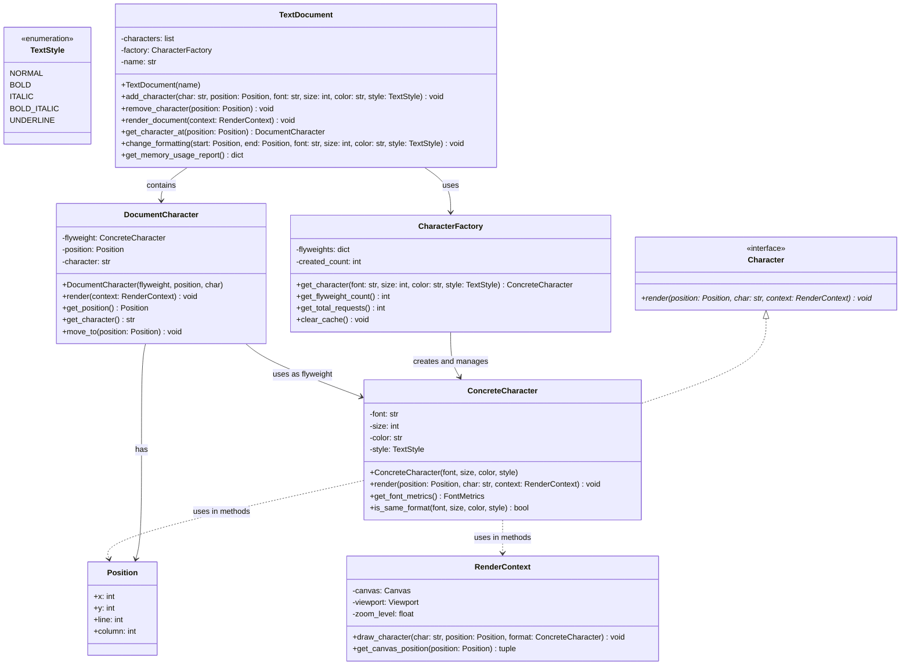

# Design Pattern: Flyweight (Peso-Mosca)

## 1. Introdução e Contexto

O padrão Flyweight é um design pattern estrutural que permite suportar eficientemente grandes quantidades de objetos similares através do compartilhamento inteligente de dados comuns. O padrão minimiza o uso de memória dividindo o estado do objeto em duas categorias: estado intrínseco (compartilhado) e estado extrínseco (contextual).

O conceito do Flyweight é inspirado no termo "peso-mosca" do boxe, a categoria de menor peso, simbolizando a eficiência no uso de recursos. Na programação, este padrão é crucial quando você precisa criar milhares ou milhões de objetos similares, mas criar uma instância separada para cada um seria proibitivo em termos de memória.

O Flyweight funciona através da separação cuidadosa entre dados que podem ser compartilhados (intrínsecos) e dados que devem ser únicos para cada contexto (extrínsecos). O estado intrínseco é armazenado no flyweight e compartilhado entre múltiplos contextos, enquanto o estado extrínseco é passado como parâmetro para os métodos do flyweight quando necessário.

Este padrão é fundamental em sistemas que lidam com grandes volumes de objetos similares, como editores de texto (onde caracteres compartilham formatação), jogos (onde partículas compartilham propriedades visuais), sistemas gráficos (onde formas geométricas compartilham estilos), ou qualquer aplicação que precise otimizar o uso de memória mantendo flexibilidade funcional.

O Flyweight promove uma arquitetura onde a eficiência de memória é priorizada sem sacrificar a funcionalidade, sendo especialmente valioso em aplicações que executam em ambientes com restrições de recursos.

## 2. Que Problema Resolve

O padrão Flyweight resolve problemas fundamentais relacionados ao uso eficiente de memória em aplicações com grandes volumes de objetos:

### Consumo Excessivo de Memória
Quando uma aplicação precisa criar milhares ou milhões de objetos similares, o consumo de memória pode se tornar proibitivo. Por exemplo, um documento de texto com 100.000 caracteres criaria 100.000 objetos se cada caractere fosse uma instância separada.

### Redundância de Dados Compartilhados
Objetos similares frequentemente contêm dados idênticos que são duplicados desnecessariamente. Em um editor de texto, caracteres com a mesma fonte, tamanho e cor duplicam essas informações em cada instância.

### Performance Degradada por Overhead de Objetos
Criar e manter muitos objetos similares impacta não apenas a memória, mas também a performance devido ao overhead de alocação, garbage collection e gerenciamento de referências.

### Ineficiência em Sistemas com Recursos Limitados
Em aplicações móveis, embarcadas ou web, onde recursos são limitados, a criação indiscriminada de objetos pode causar problemas de performance e até falhas do sistema.

### Dificuldade de Otimização Manual
Sem uma estratégia sistemática de compartilhamento, desenvolvedores podem tentar otimizações manuais que são propensas a erros e difíceis de manter.

### Escalabilidade Limitada
Aplicações que não otimizam o uso de memória podem ter seu crescimento limitado, não conseguindo lidar com volumes maiores de dados ou usuários.

## 3. Quando Usar o Padrão Flyweight

### Cenários Ideais de Aplicação

**Grande Quantidade de Objetos Similares**: Quando sua aplicação precisa criar milhares ou milhões de objetos que compartilham características comuns.

**Dados Compartilháveis Identificáveis**: Quando você pode claramente identificar dados que podem ser compartilhados (intrínsecos) versus dados únicos por contexto (extrínsecos).

**Restrições de Memória**: Em ambientes onde o uso eficiente de memória é crítico, como aplicações móveis, embarcadas ou sistemas com muitos usuários simultâneos.

**Objetos com Estado Particionável**: Quando objetos podem ter seu estado dividido entre informações compartilháveis e contextuais.

**Performance de Criação de Objetos**: Quando o custo de criação de objetos está impactando significativamente a performance da aplicação.

### Indicadores de Necessidade

- Sua aplicação cria grandes quantidades de objetos similares
- O uso de memória está crescendo de forma insustentável
- Há dados claramente redundantes entre objetos similares
- Performance está sendo impactada por criação excessiva de objetos
- Você precisa otimizar para ambientes com recursos limitados
- Análises de profiling mostram alto consumo de memória por objetos similares

## 4. Quando NÃO Usar o Padrão Flyweight

### Cenários Inadequados

**Poucos Objetos ou Objetos Únicos**: Se você tem apenas algumas dezenas ou centenas de objetos, ou se cada objeto é fundamentalmente único, o overhead do Flyweight pode superar os benefícios.

**Estado Majoritariamente Extrínseco**: Quando a maior parte do estado do objeto é extrínseca, o benefício de compartilhamento se torna mínimo.

**Complexidade de Implementação Excessiva**: Se separar estado intrínseco de extrínseco torna o código significativamente mais complexo sem benefícios claros.

**Necessidade de Mutabilidade Constante**: Quando objetos precisam ser modificados frequentemente de formas que afetam o estado compartilhado.

**Debugging e Manutenção Dificultados**: Em sistemas onde a clareza do código é mais importante que a otimização de memória.

### Sinais de Alerta

- A implementação está se tornando mais complexa que o problema original
- Você está constantemente convertendo entre estado intrínseco e extrínseco
- O número de objetos não justifica a otimização
- A separação entre estados intrínsecos e extrínsecos não é clara
- Performance está sendo impactada pela complexidade adicional

## 5. Exemplo Prático: Editor de Texto com Formatação

### Contexto do Problema

Imagine que você está desenvolvendo um editor de texto rico que permite diferentes formatações. Cada caractere no documento pode ter propriedades como fonte, tamanho, cor, estilo (negrito, itálico), além de sua posição no documento.

Sem o padrão Flyweight, um documento com 50.000 caracteres criaria 50.000 objetos, cada um armazenando todas as propriedades de formatação. Se 80% dos caracteres usam a mesma formatação (Arial, 12pt, preto), você estaria duplicando essas informações 40.000 vezes.

Com o Flyweight, as propriedades de formatação (estado intrínseco) são compartilhadas, e apenas a posição e o caractere específico (estado extrínseco) são únicos para cada instância.

### Diagrama da Solução



### Implementação em Python

```python
import weakref
from abc import ABC, abstractmethod
from dataclasses import dataclass
from enum import Enum
from typing import Any, Dict, List, Optional, Tuple


# Enums e estruturas de dados
class TextStyle(Enum):
    NORMAL = "normal"
    BOLD = "bold"
    ITALIC = "italic"
    BOLD_ITALIC = "bold_italic"
    UNDERLINE = "underline"


@dataclass
class Position:
    x: int
    y: int
    line: int
    column: int

    def __hash__(self):
        return hash((self.x, self.y, self.line, self.column))


@dataclass
class FontMetrics:
    width: float
    height: float
    baseline: float


class RenderContext:
    def __init__(self, canvas_width: int = 800, canvas_height: int = 600):
        self.canvas_width = canvas_width
        self.canvas_height = canvas_height
        self.zoom_level = 1.0
        self.rendered_characters = []

    def draw_character(
        self,
        char: str,
        position: Position,
        font: str,
        size: int,
        color: str,
        style: TextStyle,
    ) -> None:
        # Simulação de renderização
        render_info = {
            "character": char,
            "position": position,
            "font": font,
            "size": size,
            "color": color,
            "style": style.value,
            "screen_x": position.x * self.zoom_level,
            "screen_y": position.y * self.zoom_level,
        }
        self.rendered_characters.append(render_info)

    def clear(self) -> None:
        self.rendered_characters.clear()

    def get_render_count(self) -> int:
        return len(self.rendered_characters)


# Flyweight interface
class Character(ABC):
    @abstractmethod
    def render(self, position: Position, char: str, context: RenderContext) -> None:
        pass


# Concrete Flyweight - armazena estado intrínseco (formatação)
class ConcreteCharacter(Character):
    def __init__(self, font: str, size: int, color: str, style: TextStyle):
        # Estado intrínseco - compartilhado entre muitos caracteres
        self.font = font
        self.size = size
        self.color = color
        self.style = style

        # Cache de métricas da fonte
        self._font_metrics = None

    def render(self, position: Position, char: str, context: RenderContext) -> None:
        """
        Renderiza o caractere usando estado intrínseco (self) e extrínseco (parâmetros)
        """
        context.draw_character(
            char, position, self.font, self.size, self.color, self.style
        )

    def get_font_metrics(self) -> FontMetrics:
        """Cache de métricas da fonte para evitar recálculos"""
        if self._font_metrics is None:
            # Simulação de cálculo de métricas baseado na fonte e tamanho
            base_width = len(self.font) * 0.6  # Simulação simples
            self._font_metrics = FontMetrics(
                width=self.size * base_width / 10,
                height=self.size * 1.2,
                baseline=self.size * 0.8,
            )
        return self._font_metrics

    def is_same_format(
        self, font: str, size: int, color: str, style: TextStyle
    ) -> bool:
        """Verifica se este flyweight tem a mesma formatação"""
        return (
            self.font == font
            and self.size == size
            and self.color == color
            and self.style == style
        )

    def __str__(self) -> str:
        return f"CharacterFormat({self.font}, {self.size}pt, {self.color}, {self.style.value})"

    def __hash__(self) -> int:
        return hash((self.font, self.size, self.color, self.style))

    def __eq__(self, other) -> bool:
        if not isinstance(other, ConcreteCharacter):
            return False
        return (
            self.font == other.font
            and self.size == other.size
            and self.color == other.color
            and self.style == other.style
        )


# Flyweight Factory - gerencia e compartilha flyweights
class CharacterFactory:
    def __init__(self):
        self._flyweights: Dict[Tuple, ConcreteCharacter] = {}
        self._total_requests = 0
        self._cache_hits = 0

    def get_character(
        self, font: str, size: int, color: str, style: TextStyle
    ) -> ConcreteCharacter:
        """
        Retorna um flyweight compartilhado ou cria um novo se necessário
        """
        self._total_requests += 1
        key = (font, size, color, style)

        if key not in self._flyweights:
            # Cria novo flyweight apenas se não existir
            self._flyweights[key] = ConcreteCharacter(font, size, color, style)
            print(f"Created new flyweight: {font} {size}pt {color} {style.value}")
        else:
            self._cache_hits += 1

        return self._flyweights[key]

    def get_flyweight_count(self) -> int:
        """Retorna número de flyweights únicos criados"""
        return len(self._flyweights)

    def get_total_requests(self) -> int:
        """Retorna número total de solicitações"""
        return self._total_requests

    def get_cache_efficiency(self) -> float:
        """Retorna eficiência do cache como porcentagem"""
        if self._total_requests == 0:
            return 0.0
        return (self._cache_hits / self._total_requests) * 100

    def clear_cache(self) -> None:
        """Limpa cache de flyweights (usar com cuidado)"""
        self._flyweights.clear()
        self._total_requests = 0
        self._cache_hits = 0

    def get_memory_report(self) -> Dict[str, Any]:
        """Retorna relatório de uso de memória"""
        return {
            "unique_flyweights": len(self._flyweights),
            "total_requests": self._total_requests,
            "cache_hits": self._cache_hits,
            "cache_efficiency": f"{self.get_cache_efficiency():.1f}%",
            "memory_saved": self._cache_hits,  # Cada hit é um objeto não criado
        }


# Context - armazena estado extrínseco e referência ao flyweight
class DocumentCharacter:
    def __init__(
        self, flyweight: ConcreteCharacter, position: Position, character: str
    ):
        self._flyweight = flyweight  # Referência ao flyweight compartilhado
        self._position = position  # Estado extrínseco - posição única
        self._character = character  # Estado extrínseco - caractere específico

    def render(self, context: RenderContext) -> None:
        """Delega renderização ao flyweight, passando estado extrínseco"""
        self._flyweight.render(self._position, self._character, context)

    def get_position(self) -> Position:
        return self._position

    def get_character(self) -> str:
        return self._character

    def get_flyweight(self) -> ConcreteCharacter:
        return self._flyweight

    def move_to(self, new_position: Position) -> None:
        """Move caractere para nova posição (modifica estado extrínseco)"""
        self._position = new_position

    def change_character(self, new_char: str) -> None:
        """Muda o caractere (modifica estado extrínseco)"""
        self._character = new_char

    def __str__(self) -> str:
        return f"'{self._character}' at {self._position} using {self._flyweight}"


# Client - usa flyweights através da factory
class TextDocument:
    def __init__(self, name: str):
        self.name = name
        self._characters: List[DocumentCharacter] = []
        self._factory = CharacterFactory()

    def add_character(
        self,
        char: str,
        position: Position,
        font: str = "Arial",
        size: int = 12,
        color: str = "black",
        style: TextStyle = TextStyle.NORMAL,
    ) -> None:
        """Adiciona caractere ao documento usando flyweight pattern"""

        # Obtém flyweight compartilhado da factory
        flyweight = self._factory.get_character(font, size, color, style)

        # Cria contexto com estado extrínseco
        doc_char = DocumentCharacter(flyweight, position, char)
        self._characters.append(doc_char)

    def add_text(
        self,
        text: str,
        start_position: Position,
        font: str = "Arial",
        size: int = 12,
        color: str = "black",
        style: TextStyle = TextStyle.NORMAL,
    ) -> None:
        """Adiciona texto completo com formatação uniforme"""
        current_pos = Position(
            start_position.x,
            start_position.y,
            start_position.line,
            start_position.column,
        )

        for char in text:
            if char == "\n":
                current_pos.line += 1
                current_pos.column = 0
                current_pos.y += size + 2  # Espaçamento entre linhas
                current_pos.x = start_position.x
            else:
                self.add_character(
                    char,
                    Position(
                        current_pos.x,
                        current_pos.y,
                        current_pos.line,
                        current_pos.column,
                    ),
                    font,
                    size,
                    color,
                    style,
                )
                current_pos.column += 1
                current_pos.x += size * 0.6  # Largura aproximada do caractere

    def remove_character(self, position: Position) -> bool:
        """Remove caractere na posição especificada"""
        for i, char in enumerate(self._characters):
            if char.get_position() == position:
                del self._characters[i]
                return True
        return False

    def get_character_at(self, position: Position) -> Optional[DocumentCharacter]:
        """Obtém caractere na posição especificada"""
        for char in self._characters:
            if char.get_position() == position:
                return char
        return None

    def change_formatting(
        self,
        start_line: int,
        start_col: int,
        end_line: int,
        end_col: int,
        font: str,
        size: int,
        color: str,
        style: TextStyle,
    ) -> int:
        """Muda formatação de uma região do texto"""
        changed_count = 0

        for char in self._characters:
            pos = char.get_position()

            # Verifica se está na região selecionada
            if (
                pos.line > start_line
                or (pos.line == start_line and pos.column >= start_col)
            ) and (
                pos.line < end_line or (pos.line == end_line and pos.column <= end_col)
            ):

                # Obtém novo flyweight com nova formatação
                new_flyweight = self._factory.get_character(font, size, color, style)

                # Substitui o caractere com nova formatação
                new_char = DocumentCharacter(new_flyweight, pos, char.get_character())

                # Encontra e substitui na lista
                for i, existing_char in enumerate(self._characters):
                    if existing_char == char:
                        self._characters[i] = new_char
                        changed_count += 1
                        break

        return changed_count

    def render_document(self, context: RenderContext) -> None:
        """Renderiza documento completo"""
        print(f"\nRendering document: {self.name}")
        context.clear()

        for char in self._characters:
            char.render(context)

        print(f"Rendered {len(self._characters)} characters")

    def get_memory_usage_report(self) -> Dict[str, Any]:
        """Gera relatório detalhado de uso de memória"""
        factory_report = self._factory.get_memory_report()

        # Calcula estatísticas do documento
        total_chars = len(self._characters)
        unique_formats = factory_report["unique_flyweights"]

        # Estima economia de memória
        without_flyweight = total_chars  # Um objeto por caractere
        with_flyweight = unique_formats + total_chars  # Flyweights + contextos
        memory_saved = without_flyweight - with_flyweight
        efficiency = (
            (memory_saved / without_flyweight * 100) if without_flyweight > 0 else 0
        )

        return {
            "document_name": self.name,
            "total_characters": total_chars,
            "unique_flyweights": unique_formats,
            "flyweight_factory": factory_report,
            "estimated_objects_without_flyweight": without_flyweight,
            "estimated_objects_with_flyweight": with_flyweight,
            "estimated_memory_savings": memory_saved,
            "efficiency_percentage": f"{efficiency:.1f}%",
        }

    def get_character_count(self) -> int:
        return len(self._characters)

    def get_text_content(self) -> str:
        """Retorna conteúdo textual do documento"""
        # Ordena caracteres por posição para reconstruir texto
        sorted_chars = sorted(
            self._characters,
            key=lambda c: (c.get_position().line, c.get_position().column),
        )
        return "".join(char.get_character() for char in sorted_chars)


# Sistema de gerenciamento de documentos
class DocumentManager:
    def __init__(self):
        self.documents: Dict[str, TextDocument] = {}

    def create_document(self, name: str) -> TextDocument:
        """Cria novo documento"""
        if name in self.documents:
            raise ValueError(f"Document '{name}' already exists")

        self.documents[name] = TextDocument(name)
        return self.documents[name]

    def get_document(self, name: str) -> Optional[TextDocument]:
        """Obtém documento existente"""
        return self.documents.get(name)

    def get_global_memory_report(self) -> Dict[str, Any]:
        """Gera relatório global de uso de memória"""
        total_chars = 0
        total_docs = len(self.documents)

        for doc in self.documents.values():
            total_chars += doc.get_character_count()

        return {
            "total_documents": total_docs,
            "total_characters": total_chars,
            "average_chars_per_doc": total_chars / total_docs if total_docs > 0 else 0,
            "documents": {
                name: doc.get_memory_usage_report()
                for name, doc in self.documents.items()
            },
        }


# Exemplo de uso
def main():
    # Criando gerenciador de documentos
    doc_manager = DocumentManager()

    # Criando documento
    doc = doc_manager.create_document("sample_document.txt")

    print("=== Creating Document with Flyweight Pattern ===")

    # Adicionando texto com formatações variadas
    print("Adding formatted text...")

    # Título com formatação especial
    doc.add_text(
        "DOCUMENTO DE EXEMPLO",
        Position(50, 50, 0, 0),
        "Arial",
        18,
        "blue",
        TextStyle.BOLD,
    )

    # Parágrafo normal
    doc.add_text(
        "\n\nEste é um exemplo de documento que demonstra o padrão Flyweight. ",
        Position(50, 90, 2, 0),
        "Arial",
        12,
        "black",
        TextStyle.NORMAL,
    )

    # Texto destacado
    doc.add_text(
        "Palavras importantes",
        Position(50, 110, 3, 0),
        "Arial",
        12,
        "red",
        TextStyle.BOLD,
    )

    # Mais texto normal
    doc.add_text(
        " podem ter formatação diferente, mas caracteres com a mesma formatação compartilham flyweights.",
        Position(200, 110, 3, 18),
        "Arial",
        12,
        "black",
        TextStyle.NORMAL,
    )

    # Texto em itálico
    doc.add_text(
        "\n\nTexto em itálico também demonstra o compartilhamento eficiente.",
        Position(50, 140, 5, 0),
        "Arial",
        12,
        "green",
        TextStyle.ITALIC,
    )

    # Simulando documento maior com muito texto repetitivo
    print("Adding large amount of text to demonstrate efficiency...")

    base_y = 180
    for i in range(10):
        line_text = f"Linha {i+1}: Esta é uma linha de texto que se repete com formatação padrão. "
        line_text += "Todos os caracteres desta linha compartilham o mesmo flyweight para economizar memória. "
        doc.add_text(
            line_text,
            Position(50, base_y + i * 20, 7 + i, 0),
            "Arial",
            11,
            "black",
            TextStyle.NORMAL,
        )

    # Adicionando mais texto com formatação diferente
    special_text = "TEXTO ESPECIAL COM FORMATAÇÃO ÚNICA"
    doc.add_text(
        special_text,
        Position(50, base_y + 220, 18, 0),
        "Times",
        14,
        "purple",
        TextStyle.BOLD_ITALIC,
    )

    # Relatório de uso de memória
    print("\n=== Memory Usage Report ===")
    memory_report = doc.get_memory_usage_report()

    print(f"Document: {memory_report['document_name']}")
    print(f"Total characters: {memory_report['total_characters']}")
    print(f"Unique flyweights created: {memory_report['unique_flyweights']}")
    print(f"Cache efficiency: {memory_report['flyweight_factory']['cache_efficiency']}")
    print(
        f"Estimated objects without Flyweight: {memory_report['estimated_objects_without_flyweight']}"
    )
    print(
        f"Estimated objects with Flyweight: {memory_report['estimated_objects_with_flyweight']}"
    )
    print(
        f"Memory savings: {memory_report['estimated_memory_savings']} objects ({memory_report['efficiency_percentage']})"
    )

    # Demonstrando mudança de formatação
    print(f"\n=== Demonstrating Format Changes ===")
    print("Changing formatting of a section...")
    changed = doc.change_formatting(
        7, 0, 10, 50, "Arial", 12, "darkblue", TextStyle.BOLD
    )
    print(f"Changed formatting of {changed} characters")

    # Novo relatório após mudanças
    new_report = doc.get_memory_usage_report()
    print(
        f"Unique flyweights after formatting change: {new_report['unique_flyweights']}"
    )
    print(
        f"New cache efficiency: {new_report['flyweight_factory']['cache_efficiency']}"
    )

    # Demonstrando renderização
    print(f"\n=== Rendering Document ===")
    render_context = RenderContext(1200, 800)
    doc.render_document(render_context)
    print(f"Rendered {render_context.get_render_count()} characters to canvas")

    # Criando segundo documento para demonstrar compartilhamento global
    print(f"\n=== Creating Second Document ===")
    doc2 = doc_manager.create_document("second_document.txt")

    # Usando as mesmas formatações do primeiro documento
    doc2.add_text(
        "SEGUNDO DOCUMENTO", Position(50, 50, 0, 0), "Arial", 18, "blue", TextStyle.BOLD
    )  # Mesmo flyweight do doc1

    doc2.add_text(
        "\n\nEste documento compartilha flyweights com o primeiro documento.",
        Position(50, 90, 2, 0),
        "Arial",
        12,
        "black",
        TextStyle.NORMAL,
    )

    # Relatório global
    print(f"\n=== Global Memory Report ===")
    global_report = doc_manager.get_global_memory_report()
    print(f"Total documents: {global_report['total_documents']}")
    print(f"Total characters: {global_report['total_characters']}")
    print(
        f"Average characters per document: {global_report['average_chars_per_doc']:.1f}"
    )

    # Demonstrando eficiência comparativa
    print(f"\n=== Efficiency Comparison ===")
    total_chars = global_report["total_characters"]
    total_flyweights = sum(
        doc.get_memory_usage_report()["unique_flyweights"]
        for doc in doc_manager.documents.values()
    )

    print(f"Without Flyweight: {total_chars} character objects would be created")
    print(
        f"With Flyweight: {total_flyweights} flyweight objects + {total_chars} context objects"
    )
    print(
        f"Memory efficiency: {((total_chars - total_flyweights) / total_chars * 100):.1f}% fewer objects"
    )

    # Teste de busca e modificação
    print(f"\n=== Character Operations ===")
    char_at_pos = doc.get_character_at(Position(50, 50, 0, 0))
    if char_at_pos:
        print(
            f"Character at (50,50): '{char_at_pos.get_character()}' using {char_at_pos.get_flyweight()}"
        )

    # Demonstrando que flyweights são realmente compartilhados
    print(f"\n=== Flyweight Sharing Verification ===")
    doc3 = doc_manager.create_document("third_document.txt")
    doc3.add_character(
        "A", Position(0, 0, 0, 0), "Arial", 12, "black", TextStyle.NORMAL
    )
    doc3.add_character(
        "B", Position(10, 0, 0, 1), "Arial", 12, "black", TextStyle.NORMAL
    )

    char1 = doc3.get_character_at(Position(0, 0, 0, 0))
    char2 = doc3.get_character_at(Position(10, 0, 0, 1))

    if char1 and char2:
        same_flyweight = char1.get_flyweight() is char2.get_flyweight()
        print(f"Characters 'A' and 'B' share the same flyweight: {same_flyweight}")
        print(f"Flyweight object ID for 'A': {id(char1.get_flyweight())}")
        print(f"Flyweight object ID for 'B': {id(char2.get_flyweight())}")


if __name__ == "__main__":
    main()
```

### Vantagens da Solução

**Eficiência de Memória**: Dramaticamente reduz uso de memória compartilhando propriedades comuns entre objetos similares.

**Escalabilidade**: Permite que aplicações lidem com volumes muito maiores de objetos sem impacto proporcional na memória.

**Performance**: Reduz overhead de criação de objetos e garbage collection.

**Flexibilidade**: Mantém capacidade de ter objetos únicos através do estado extrínseco.

**Transparência**: Clientes podem usar objetos normalmente sem conhecer a otimização interna.

### Análise da Implementação

Este exemplo demonstra como o padrão Flyweight otimiza drasticamente o uso de memória em um editor de texto. Sem o Flyweight, cada caractere seria um objeto separado com suas próprias propriedades de formatação. Com o Flyweight, caracteres com a mesma formatação compartilham um único objeto flyweight.

O `ConcreteCharacter` armazena o estado intrínseco (fonte, tamanho, cor, estilo) que é compartilhado, enquanto o `DocumentCharacter` mantém o estado extrínseco (posição, caractere específico). A `CharacterFactory` garante que apenas um flyweight existe para cada combinação única de formatação.

Em um documento com 50.000 caracteres onde 80% usam formatação padrão, o Flyweight reduziria de 50.000 objetos para aproximadamente 10 flyweights + 50.000 contextos, economizando dezenas de milhares de objetos.

O padrão mantém total flexibilidade - você pode ter quantas formatações diferentes quiser, e cada caractere pode ser movido ou modificado independentemente, demonstrando como eficiência e funcionalidade podem coexistir elegantemente.