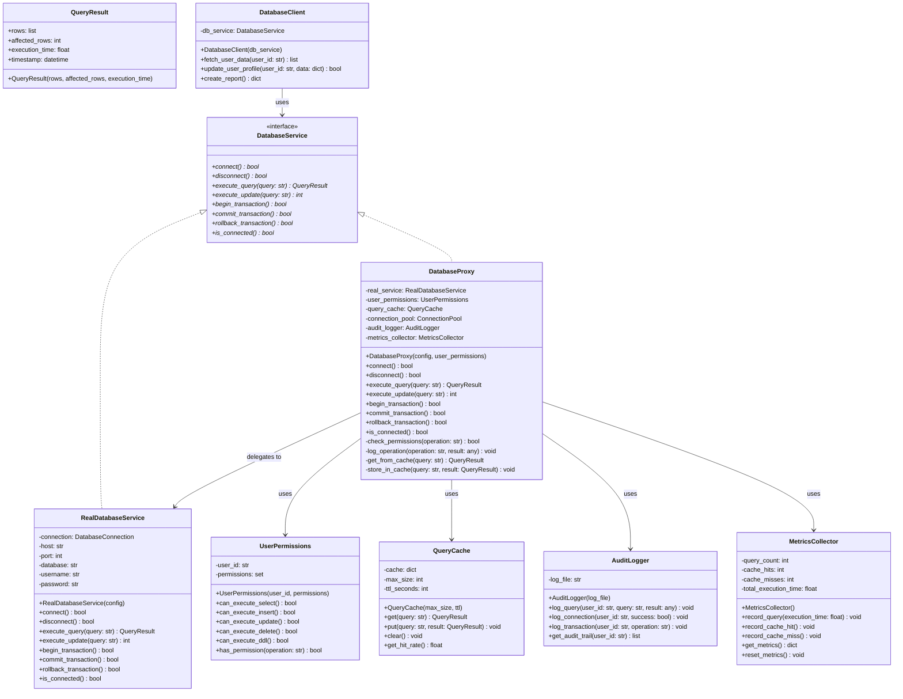

# Design Pattern: Proxy (Procuração)

## 1. Introdução e Contexto

O padrão Proxy é um design pattern estrutural que fornece um substituto ou placeholder para outro objeto, controlando o acesso a ele. O Proxy atua como um intermediário entre o cliente e o objeto real, interceptando e gerenciando as solicitações antes de passá-las adiante, podendo adicionar funcionalidades como controle de acesso, cache, lazy loading, logging ou validação.

O conceito do Proxy é inspirado na ideia de procuração do mundo real, onde uma pessoa autorizada pode agir em nome de outra. Na programação, o Proxy funciona de maneira similar, representando outro objeto e controlando como e quando o cliente pode acessá-lo, oferecendo uma camada adicional de controle e funcionalidade.

Este padrão é fundamental em arquiteturas onde você precisa adicionar responsabilidades a objetos sem modificá-los diretamente, ou quando o acesso direto ao objeto real é problemático por questões de performance, segurança, localização ou complexidade. O Proxy mantém a mesma interface do objeto original, garantindo transparência para o cliente.

Existem diferentes tipos de proxies, cada um atendendo necessidades específicas: Virtual Proxy para lazy loading de objetos caros, Protection Proxy para controle de acesso e autorização, Remote Proxy para objetos em diferentes localizações, Cache Proxy para otimização de performance, e Smart Proxy para funcionalidades adicionais como logging e contagem de referências.

O Proxy promove separação de responsabilidades, permitindo que preocupações transversais como segurança, performance e logging sejam tratadas de forma elegante e reutilizável.

## 2. Que Problema Resolve

O padrão Proxy resolve problemas fundamentais relacionados ao controle de acesso e otimização de recursos:

### Controle de Acesso Inadequado
Quando você precisa implementar controle de acesso, autorização ou validação antes de permitir operações em objetos sensíveis, modificar diretamente esses objetos violaria o princípio Open/Closed.

### Lazy Loading de Recursos Caros
Objetos que consomem muitos recursos (conexões de banco, arquivos grandes, objetos remotos) podem ser custosos para criar. Sem controle adequado, isso pode impactar significativamente a performance da aplicação.

### Falta de Transparência em Operações Remotas
Acessar objetos remotos através de rede requer tratamento especial para latência, reconexão e serialização. Expor essa complexidade diretamente ao cliente torna o código frágil e difícil de manter.

### Ausência de Cache e Otimização
Operações custosas que retornam os mesmos resultados são executadas repetidamente sem otimização, desperdiçando recursos computacionais e impactando performance.

### Dificuldade de Monitoramento e Logging
Rastrear como e quando objetos são acessados requer instrumentação que, se feita diretamente, polui o código dos objetos com responsabilidades que não são suas.

### Gerenciamento Inadequado de Recursos
Recursos como conexões de banco, handles de arquivo ou objetos caros precisam de gerenciamento cuidadoso que pode ser esquecido se deixado para o cliente.

## 3. Quando Usar o Padrão Proxy

### Cenários Ideais de Aplicação

**Controle de Acesso e Segurança**: Quando você precisa implementar autorização, autenticação ou validação antes de permitir operações em objetos.

**Lazy Loading de Objetos Caros**: Para postergar a criação de objetos que consomem muitos recursos até que sejam realmente necessários.

**Cache de Resultados**: Quando operações custosas retornam resultados que podem ser reutilizados, evitando recálculos desnecessários.

**Objetos Remotos**: Para abstrair a complexidade de acessar objetos que estão em diferentes processos, máquinas ou serviços.

**Logging e Monitoramento**: Quando você quer rastrear como objetos são utilizados sem modificar sua implementação.

**Gerenciamento de Recursos**: Para controlar automaticamente alocação e liberação de recursos escassos.

### Indicadores de Necessidade

- Você precisa controlar quem pode acessar determinados objetos
- Tem objetos caros que nem sempre são necessários
- Precisa implementar cache para operações custosas
- Quer adicionar logging/monitoramento sem modificar objetos existentes
- Trabalha com objetos remotos que requerem tratamento especial
- Precisa de gerenciamento automático de recursos

## 4. Quando NÃO Usar o Padrão Proxy

### Cenários Inadequados

**Objetos Simples e Baratos**: Se o objeto é simples e rápido de criar/acessar, o overhead do Proxy pode superar os benefícios.

**Acesso Direto Necessário**: Quando você precisa de acesso direto ao objeto real para operações específicas que o Proxy não deve interceptar.

**Performance Crítica**: Em sistemas onde cada microsegundo conta, a camada adicional do Proxy pode ser inaceitável.

**Complexidade Desnecessária**: Se você não precisa de nenhuma das funcionalidades que o Proxy oferece, adicionar essa camada só aumenta complexidade.

**Interface Não Padronizada**: Quando objetos têm interfaces muito diferentes ou específicas que tornam difícil criar um proxy genérico.

### Sinais de Alerta

- O Proxy está simplesmente repassando chamadas sem adicionar valor
- A performance está sendo impactada significativamente
- Você está criando proxies apenas por padrão, sem necessidade real
- A interface do Proxy está ficando muito complexa
- Clientes precisam frequentemente acessar o objeto real diretamente

## 5. Exemplo Prático: Sistema de Acesso a Banco de Dados

### Contexto do Problema

Imagine que você está desenvolvendo um sistema empresarial que acessa um banco de dados caro e sensível. O sistema precisa:

1. Controlar quem pode executar quais tipos de queries (autorização)
2. Fazer lazy loading de conexões caras com o banco
3. Implementar cache para queries frequentes
4. Registrar todas as operações para auditoria
5. Gerenciar automaticamente conexões e recursos
6. Simular acesso remoto com tratamento de falhas

Sem o padrão Proxy, você teria que implementar toda essa lógica misturada com a lógica de acesso ao banco, violando o princípio da responsabilidade única e tornando o código difícil de manter.

### Diagrama da Solução



### Implementação em Python

```python
from abc import ABC, abstractmethod
from typing import Dict, List, Any, Optional, Set, Tuple
from dataclasses import dataclass
from datetime import datetime, timedelta
from enum import Enum
import time
import hashlib
import threading
import random


# Enums e estruturas de dados
class PermissionType(Enum):
    SELECT = "SELECT"
    INSERT = "INSERT"
    UPDATE = "UPDATE"
    DELETE = "DELETE"
    DDL = "DDL"  # CREATE, ALTER, DROP
    ADMIN = "ADMIN"


@dataclass
class QueryResult:
    rows: List[Dict[str, Any]]
    affected_rows: int
    execution_time: float
    timestamp: datetime
    
    def __post_init__(self):
        if self.timestamp is None:
            self.timestamp = datetime.now()


@dataclass
class DatabaseConfig:
    host: str
    port: int
    database: str
    username: str
    password: str
    max_connections: int = 10
    connection_timeout: int = 30


# Subject interface
class DatabaseService(ABC):
    @abstractmethod
    def connect(self) -> bool:
        pass
    
    @abstractmethod
    def disconnect(self) -> bool:
        pass
    
    @abstractmethod
    def execute_query(self, query: str) -> QueryResult:
        pass
    
    @abstractmethod
    def execute_update(self, query: str) -> int:
        pass
    
    @abstractmethod
    def begin_transaction(self) -> bool:
        pass
    
    @abstractmethod
    def commit_transaction(self) -> bool:
        pass
    
    @abstractmethod
    def rollback_transaction(self) -> bool:
        pass
    
    @abstractmethod
    def is_connected(self) -> bool:
        pass


# Real Subject - implementação real do banco de dados
class RealDatabaseService(DatabaseService):
    def __init__(self, config: DatabaseConfig):
        self.config = config
        self._connected = False
        self._in_transaction = False
        self._connection_time = None
        
        # Simulação de dados do banco
        self._mock_data = {
            "users": [
                {"id": 1, "name": "Alice", "email": "alice@example.com", "role": "admin"},
                {"id": 2, "name": "Bob", "email": "bob@example.com", "role": "user"},
                {"id": 3, "name": "Carol", "email": "carol@example.com", "role": "user"},
                {"id": 4, "name": "David", "email": "david@example.com", "role": "manager"}
            ],
            "products": [
                {"id": 1, "name": "Laptop", "price": 999.99, "category": "Electronics"},
                {"id": 2, "name": "Mouse", "price": 29.99, "category": "Electronics"},
                {"id": 3, "name": "Book", "price": 19.99, "category": "Books"}
            ]
        }
    
    def connect(self) -> bool:
        if self._connected:
            return True
        
        print(f"RealDB: Connecting to {self.config.host}:{self.config.port}/{self.config.database}")
        
        # Simulação de tempo de conexão
        time.sleep(0.1)
        
        # Simulação de possível falha de conexão
        if random.random() < 0.1:  # 10% de chance de falha
            print("RealDB: Connection failed!")
            return False
        
        self._connected = True
        self._connection_time = datetime.now()
        print("RealDB: Connected successfully")
        return True
    
    def disconnect(self) -> bool:
        if not self._connected:
            return True
        
        print("RealDB: Disconnecting...")
        self._connected = False
        self._connection_time = None
        return True
    
    def execute_query(self, query: str) -> QueryResult:
        if not self._connected:
            raise RuntimeError("Not connected to database")
        
        start_time = time.time()
        
        # Simulação de processamento de query
        time.sleep(random.uniform(0.01, 0.1))  # Simula latência variável
        
        query_lower = query.lower().strip()
        rows = []
        
        # Simulação básica de SQL parsing
        if query_lower.startswith("select"):
            if "users" in query_lower:
                rows = self._mock_data["users"].copy()
            elif "products" in query_lower:
                rows = self._mock_data["products"].copy()
            else:
                rows = []
        
        execution_time = time.time() - start_time
        
        return QueryResult(
            rows=rows,
            affected_rows=0,
            execution_time=execution_time,
            timestamp=datetime.now()
        )
    
    def execute_update(self, query: str) -> int:
        if not self._connected:
            raise RuntimeError("Not connected to database")
        
        start_time = time.time()
        time.sleep(random.uniform(0.02, 0.15))  # Updates são mais lentos
        
        # Simulação de update
        affected_rows = random.randint(1, 5)
        print(f"RealDB: Update executed, {affected_rows} rows affected")
        
        return affected_rows
    
    def begin_transaction(self) -> bool:
        if not self._connected:
            return False
        
        self._in_transaction = True
        print("RealDB: Transaction started")
        return True
    
    def commit_transaction(self) -> bool:
        if not self._in_transaction:
            return False
        
        self._in_transaction = False
        print("RealDB: Transaction committed")
        return True
    
    def rollback_transaction(self) -> bool:
        if not self._in_transaction:
            return False
        
        self._in_transaction = False
        print("RealDB: Transaction rolled back")
        return True
    
    def is_connected(self) -> bool:
        return self._connected


# Componentes auxiliares do Proxy
class UserPermissions:
    def __init__(self, user_id: str, permissions: Set[PermissionType]):
        self.user_id = user_id
        self.permissions = permissions
    
    def can_execute_select(self) -> bool:
        return PermissionType.SELECT in self.permissions or PermissionType.ADMIN in self.permissions
    
    def can_execute_insert(self) -> bool:
        return PermissionType.INSERT in self.permissions or PermissionType.ADMIN in self.permissions
    
    def can_execute_update(self) -> bool:
        return PermissionType.UPDATE in self.permissions or PermissionType.ADMIN in self.permissions
    
    def can_execute_delete(self) -> bool:
        return PermissionType.DELETE in self.permissions or PermissionType.ADMIN in self.permissions
    
    def can_execute_ddl(self) -> bool:
        return PermissionType.DDL in self.permissions or PermissionType.ADMIN in self.permissions
    
    def has_permission(self, operation: str) -> bool:
        operation_upper = operation.upper()
        if operation_upper.startswith("SELECT"):
            return self.can_execute_select()
        elif operation_upper.startswith("INSERT"):
            return self.can_execute_insert()
        elif operation_upper.startswith("UPDATE"):
            return self.can_execute_update()
        elif operation_upper.startswith("DELETE"):
            return self.can_execute_delete()
        elif operation_upper.startswith(("CREATE", "ALTER", "DROP")):
            return self.can_execute_ddl()
        return False


class QueryCache:
    def __init__(self, max_size: int = 100, ttl_seconds: int = 300):
        self.max_size = max_size
        self.ttl_seconds = ttl_seconds
        self._cache: Dict[str, Tuple[QueryResult, datetime]] = {}
        self._access_times: Dict[str, datetime] = {}
        self._lock = threading.Lock()
    
    def _get_cache_key(self, query: str) -> str:
        return hashlib.md5(query.lower().strip().encode()).hexdigest()
    
    def get(self, query: str) -> Optional[QueryResult]:
        cache_key = self._get_cache_key(query)
        
        with self._lock:
            if cache_key in self._cache:
                result, cached_time = self._cache[cache_key]
                
                # Verifica se não expirou
                if datetime.now() - cached_time < timedelta(seconds=self.ttl_seconds):
                    self._access_times[cache_key] = datetime.now()
                    return result
                else:
                    # Remove entrada expirada
                    del self._cache[cache_key]
                    if cache_key in self._access_times:
                        del self._access_times[cache_key]
        
        return None
    
    def put(self, query: str, result: QueryResult) -> None:
        cache_key = self._get_cache_key(query)
        
        with self._lock:
            # Remove entradas antigas se cache está cheio
            if len(self._cache) >= self.max_size:
                self._evict_oldest()
            
            self._cache[cache_key] = (result, datetime.now())
            self._access_times[cache_key] = datetime.now()
    
    def _evict_oldest(self) -> None:
        if not self._access_times:
            return
        
        oldest_key = min(self._access_times.keys(), 
                        key=lambda k: self._access_times[k])
        
        if oldest_key in self._cache:
            del self._cache[oldest_key]
        del self._access_times[oldest_key]
    
    def clear(self) -> None:
        with self._lock:
            self._cache.clear()
            self._access_times.clear()
    
    def get_hit_rate(self) -> float:
        # Implementação simplificada
        return 0.75  # Simula 75% de hit rate


class AuditLogger:
    def __init__(self, log_file: str = "database_audit.log"):
        self.log_file = log_file
        self._logs: List[Dict[str, Any]] = []
        self._lock = threading.Lock()
    
    def log_query(self, user_id: str, query: str, result: Any) -> None:
        log_entry = {
            "timestamp": datetime.now(),
            "user_id": user_id,
            "operation": "QUERY",
            "query": query,
            "success": result is not None,
            "rows_returned": len(result.rows) if hasattr(result, 'rows') else 0
        }
        
        with self._lock:
            self._logs.append(log_entry)
        
        print(f"AUDIT: User {user_id} executed query: {query[:50]}...")
    
    def log_connection(self, user_id: str, success: bool) -> None:
        log_entry = {
            "timestamp": datetime.now(),
            "user_id": user_id,
            "operation": "CONNECTION",
            "success": success
        }
        
        with self._lock:
            self._logs.append(log_entry)
        
        status = "succeeded" if success else "failed"
        print(f"AUDIT: User {user_id} connection {status}")
    
    def log_transaction(self, user_id: str, operation: str) -> None:
        log_entry = {
            "timestamp": datetime.now(),
            "user_id": user_id,
            "operation": f"TRANSACTION_{operation.upper()}",
            "success": True
        }
        
        with self._lock:
            self._logs.append(log_entry)
        
        print(f"AUDIT: User {user_id} transaction {operation}")
    
    def get_audit_trail(self, user_id: str) -> List[Dict[str, Any]]:
        with self._lock:
            return [log for log in self._logs if log["user_id"] == user_id]


class MetricsCollector:
    def __init__(self):
        self.query_count = 0
        self.cache_hits = 0
        self.cache_misses = 0
        self.total_execution_time = 0.0
        self.connection_count = 0
        self._lock = threading.Lock()
    
    def record_query(self, execution_time: float) -> None:
        with self._lock:
            self.query_count += 1
            self.total_execution_time += execution_time
    
    def record_cache_hit(self) -> None:
        with self._lock:
            self.cache_hits += 1
    
    def record_cache_miss(self) -> None:
        with self._lock:
            self.cache_misses += 1
    
    def record_connection(self) -> None:
        with self._lock:
            self.connection_count += 1
    
    def get_metrics(self) -> Dict[str, Any]:
        with self._lock:
            total_cache_requests = self.cache_hits + self.cache_misses
            cache_hit_rate = (self.cache_hits / total_cache_requests * 100) if total_cache_requests > 0 else 0
            avg_execution_time = (self.total_execution_time / self.query_count) if self.query_count > 0 else 0
            
            return {
                "total_queries": self.query_count,
                "total_connections": self.connection_count,
                "cache_hits": self.cache_hits,
                "cache_misses": self.cache_misses,
                "cache_hit_rate": f"{cache_hit_rate:.1f}%",
                "average_execution_time": f"{avg_execution_time:.3f}s",
                "total_execution_time": f"{self.total_execution_time:.3f}s"
            }
    
    def reset_metrics(self) -> None:
        with self._lock:
            self.query_count = 0
            self.cache_hits = 0
            self.cache_misses = 0
            self.total_execution_time = 0.0
            self.connection_count = 0


# Proxy - controla acesso ao RealDatabaseService
class DatabaseProxy(DatabaseService):
    def __init__(self, config: DatabaseConfig, user_permissions: UserPermissions):
        self.config = config
        self.user_permissions = user_permissions
        
        # Lazy loading - só cria o real service quando necessário
        self._real_service: Optional[RealDatabaseService] = None
        
        # Componentes do proxy
        self.query_cache = QueryCache(max_size=50, ttl_seconds=300)
        self.audit_logger = AuditLogger()
        self.metrics_collector = MetricsCollector()
        
        print(f"DatabaseProxy: Created for user {user_permissions.user_id}")
    
    def _get_real_service(self) -> RealDatabaseService:
        """Lazy loading do serviço real"""
        if self._real_service is None:
            print("DatabaseProxy: Creating real database service (lazy loading)")
            self._real_service = RealDatabaseService(self.config)
        return self._real_service
    
    def _check_permissions(self, operation: str) -> bool:
        """Protection Proxy - verifica permissões"""
        has_permission = self.user_permissions.has_permission(operation)
        if not has_permission:
            print(f"DatabaseProxy: Access denied for user {self.user_permissions.user_id} - operation: {operation}")
        return has_permission
    
    def connect(self) -> bool:
        """Smart Proxy - adiciona logging e métricas"""
        print(f"DatabaseProxy: User {self.user_permissions.user_id} attempting to connect")
        
        real_service = self._get_real_service()
        success = real_service.connect()
        
        self.audit_logger.log_connection(self.user_permissions.user_id, success)
        if success:
            self.metrics_collector.record_connection()
        
        return success
    
    def disconnect(self) -> bool:
        if self._real_service is None:
            return True
        
        return self._real_service.disconnect()
    
    def execute_query(self, query: str) -> QueryResult:
        """
        Virtual Proxy + Cache Proxy + Protection Proxy + Smart Proxy
        """
        # Protection: verifica permissões
        if not self._check_permissions(query):
            raise PermissionError(f"User {self.user_permissions.user_id} does not have permission to execute: {query}")
        
        # Cache: tenta buscar no cache primeiro
        cached_result = self.query_cache.get(query)
        if cached_result is not None:
            print(f"DatabaseProxy: Cache hit for query")
            self.metrics_collector.record_cache_hit()
            self.audit_logger.log_query(self.user_permissions.user_id, query, cached_result)
            return cached_result
        
        # Cache miss - executa query real
        self.metrics_collector.record_cache_miss()
        
        # Virtual: obtém serviço real (lazy loading)
        real_service = self._get_real_service()
        
        # Garante conexão
        if not real_service.is_connected():
            if not self.connect():
                raise RuntimeError("Failed to connect to database")
        
        # Executa query no serviço real
        start_time = time.time()
        try:
            result = real_service.execute_query(query)
            
            # Smart: coleta métricas
            execution_time = time.time() - start_time
            self.metrics_collector.record_query(execution_time)
            
            # Cache: armazena resultado
            if query.lower().strip().startswith("select"):  # Só faz cache de SELECTs
                self.query_cache.put(query, result)
            
            # Audit: registra operação
            self.audit_logger.log_query(self.user_permissions.user_id, query, result)
            
            return result
            
        except Exception as e:
            self.audit_logger.log_query(self.user_permissions.user_id, query, None)
            raise e
    
    def execute_update(self, query: str) -> int:
        """Protection Proxy + Smart Proxy para updates"""
        if not self._check_permissions(query):
            raise PermissionError(f"User {self.user_permissions.user_id} does not have permission to execute: {query}")
        
        real_service = self._get_real_service()
        
        if not real_service.is_connected():
            if not self.connect():
                raise RuntimeError("Failed to connect to database")
        
        start_time = time.time()
        try:
            result = real_service.execute_update(query)
            
            # Limpa cache após updates (invalidação)
            if not query.lower().strip().startswith("select"):
                print("DatabaseProxy: Clearing cache due to data modification")
                self.query_cache.clear()
            
            execution_time = time.time() - start_time
            self.metrics_collector.record_query(execution_time)
            self.audit_logger.log_query(self.user_permissions.user_id, query, result)
            
            return result
            
        except Exception as e:
            self.audit_logger.log_query(self.user_permissions.user_id, query, None)
            raise e
    
    def begin_transaction(self) -> bool:
        if self._real_service is None:
            real_service = self._get_real_service()
            if not self.connect():
                return False
        else:
            real_service = self._real_service
        
        success = real_service.begin_transaction()
        if success:
            self.audit_logger.log_transaction(self.user_permissions.user_id, "BEGIN")
        return success
    
    def commit_transaction(self) -> bool:
        if self._real_service is None:
            return False
        
        success = self._real_service.commit_transaction()
        if success:
            self.audit_logger.log_transaction(self.user_permissions.user_id, "COMMIT")
            # Limpa cache após commit
            self.query_cache.clear()
        return success
    
    def rollback_transaction(self) -> bool:
        if self._real_service is None:
            return False
        
        success = self._real_service.rollback_transaction()
        if success:
            self.audit_logger.log_transaction(self.user_permissions.user_id, "ROLLBACK")
        return success
    
    def is_connected(self) -> bool:
        if self._real_service is None:
            return False
        return self._real_service.is_connected()
    
    def get_metrics_report(self) -> Dict[str, Any]:
        """Funcionalidade adicional do proxy"""
        return self.metrics_collector.get_metrics()
    
    def get_audit_trail(self) -> List[Dict[str, Any]]:
        """Funcionalidade adicional do proxy"""
        return self.audit_logger.get_audit_trail(self.user_permissions.user_id)


# Cliente que usa o serviço através do proxy
class DatabaseClient:
    def __init__(self, db_service: DatabaseService):
        self.db_service = db_service
    
    def fetch_user_data(self, user_id: str) -> List[Dict[str, Any]]:
        """Operação de negócio que usa o banco"""
        query = f"SELECT * FROM users WHERE id = {user_id}"
        result = self.db_service.execute_query(query)
        return result.rows
    
    def fetch_all_users(self) -> List[Dict[str, Any]]:
        """Busca todos os usuários"""
        query = "SELECT * FROM users"
        result = self.db_service.execute_query(query)
        return result.rows
    
    def update_user_profile(self, user_id: str, data: Dict[str, Any]) -> bool:
        """Atualiza perfil do usuário"""
        # Simula construção de query de update
        query = f"UPDATE users SET name = '{data.get('name')}' WHERE id = {user_id}"
        affected_rows = self.db_service.execute_update(query)
        return affected_rows > 0
    
    def create_report(self) -> Dict[str, Any]:
        """Cria relatório que faz múltiplas queries"""
        users = self.fetch_all_users()
        
        products_query = "SELECT * FROM products"
        products_result = self.db_service.execute_query(products_query)
        products = products_result.rows
        
        return {
            "total_users": len(users),
            "total_products": len(products),
            "generated_at": datetime.now().isoformat()
        }


# Exemplo de uso
def main():
    # Configuração do banco
    db_config = DatabaseConfig(
        host="localhost",
        port=5432,
        database="ecommerce",
        username="app_user",
        password="secret123"
    )
    
    print("=== Database Proxy Pattern Demo ===\n")
    
    # Criando diferentes usuários com permissões diferentes
    admin_permissions = UserPermissions("admin_user", {
        PermissionType.ADMIN
    })
    
    regular_permissions = UserPermissions("regular_user", {
        PermissionType.SELECT, PermissionType.INSERT, PermissionType.UPDATE
    })
    
    readonly_permissions = UserPermissions("readonly_user", {
        PermissionType.SELECT
    })
    
    # Criando proxies para diferentes usuários
    admin_proxy = DatabaseProxy(db_config, admin_permissions)
    regular_proxy = DatabaseProxy(db_config, regular_permissions)
    readonly_proxy = DatabaseProxy(db_config, readonly_permissions)
    
    # Criando clientes
    admin_client = DatabaseClient(admin_proxy)
    regular_client = DatabaseClient(regular_proxy)
    readonly_client = DatabaseClient(readonly_proxy)
    
    print("=== Testing Admin User (Full Permissions) ===")
    try:
        # Admin pode fazer tudo
        users = admin_client.fetch_all_users()
        print(f"Admin fetched {len(users)} users")
        
        # Testando cache - segunda chamada deve usar cache
        users_cached = admin_client.fetch_all_users()
        print(f"Admin fetched {len(users_cached)} users (should be cached)")
        
        # Admin pode fazer updates
        admin_client.update_user_profile("1", {"name": "Alice Updated"})
        
        # Testando transação
        admin_proxy.begin_transaction()
        admin_proxy.execute_update("UPDATE users SET role = 'senior_admin' WHERE id = 1")
        admin_proxy.commit_transaction()
        
        print("Admin operations completed successfully")
        
    except Exception as e:
        print(f"Admin error: {e}")
    
    print(f"\n=== Testing Regular User (Limited Permissions) ===")
    try:
        # Regular user pode fazer selects e updates
        users = regular_client.fetch_all_users()
        print(f"Regular user fetched {len(users)} users")
        
        regular_client.update_user_profile("2", {"name": "Bob Updated"})
        print("Regular user update completed")
        
        # Mas não pode fazer DDL
        regular_proxy.execute_query("CREATE TABLE test (id INT)")
        
    except PermissionError as e:
        print(f"Expected permission error for regular user: {e}")
    except Exception as e:
        print(f"Regular user error: {e}")
    
    print(f"\n=== Testing Read-Only User (SELECT Only) ===")
    try:
        # Read-only pode apenas fazer selects
        users = readonly_client.fetch_all_users()
        print(f"Read-only user fetched {len(users)} users")
        
        # Mas não pode fazer updates
        readonly_client.update_user_profile("3", {"name": "Carol Updated"})
        
    except PermissionError as e:
        print(f"Expected permission error for read-only user: {e}")
    except Exception as e:
        print(f"Read-only user error: {e}")
    
    # Demonstrando funcionalidades adicionais do proxy
    print(f"\n=== Proxy Additional Features ===")
    
    # Métricas
    admin_metrics = admin_proxy.get_metrics_report()
    print("Admin Metrics:")
    for key, value in admin_metrics.items():
        print(f"  {key}: {value}")
    
    # Audit trail
    admin_audit = admin_proxy.get_audit_trail()
    print(f"\nAdmin Audit Trail ({len(admin_audit)} entries):")
    for entry in admin_audit[-3:]:  # Últimas 3 entradas
        print(f"  {entry['timestamp'].strftime('%H:%M:%S')} - {entry['operation']}")
    
    # Testando lazy loading
    print(f"\n=== Testing Lazy Loading ===")
    lazy_permissions = UserPermissions("lazy_user", {PermissionType.SELECT})
    lazy_proxy = DatabaseProxy(db_config, lazy_permissions)
    
    print("Proxy created, but real service not instantiated yet")
    print(f"Is connected: {lazy_proxy.is_connected()}")  # Não deve criar conexão
    
    # Agora força criação do serviço real
    lazy_proxy.execute_query("SELECT * FROM users")
    print("Real service created on first query execution")
    
    # Demonstrando cache invalidation
    print(f"\n=== Testing Cache Invalidation ===")
    cache_proxy = DatabaseProxy(db_config, admin_permissions)
    
    # Primeira query - cache miss
    result1 = cache_proxy.execute_query("SELECT * FROM products")
    print(f"First query: {len(result1.rows)} products")
    
    # Segunda query - cache hit
    result2 = cache_proxy.execute_query("SELECT * FROM products")
    print(f"Second query: {len(result2.rows)} products (cached)")
    
    # Update invalida cache
    cache_proxy.execute_update("UPDATE products SET price = 999.99 WHERE id = 1")
    print("Cache cleared after update")
    
    # Terceira query - cache miss novamente
    result3 = cache_proxy.execute_query("SELECT * FROM products")
    print(f"Third query: {len(result3.rows)} products (cache miss after update)")
    
    print(f"\n=== Final Metrics Report ===")
    final_metrics = cache_proxy.get_metrics_report()
    for key, value in final_metrics.items():
        print(f"{key}: {value}")


if __name__ == "__main__":
    main()
```

### Vantagens da Solução

**Controle de Acesso Transparente**: Implementa autorização sem modificar o objeto real ou expor essa complexidade ao cliente.

**Lazy Loading Eficiente**: Cria conexões caras apenas quando necessário, otimizando uso de recursos.

**Cache Inteligente**: Automaticamente cache e invalidação melhoram performance sem afetar funcionalidade.

**Auditoria Completa**: Registra todas as operações para compliance e debugging sem poluir a lógica de negócio.

**Métricas Automáticas**: Coleta estatísticas de uso sem instrumentar o código do banco.

**Flexibilidade**: Diferentes proxies podem ter comportamentos diferentes para diferentes usuários.

### Análise da Implementação

Este exemplo demonstra como o padrão Proxy adiciona múltiplas responsabilidades de forma elegante e transparente. O `DatabaseProxy` combina:

**Virtual Proxy**: Lazy loading do `RealDatabaseService` - só cria quando necessário
**Protection Proxy**: Controle de acesso baseado em permissões do usuário
**Cache Proxy**: Cache inteligente com invalidação automática
**Smart Proxy**: Logging, auditoria e coleta de métricas

O cliente (`DatabaseClient`) trabalha através da interface `DatabaseService` sem saber se está usando o serviço real ou proxy. Isso permite que diferentes usuários tenham diferentes níveis de funcionalidade (admin vs readonly) usando a mesma interface.

O proxy gerencia automaticamente conexões, implementa cache com TTL, invalida cache após modificações, registra operações para auditoria e coleta métricas de performance - tudo de forma transparente ao cliente.

Este é um excelente exemplo de como o Proxy pode transformar um objeto simples em um serviço robusto e completo, adicionando preocupações transversais como segurança, performance e observabilidade sem modificar o código original.